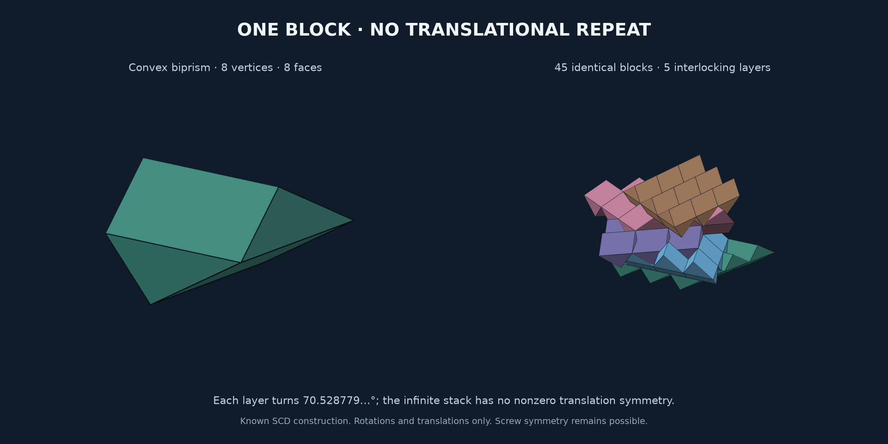

# Aperiodic Chair Lab

Reproducible research on three-dimensional chair tilings, local matching
rules, and a candidate strongly aperiodic solid. The target is a single
block whose every tiling has finite symmetry group, including no
infinite-order screw symmetry. **The physical monotile claim and novelty
remain unestablished.**

## Start here

| Purpose | Entry point |
|---|---|
| Resume the research | [Current handoff](HANDOFF.md) |
| Find reports, scripts, evidence, and commands | [Project index](docs/INDEX.md) |
| Inspect the candidate | [Offline chair viewer](strong/artifacts/recut-chair.html) |
| Read the proposed construction | [Recut-chair proposal](strong/RECUT_CHAIR.md) |
| Review the latest comparison | [Auxiliary reconstruction](strong/review/AUXILIARY_RECONSTRUCTION.md) |
| Assess correctness and prior work | [Review preparation](strong/review/README.md) |

The latest work identifies obstructions to a natural local conversion
between our decorations and Goodman-Strauss's auxiliary markings. It also
records an unresolved discrepancy in our transcription of the connected
cross variant. These arguments await independent scrutiny. The older SCD
reproduction and unsuccessful searches remain part of the research record.

Project/package name: `aperiodic-chair-lab` (formerly
`aperiodic-3d-monotile`). See the [repository record](docs/REPOSITORY.md)
for the naming, layout, and preservation decisions.

## Strongly aperiodic research

**New proposal:** the [recut chair](strong/RECUT_CHAIR.md) has a verified
recursive matching rule and a proposed curved-surface argument forcing the
grid. It is a research candidate requiring mathematical review, not an
independently established monotile theorem.
Open its [offline viewer](strong/artifacts/recut-chair.html) to inspect it.
It shows the modified solid, eight- and 64-copy placements, and the failed
periodic contact; a [four-panel figure](strong/artifacts/recut-chair-placements.png)
shows the solid, assembly, and contact cross-sections.
The [frozen-candidate audit](strong/audit/README.md) reproduces the finite
certificates from coordinates alone and expands the geometric argument.
The [follow-up record](strong/FOLLOWUP_REFLECTIONS.md) explains the reflection
extension, three face patterns, and a periodic altered-solid control.
A [short review note](strong/REVIEW_NOTE.md) states the current claim and
its proof dependencies.
The [illustrated local parent rule](strong/MOTIF_GROUPING.md) now explains
why the three face patterns force a unique eight-chair grouping.
The [outside-review preparation](strong/review/README.md) contains a draft
inquiry for Goodman-Strauss, a two-page brief, and a reproducible archive.
No external validation has been received. Agents resuming the work should
start with [HANDOFF.md](HANDOFF.md).

Read [What the search taught us](FINDINGS.md) for the mathematical insights,
small proofs, methodological lessons, and open directions worth preserving.

The earlier [strong aperiodicity investigation](strong/README.md) targets
the stricter requirement of **no screw symmetry**. It analyzes 65,216 single-block
matching designs and proves a crossed-plane mechanism at the matching-rule
level. The [whole-chair exploration](strong/EIGHT_CHAIRS.md) exhausts 2,288,650
rooted eight-chair placements and gives a small parity certificate for a
surviving local candidate. The [preceding pass](strong/OPEN_FUSION.md) allows
clusters to cross test boundaries and analyzes filler attachment.
The [previous pass](strong/SECOND_PASS.md) adds off-centre connectors and
oblique periodicity checks.
**Those earlier searches found no strongly aperiodic monotile.** The SCD model below
remains a separate, weaker construction.

## SCD construction

**Result:** an explicit, connected, convex Schmitt–Conway–Danzer (SCD)
biprism, with exact coordinates, a space-filling placement rule, a
translation-aperiodicity argument, and checked numerical models.

This is a realization of a known construction, not a newly discovered monotile.
The claim uses rotations and translations of **one physical handedness**.
Screw symmetry is possible; strong aperiodicity has not been established.



## Explore or manufacture

- [Offline interactive explorer](viewer.html): open directly in a browser;
  orbit, inspect layers, separate them, and compare a periodic control.
- [STL](artifacts/block-30mm.stl), [OBJ](artifacts/block-30mm.obj),
  [OpenSCAD](artifacts/block.scad): rhombus side 30 mm, total height 24 mm.
  The STL is a closed, outward-oriented mesh. It approximates irrational
  coordinates and has no manufacturing clearance; actual printing is untested.
- [Mathematical derivation and research notes](RESEARCH.md).
- [Verification results](artifacts/verification.json).

## Reproduce

```sh
uv sync --locked
uv run --locked python verify.py
uv run --locked python build.py
node verify_viewer.cjs  # optional: exercise the offline explorer controls
```

The Python environment is locked in `uv.lock`. `geometry.py` defines the exact
construction's numerical realization; `verify.py` checks it independently with
convex-hull halfspaces and linear programming. `build.py` exports the models,
figure, and a self-contained HTML file with no network dependencies.
Both `viewer.html` and its exported copy `artifacts/explorer.html` are standalone
pages. Open either directly in Firefox or another browser; no server or build
is needed to view them.

## What passed

- 947 convex intersection optimization checks across a 175-block patch:
  no positive-volume overlaps.
- 12,000 interior sample points: each covered exactly once.
- 340,000 interface samples: maximum seam discrepancy below `1.5e-14` units.
- Exact symbolic rotation and lattice identities; mesh incidence and volume.
- Negative controls: a wrong rotation fails the fit; a 60° version repeats.

Finite checks validate the implementation. The infinite argument is mathematical;
the classification of arbitrary tilings relies on the existing SCD literature.

## Attribution

Schmitt, Conway and Danzer developed the underlying construction. The principal
technical source is Michael Baake and Dirk Frettlöh,
[SCD Patterns Have Singular Diffraction](https://www.math.uni-bielefeld.de/~frettloe/papers/scdart.pdf),
Journal of Mathematical Physics 46 (2005), DOI
[10.1063/1.1842355](https://doi.org/10.1063/1.1842355).
The derivation here fixes an explicit coordinate convention and checks the
resulting geometry directly.
