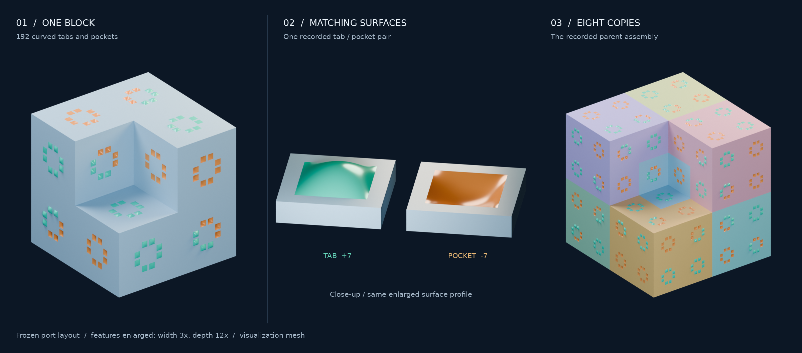

# Aperiodic Chair Lab

[](https://tritonlab.io/aperiodic-chair-lab/assembly/)

*Curved tabs and pockets carry the matching rules. The frozen port layout is
shown with features enlarged **3× in width and 12× in depth** for visibility.
[Rendering details](docs/figures/aperiodic-chair-cover-enlarged.md).*

Match face patterns and arrows, connect 3D blocks, and discover how eight
pieces can form a larger block of the same shape.

**[Try the interactive builder →](https://tritonlab.io/aperiodic-chair-lab/assembly/)**

[Watch a quick demo](https://tritonlab.io/aperiodic-chair-lab/assembly/?demo=1) ·
[Project home](https://tritonlab.io/aperiodic-chair-lab/)

No installation or prior knowledge needed. Follow hints or build freely,
and undo whenever you like. Available in Japanese, English and Simplified Chinese.

## Start here

| Purpose | Entry point |
|---|---|
| Build and explore | [Interactive builder](https://tritonlab.io/aperiodic-chair-lab/assembly/) · [guided demo](https://tritonlab.io/aperiodic-chair-lab/assembly/?demo=1) · [standalone HTML](docs/assembly.html) |
| Learn the ideas | [Read the illustrated tutorial](https://tritonlab.io/aperiodic-chair-lab/tutorial/) · [Markdown source](docs/APERIODIC_CHAIR_TUTORIAL.md) · [download HTML](https://tritonlab.io/aperiodic-chair-lab/downloads/tutorial.html) |
| Inspect the candidate | [Interactive chair viewer](https://tritonlab.io/aperiodic-chair-lab/viewer/) · [repository edition](strong/artifacts/recut-chair.html) |
| Compare the constructions | [Geometry and proof comparison](strong/review/CHAIR44_PROOF_COMPARISON.md) |
| Inspect reproduced evidence | [Chair44 build record](strong/review/CHAIR44_BUILD_REPRODUCTION.md) · [independent finite replay](strong/review/CHAIR44_COMPANION_REPLAY.md) |
| Follow our formal argument | [Lean project](formal/README.md) · [grid symmetry bound](formal/GRID_SYMMETRY.md) |
| Assess the proof dependencies | [Current claim table](docs/PROOF_STATUS.md) · [short geometric manuscript](strong/review/CURVED_GRID_NOTE.md) |
| Find reports and commands | [Project index](docs/INDEX.md) |
| Understand attribution and AI use | [Provenance](docs/PROVENANCE.md) · [third-party notices](THIRD_PARTY_NOTICES.md) |

For offline play, clone the repository and open `docs/assembly.html` in a
browser. The tutorial download also includes its figures, styles and scripts
for offline reading. GitHub's HTML file view displays source code; download
the file or use the online links above to open the interactive version.

## Research background

This repository is also a computational research notebook on three-dimensional
aperiodic chair tilings: comparisons with Chair44, reproducible verification,
undergraduate explanations, and investigations toward printable realizations.

**Relationship to Chair44.** Ioannis Tsiokos's
[*A Strongly Aperiodic Monotile in Three Dimensions*](https://zenodo.org/records/22792358)
uses the same discrete decorated-chair matching system as this project,
after a coordinate conversion and key relabelling. The physical surfaces
differ: Chair44 uses square pyramids; our candidate uses asymmetric curved
caps. We reproduced the pinned Chair44 proof build and investigated that
correspondence. We do not claim a distinct matching-system discovery or
established discovery priority. See the [exact comparison](strong/review/TSIOKOS_CHAIR44_COMPARISON.md).

The viewers and meshes approximate exact surfaces and do not certify the
aperiodicity of a printed object.

## What is established?

The mathematical target is a single space-filling block whose **every tiling
has a finite symmetry group**, including no nonzero translation or
infinite-order screw symmetry. Our evidence has several distinct scopes:

| Work | Established scope | Remaining limitations |
|---|---|---|
| Our discrete chair model | Lean proofs of contact recurrence, universal eight-chair grouping, legal deflation, exclusion of every nonzero integer translation period and at most 24 proper grid symmetries | Assumes the defined proper integer-grid model; initial existence, arbitrary Euclidean placement, reflections and the full physical symmetry bound are outside these Lean results |
| Our exact curved-cap solid | Written geometric and existence arguments, with exact finite checks | Full physical-solid theorem awaits mathematical review; mesh and manufacturing approximations do not inherit it |
| Chair44 reproduction | Unchanged pinned Lean release builds; its endpoint includes physical tiling existence and a symmetry bound of 24 for arbitrary Euclidean tilings | Disclosed native-evaluation trust boundary; not a complete independent semantic audit or human review |
| Printable replacement interfaces | Proposed broad relief patterns, contact coupons and hierarchy experiments | No replacement design or printing experiment has yet been validated |

Our Lean audit reports only standard logical axioms, with no admitted proofs
or native-evaluation hooks. The reproduced Chair44 endpoint also uses 21
native-evaluation hooks. Its release control suite has one packaging failure:
a historical comparison archive is absent. The proof builds, fresh axiom
audit and logical controls passed. The [build report](strong/review/CHAIR44_BUILD_REPRODUCTION.md)
records both outcomes rather than treating the whole control suite as passing.

## What this repository contributes

- An interactive builder with face matching, guided assembly and exploration
  of parent and child blocks at successive scales.
- Independently implemented finite checks and a precise comparison of the
  two geometric realizations of the shared matching system.
- A separate formal development of the grid argument and an illustrated
  account of the [local parent rule](strong/MOTIF_GROUPING.md), with its
  Goodman-Strauss attribution.
- A tutorial connecting hierarchy to symmetry, defects, coarse-graining,
  diffraction, and manufacturing tolerances.
- Preserved search results, failed approaches and negative controls, so
  others can inspect how conclusions changed.

The current physical direction is to replace fine depth distinctions with
printable interface patterns, test correct and incorrect contacts, and build
eight- and 64-chair demonstrations. Assembly paths, tolerances and observable
contrast are open experimental questions. The
[tutorial's printing section](docs/APERIODIC_CHAIR_TUTORIAL.md#10-bringing-the-rules-to-a-3d-printer)
explains the proposal.

## Reproduce

Use Python 3.13+ through `uv`, from the repository root:

```sh
uv sync --locked

# Check the frozen candidate hashes without regenerating evidence.
uv run --locked python strong/review/verify_package.py --hashes-only

# Reproduce the finite local grouping checks (writes its result files).
uv run --locked python strong/audit/motif_grouping.py

# Reproduce our Lean development with the pinned toolchain installed.
uv run --locked python formal/verify.py
```

Read [formal/README.md](formal/README.md) for the toolchain and theorem scope.
Chair44 uses a different pinned toolchain and external release checkout;
its commands are in the [reproduction report](strong/review/CHAIR44_BUILD_REPRODUCTION.md).
The [project index](docs/INDEX.md) covers other searches and optional tools.
Inspect evidence diffs after running generators; preserve the frozen inputs.

## Provenance, AI assistance and historical material

This project was developed with substantial AI assistance, including search
programs, proposed arguments, Lean code, documentation and agent reviews.
The human maintainer directs the work. An independent agent review means
review by another AI agent, not independent human mathematical validation.
No outside expert has reviewed or endorsed this project, and no inquiry has
been sent. [Provenance and chronology](docs/PROVENANCE.md) distinguish the
recorded evidence from claims it cannot establish.

The chair hierarchy and recognition mechanism have predecessors in
Chaim Goodman-Strauss's [aperiodic pair construction](https://strauss.hosted.uark.edu/papers/NDimPair.pdf).
The [historical-material guide](docs/HISTORICAL_MATERIAL.md) identifies older
proposal notes and unsent review packets that predate the Chair44 comparison.
They are retained as research history, not current announcements.

The earlier [Schmitt–Conway–Danzer study](RESEARCH.md) reproduces a known
construction that allows screw symmetry. It has a separate [viewer](viewer.html)
and [verification evidence](artifacts/verification.json). Other early searches
found no strongly aperiodic monotile; see [findings](FINDINGS.md) and the
[search history](strong/README.md).

## Reuse and contributions

Project code and original machine-readable research data are available under
[MIT](LICENSE); project writing, figures and geometric models under
[CC BY 4.0](LICENSES/CC-BY-4.0.txt). Third-party material retains its own terms.
[Licensing scope](LICENSING.md) explains mixed HTML documents, archived files,
source-derived evidence and attribution.

Concrete corrections, reproducible counterexamples, clearer proofs and
printing measurements are welcome. Include the relevant file or commit,
assumptions, commands and output. Distinguish a finite successful example
from an infinite theorem, and a geometry change from a change to the discrete
matching rules.

Project name: `aperiodic-chair-lab` (formerly `aperiodic-3d-monotile`).
[Repository record](docs/REPOSITORY.md) · [maintainer handoff](HANDOFF.md) ·
[publication review](docs/PUBLICATION_REVIEW.md).
