# Before we begin

Imagine a box of identical blocks. You can translate and rotate them, and
you want to fill three-dimensional space without gaps or overlapping interiors.
Could their shape make a repeating arrangement impossible?

This tutorial explains the mechanism behind one approach: a seven-cube chair
with carefully designed surface features. Its central idea is that local
contacts can force a hierarchy extending to every length scale.

The route is simple to state: surface features restrict neighboring blocks;
those restrictions force groups of eight; the groups obey the same rules
again. A repeating arrangement would have to repeat consistently through
every level of this hierarchy. We will see why that is impossible.

**Audience.** Undergraduate students familiar with vectors, matrices, and
elementary calculus. No previous tiling theory or abstract algebra is needed.
The physics sections introduce the energy and interference formulas they use;
no course in statistical mechanics or Fourier analysis is assumed. The most
technical part, Section 7.1, uses elementary facts about polynomials, explained
there before they are applied.

**Reading route.** Sections 1–7 explain the mathematical mechanism;
Sections 8–10 connect it to physics and printing. Section 11 gives the
verification status and further reading. Exercises with answers follow.

For a first pass, follow the worked examples and figures. For a proof-oriented
pass, also follow the finite-enumeration recipe in Section 3, the parent-map
argument in Section 4, and the five geometric steps in Section 7. We explain
why the finite checks suffice; their complete machine-generated tables remain
in the linked appendix so that hundreds of similar entries do not interrupt
the argument. In particular, a reported census is a finite input to a proof,
not a replacement for explaining its universal implications.

**Status matters.** For our curved chair, the proof is most complete in a
model that restricts blocks to a cubic grid. Showing that freely moving
blocks must obey that model is a separate argument still requiring review.
A related construction, Chair44, uses different surface features and has a
more complete computer-checked proof. Section 11 explains that comparison.
The printable replacement interfaces described here remain proposals.

**Which shape is illustrated?** The geometric main example now uses the
two-depth, triangular cubic ports proposed on 19 September. Their exact
contact sets agree with the frozen square-port reference used by the grid
audits. The earlier square surface remains a comparison below; Figure 1's
whole-chair renderings show that earlier design. The new geometry has
written arguments and finite checks, not a new real-geometry Lean theorem.
We keep the recorded small dimensions as a reference example. Section 10
also presents a relocated triangular candidate with twelve times the width
and 256 times the depth, preserving the contact rules. These larger dimensions
have exact geometric checks, but no printing or assembly trial yet.

# 1. Aperiodic means more than an irregular-looking arrangement

A **tiling** covers all of space with copies of a shape, allowing their
boundaries to touch but forbidding interior overlap. A **packing** only
requires no interior overlap; it may leave gaps.

For a tiling $T$, a vector $v$ is a **translation period** if shifting every
tile by $v$ leaves exactly the same collection of tiles:

$$T+v=T.$$

The zero vector always works. A tiling is translation-nonperiodic if no
nonzero vector works. Here “no period” excludes even repetition in just one
direction, not merely a full three-dimensional crystal lattice.

An **aperiodic tile** must satisfy two different requirements:

1. At least one infinite tiling exists.
2. Every allowed infinite tiling has no nonzero translation period.

Even constructing one infinite nonrepeating tiling would not establish the
second requirement: the same shape might also allow a repeating arrangement.
Ordinary cubes, for example, admit the familiar periodic cubic tiling and
therefore cannot be an aperiodic tile, regardless of their other arrangements.

In three dimensions there is another issue. A **screw motion** rotates around
an axis and translates along it. Repeating the motion can generate an
infinite symmetry even when a pure translation is unavailable. Our earlier
Schmitt–Conway–Danzer construction illustrates this distinction; see the
[SCD research note](../RESEARCH.md).

Our stronger target is explicit:

> One solid tiles space, and every tiling by that solid has a finite symmetry
> group, even when reflected copies are allowed.

A symmetry group is simply the collection of rigid motions preserving the
tiling. A finite group permits a few rotations, but excludes nonzero
translations and infinite-order screws. Terminology for “strongly aperiodic”
varies, so this explicit property is more useful than the label alone.

We will first tackle translations, then return to screw motions in Section 6.

# 2. Meet the chair

Start with a $2\times2\times2$ cube assembled from eight unit cubes. Remove
one corner cube. The remaining seven cubes form the **three-dimensional
chair**. We call this coarse shape the **carrier**; later we modify its surface.

The carrier has volume 7. Its boundary has 24 unit-square panels, including
the three panels facing the missing corner, or **notch**.

Fix coordinates now: the large cube is $[-1,1]^3$, and the missing unit cube
is $[0,1]^3$. More precisely, the closed carrier $L$ is the union of the seven
closed unit cubes whose lower corners are in
$\{-1,0\}^3\setminus\{(0,0,0)\}$. Boundary points shared with a retained cube
stay in $L$. The inward corner of the notch is the origin $(0,0,0)$; the
center of the removed cube is $(1/2,1/2,1/2)$. These are different points.

Here $[-1,1]^3$ means that each of three coordinates lies between $-1$ and
$1$. Likewise $\{-1,0\}^3$ lists the eight triples whose entries are each
$-1$ or $0$; the set-minus symbol removes the one indicated triple.
“Closed” means that we include the boundary, as $[0,1]$ includes its endpoints.

A placed chair has points $t+Rx$, where $x$ is a point of this reference
chair, $R$ is its orientation matrix, and $t$ is its notch-corner position.
For example, $R(x,y,z)=(x,z,-y)$ is a quarter-turn around the $x$ axis.
It sends $(0,1,0)$ to $(0,0,-1)$. Throughout the grid argument, $R$ is one
of the 24 rotations that send coordinate axes to coordinate axes.
The markings distinguish orientations that the bare carrier might identify.

When transforming a cube, transform its center or all eight corners.
Transforming just its lower corner is unsafe: reflection of the interval
$[0,1]$ gives $[-1,0]$, whose lower endpoint is $-1$, not the image of $0$.
This small bookkeeping point matters when checking the coordinate tables.

Eight suitably oriented chairs fit together to form a chair with twice the
linear dimensions. The volume check is

$$8\times7=7\times2^3=56.$$

This is a useful consistency check, but equal volume alone does not prove
that the pieces fit. Their positions and orientations must also be checked.

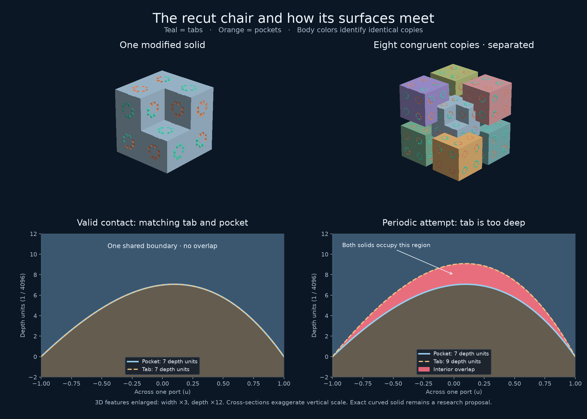

*Figure 1. Earlier square-port design. Body colors distinguish identical
copies. Surface features are enlarged by factors of 3 in width and 12 in
depth; the cross-sections also exaggerate the vertical scale. The image is
an approximate rendering, not a certificate for the exact curved solid.*

Repeating the eight-child construction gives patches containing
$8,64,512,\ldots$ chairs. This is called a **substitution**: replace a larger
chair by eight smaller ones. Equivalently, enlarge a chair by a factor of
two and fill it with eight chairs of the original size. A **level-one group**
contains eight original chairs; a level-two group contains eight such
groups, or 64 original chairs.

However, the undecorated chair also admits periodic tilings. Its ability
to participate in a hierarchy does not force every arrangement to have one.
The surface features must supply that missing constraint.

# 3. Surfaces can carry local information

Think of a jigsaw puzzle. A tab and a matching pocket allow one contact;
incompatible profiles obstruct another. Our chair uses small surface features,
called **ports**, to encode allowed neighbors. A **matching rule** specifies
which contacts are allowed.

For Sections 3–5, imagine placing the chairs on three-dimensional graph
paper: their carrier cubes occupy cells of one common cubic lattice. This
is the **grid model**. A **legal tiling** in this model covers every cell
exactly once and satisfies every matching rule. We temporarily assume this
alignment so that we can understand the hierarchy; Section 7 explains why
justifying the alignment for freely moving solids is a separate challenge.

Both the frozen reference and the new triangular design have eight ports
on each of their 24 panels: 192 ports in total. Signed keys specify
complementary protrusions and recesses, with the magnitude controlling
depth. The reference uses $\pm1,\ldots,\pm12$; the triangular candidate
uses only $\pm1,\pm2$. Its scalene triangular footprint also fixes an
orientation within the panel. Section 7 explains why even a small shared
surface patch determines that footprint.

Two depth levels do not mean just two possible messages. As with words
built from a small alphabet, **the arrangement of the levels carries
information**. The new assignment changes some protrusions into recesses
as well as merging depths. Simply replacing every old positive key by 1
or 2 would not describe it. The [exact candidate](../strong/audit/triangular_v1/candidate.json)
records the new assignment. The matching system below is the common
abstract description, rather than a requirement to preserve twelve
distinct physical depths.

The complete arrangement can be summarized by three panel patterns, A, B,
and C, together with an arrow on each panel. These are descriptions of one
block's geometry, not three different tile species.

In words, A meets A with a specified quarter-turn between their arrows;
B meets C with their arrows pointing oppositely. The arrow records a
direction along the face, much as an arrow printed on a square card does.

To make “quarter-turn” precise, let $n$ point straight out of the first
panel and let $U$ be its unit arrow. The cross product $V=n\times U$ gives
a perpendicular arrow lying in the same panel. For example, if $n$ points
along positive $z$ and $U$ along positive $x$, then $V$ points along positive
$y$. Compare both panels' arrows in the same three-dimensional coordinate
system, even though their outward normals point oppositely.

With subscripts 1 and 2 identifying the two panels, the rules are:

| First pattern | Second pattern | Required arrow on the second panel |
|---|---|---|
| A | A | $U_2=V_1$ |
| B | C | $U_2=-U_1$ |
| C | B | $U_2=-U_1$ |

All other pattern pairings are forbidden. In particular, C cannot meet C.
The arrows are essential: forgetting them changes the rules.

**Worked handshake.** Take two A panels with $n_1=(0,0,1)$ and
$U_1=(1,0,0)$. The first panel requires $U_2=(0,1,0)$. Viewed from the
second panel, $n_2=(0,0,-1)$, so
$V_2=n_2\times U_2=(1,0,0)=U_1$: the rule works in both directions.
Giving the second panel arrow $(0,-1,0)$ instead fails the rule even though
the names A/A agree. Likewise B/C with opposite arrows passes, while C/C
with any arrows fails. A successful handshake at one panel is only one
condition; every panel in a whole-chair interface must pass.

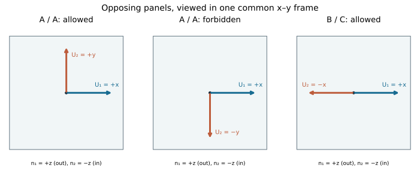

*Figure 2. Compare the two arrows in one spatial frame. Both outward normals
are perpendicular to the page, but they point in opposite directions.
The middle contact fails solely because its second arrow is reversed.*

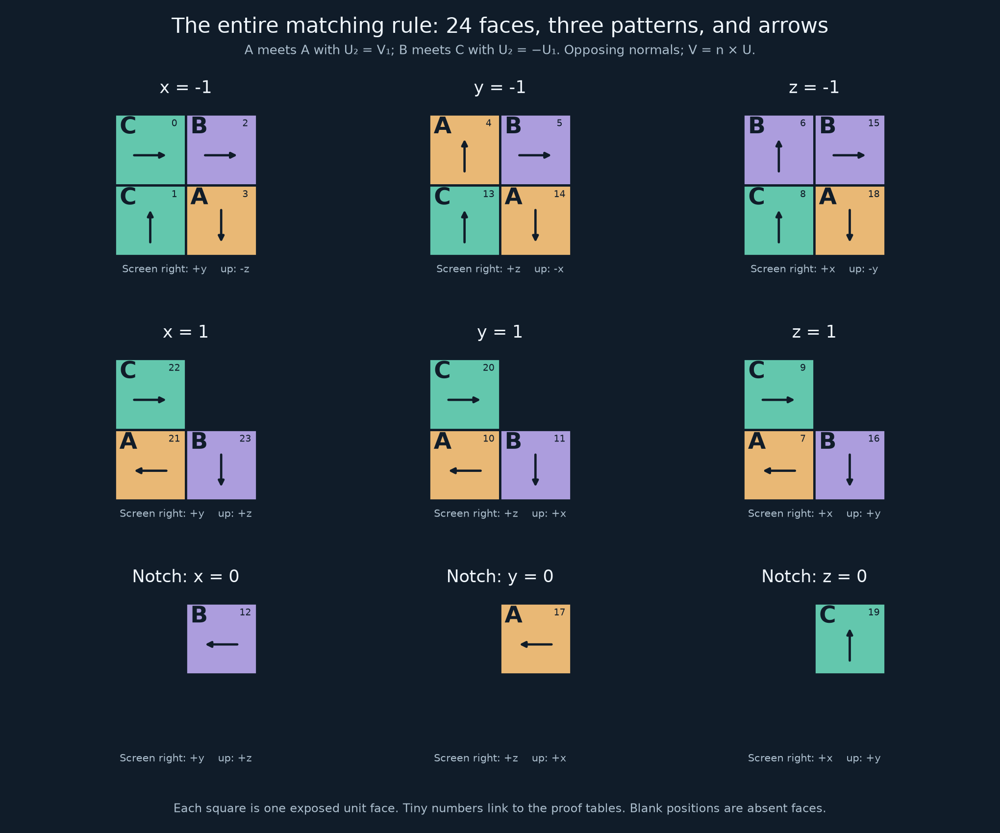

*Figure 3. The complete face layout. You do not need to memorize it. Its role
is to specify the finite input from which contacts and grouping are checked.*

Each small square is one unit panel. The labels $x=-1$, $x=0$, and so on
refer to the coordinates fixed in Section 2; the three notch panels lie in
$x=0$, $y=0$, and $z=0$. Use the coordinate arrows drawn beside each panel
array to read a screen arrow as a spatial vector. Two arrows that look alike
on differently oriented arrays need not represent the same vector.

## 3.1 How to enumerate contacts without guessing a search radius

Here is a finite, exhaustive procedure, using the face picture as input.
Represent a face by its center $f$, outward normal $n$, pattern, and arrow.
Hold the first chair at the origin. For each of the 24 rotations $R$ and
each pair of exposed faces $a,b$, require opposite normals,
$Rn_b=-n_a$, and set

$$t=f_a-Rf_b.$$

This is the only translation aligning these two unit squares. Keep integral
translations, discard overlapping carrier interiors, and remove duplicate
placements. For each remaining placement, test the pattern and arrow rule
on **every** shared panel. Why is this exhaustive? Any grid-aligned
face-neighbor shares at least one whole unit square with the first chair,
so its rotation and an aligned face pair occur in this list. No arbitrary
coordinate cutoff is involved.

We can now hold one chair fixed and list every grid-aligned way a second
chair could touch it across a panel without overlapping it. Using rotations
that preserve the cubic grid, there are 1,194 such candidate placements.
Only 44 satisfy all interface rules. Fourteen of those leave a nearby face
with no possible compatible neighbor, so they cannot occur in a complete
legal tiling. That leaves 30 contacts supporting the hierarchy.

To understand the extra exclusion, suppose a candidate neighbor $B$ fits
the fixed chair $Q$. Choose an uncovered face of $Q$ and list all placements
that could cover it. If every one overlaps $B$ or mismatches a panel of $B$,
that face cannot be filled in a tiling containing $Q,B$. Reject $B$.
This is a proof by exhaustion of a finite list, not a failed search that
might succeed if given more time.

For a concrete row of the certificate, the neighbor
$t=(-2,0,0)$, $R(x,y,z)=(z,-x,-y)$ fits $Q$ in isolation. Its presence
leaves the panel centered at $(-1,-1/2,-1/2)$ unfillable. There are exactly
two fitting candidates for that panel: the axial neighbor with
$t=(-2,0,0)$, $R(x,y,z)=(-z,y,x)$ overlaps the assumed neighbor; the
diagonal neighbor with $t=(-1,-1,-1)$, $R=I$ mismatches it. Both alternatives
are ruled out, so the assumed contact cannot occur in a complete tiling.
Here $I$ denotes the identity matrix, which changes no vector.

The exact counts are useful for checking the calculation; the next argument
does not require memorizing them. They count relative placements, not
different shapes or infinite tilings. See the
[local grouping report](../strong/MOTIF_GROUPING.md) for the full enumeration.
The [generated proof tables](../strong/audit/motif_grouping_tables.md)
give all 24 face records, all 44 fitting placements, and the obstructed
face and complete alternatives for each of the 14 exclusions. The same
procedure applied at each placement makes these finite facts usable in
an arbitrary, possibly infinite, tiling.

**Lesson:** pairwise compatibility need not imply compatibility with a whole
neighborhood. A contact can fit in isolation and still prevent space from
being filled around it.

**Check your understanding:** try Exercises 8 and 18 before continuing.
They ask you to reverse a handshake and align a pair of face centers.

# 4. The crucial step: every chair has a unique parent

To force a hierarchy, we need to recover the eight-chair groups from an
arbitrary legal tiling. We cannot assume that someone assembled it using
our preferred substitution.

Imagine receiving a finished tiling with all assembly instructions lost.
Our task is to identify its groups using only the neighbors we can see.
Each group is named by one distinguished member, its **central child**.
The rule assigns every chair to one such member, which we call its parent.

We will answer four questions in order: what identifies a center; what to
do when the inspected chair is not a center; why two groups cannot claim
the same child; and why the whole procedure can be repeated. The coordinate
table below specifies the test. You need to follow one worked use of it,
not memorize its seven rows.

## 4.1 Six contacts that identify a center

View the chair being inspected, $Q$, in its own coordinates, so it has
origin zero and orientation $I$. The following table specifies actual
neighboring placements, not just directions in which neighbors occur.
The name $D_{--+}$ records the signs of the three entries of its origin.

| Neighbor | Origin $t$ | $R(x,y,z)$ | Is a trigger? |
|---|---|---|---|
| $D_{---}$ | $(-1,-1,-1)$ | $(x,y,z)$ | No |
| $D_{--+}$ | $(-1,-1,1)$ | $(x,z,-y)$ | Yes |
| $D_{-+-}$ | $(-1,1,-1)$ | $(z,-y,x)$ | Yes |
| $D_{-++}$ | $(-1,1,1)$ | $(y,-z,-x)$ | Yes |
| $D_{+--}$ | $(1,-1,-1)$ | $(-y,x,z)$ | Yes |
| $D_{+-+}$ | $(1,-1,1)$ | $(-x,y,-z)$ | Yes |
| $D_{++-}$ | $(1,1,-1)$ | $(-z,-x,y)$ | Yes |

The six mixed-sign entries are **triggers**: the presence of any one forces
$Q$ to be a central child. A neighbor with the same origin but a different
rotation does not count. The all-negative entry is not a trigger by itself.

Here is the finite implication behind that statement. Start, for example,
with $D_{--+}$. For each face in the next table, retain only candidates from
the 30 surviving contacts that are compatible with **all** neighbors already
present. Exactly one candidate remains at each step.

**Work through the first step.** The face centered at $(-1,-1/2,-1/2)$
has just two fitting candidates in the complete contact list: $D_{---}$
and the axial placement $t=(-2,0,0)$, $R(x,y,z)=(-z,y,x)$. The axial
placement and the already present $D_{--+}$ both occupy the unit cube
with lower corner $(-2,-1,0)$. That would overlap their interiors, so the
axial placement is impossible. Coverage forces $D_{---}$. This is the
kind of elimination repeated in each row below; later rows may also use
an incompatible panel pattern to rule a candidate out.

| Step | Face of $Q$ to cover: center | Normal | Forced neighbor |
|---:|---|---|---|
| 1 | $(-1,-1/2,-1/2)$ | $-x$ | $D_{---}$ |
| 2 | $(-1,1/2,-1/2)$ | $-x$ | $D_{-+-}$ |
| 3 | $(-1,1/2,1/2)$ | $-x$ | $D_{-++}$ |
| 4 | $(0,1/2,1/2)$ | $+x$ | $N$ |
| 5 | $(1/2,-1,-1/2)$ | $-y$ | $D_{+--}$ |
| 6 | $(1/2,-1,1/2)$ | $-y$ | $D_{+-+}$ |
| 7 | $(1/2,1/2,-1)$ | $-z$ | $D_{++-}$ |

Here $N$ has origin $(1,1,1)$ and orientation $I$. It occupies the notch
of $Q$ and is **external** to the group. The eight group members are $Q$
and the seven $D$ entries. The same face-coverage procedure works for each
of the other five triggers; all six step lists are in the generated tables.
The conclusion uses complete lists of face-covering candidates, not an
assumption that the tiling was assembled by substitution.

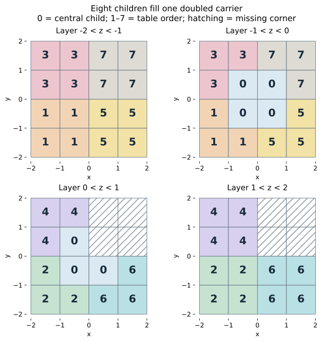

*Figure 4. The group in unit-cube layers. The same label and color identify
one child across layers; 0 is $Q$, and 1–7 are the $D$ entries in table order.
Every child owns seven cubes. The 56 cubes fill $2L$: the $4$-by-$4$-by-$4$
cube with its positive octant removed. The empty positive corner is the
parent notch. Decorations are omitted from this carrier diagram.*

To read the layers, trace child 0. It occupies four cubes in $-1<z<0$
and three in $0<z<1$: its seven-cube chair. A label recurring in another
layer belongs to the same three-dimensional object. The hatched squares
in the two positive-$z$ layers together form the missing positive octant.

## 4.2 If there is no trigger, find the notch owner

For any one of $Q$'s three notch panels, the complete contact list contains
exactly seven possible covering placements. All have origin $(1,1,1)$,
and each covers all three notch panels. Thus coverage supplies one **notch
owner** $P$. The other two panels cannot be owned by different chairs:
their outward adjacent cubes have already been occupied by $P$.

For six orientations of $P$, $Q$ viewed in $P$'s coordinates is one of the
six triggers. To change coordinates, if $P$ has placement $(t,R)$, use
$x\mapsto R^{-1}(x-t)$. In particular, $Q$ then has origin $-R^{-1}t$
and orientation $R^{-1}$. Substitution of the six nonidentity notch
orientations in the contact table gives exactly the six trigger rows.
The preceding implication therefore makes $P$ a center and $Q$ its child.

For example, take the notch owner with $t=(1,1,1)$ and
$R(x,y,z)=(-x,y,-z)$. Applying this rotation twice returns every vector,
so $R^{-1}=R$. In $P$'s coordinates, $Q$ has origin
$-R^{-1}(1,1,1)=(1,-1,1)$ and orientation $R^{-1}(x,y,z)=(-x,y,-z)$.
This is exactly the $D_{+-+}$ row. Nothing has moved: we have described
the same pair using the other chair as our reference.

One case remains: $P=N$, with the same orientation as $Q$. Looking back
from $P$ gives origin $(-1,-1,-1)$ and orientation $I$, which is not a
trigger. Here we use the assumption that $Q$ itself has no trigger.
Inspect its outer panel centered at $(1,-1/2,-1/2)$, normal $+x$.
The 30-contact list offers exactly three candidates:

1. $D_{+--}$ would be a trigger at $Q$, contradicting the assumption.
2. Origin $(2,0,0)$, rotation $(-x,z,y)$ would create a forbidden C/C
   contact with $P$, at face center $(3/2,0,1/2)$.
3. Origin $(2,0,0)$, rotation $(-y,x,z)$ is therefore forced. Call it $S$.

Viewed from $P$, the origin of $S$ is
$(2,0,0)-(1,1,1)=(1,-1,-1)$, and its rotation is unchanged. This is
exactly $D_{+--}$ in $P$'s frame. Thus $P$ is a center in the last case too.

## 4.3 Why these groups partition the tiling

Define the parent of each actual chair by the rule

$$\operatorname{parent}(Q)=
\begin{cases}
Q,&\text{if }Q\text{ has a trigger},\\
\text{the notch owner of }Q,&\text{otherwise}.
\end{cases}$$

We have proved that the selected parent is a center and that $Q$ belongs
to its eight-chair group. We still need to exclude a child selecting another
center. Merely finding an eight-chair group around each tile would not do this.

Fix a center $Q$. For any of its six mixed-sign children, $Q$ is the child's
notch owner and has a different orientation. If that child had a trigger,
Section 4.1 would force its notch owner to have its **own** orientation,
as $N$ does there. This contradicts the known notch owner. Hence each of
these six children has no trigger and selects $Q$.

For the remaining child $D_{---}$, the notch owner $Q$ has the same
orientation. Give its actual sibling $D_{+--}$ the name $S$. Viewed from
$D_{---}$, $S$ has origin $(2,0,0)$ and rotation $(-y,x,z)$: the axial
contact used in Section 4.2. Suppose now that $D_{---}$ were itself a center.
It would need a different neighbor, call it $J$, at origin $(1,-1,-1)$
with rotation $(-y,x,z)$ in **that child's coordinates**. This is the
$D_{+--}$ required by its own hypothetical central neighborhood.
But $S$ and $J$ both occupy the cube with lower corner $(1,-1,-1)$ in
the child's frame. They cannot coexist. Therefore $D_{---}$ is not a center
and also selects $Q$. Finally $Q$ selects itself.

All eight children select $Q$, and every chair selecting $Q$ was proved
to belong to those eight. Thus the sets of chairs with the same parent
are exactly the desired groups. Because a function assigns one value to
each input, these sets cover all chairs without sharing any chair.
This proves both existence and uniqueness of the grouping. Here “parent”
names the central child; it is not an additional ninth tile.

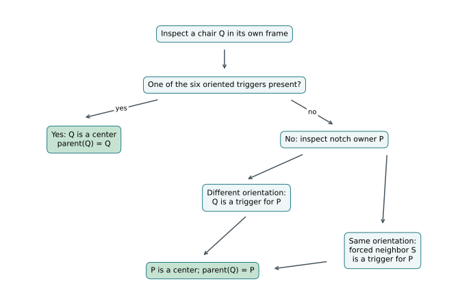

*Figure 5. The local decision rule. The two routes ending at $P$ explain
why a chair without a trigger still belongs to a recognized group. The
separate consistency argument in Section 4.3 ensures that the resulting
groups do not compete for children.*

**Check your understanding:** Exercises 9 and 10 separate finding a parent
from proving that the resulting groups form a partition.

This is **recognizability**: the larger structure can be read from the smaller
one. The chair-recognition mechanism has a predecessor in Goodman-Strauss's
1999 construction; our [markings comparison](../strong/review/GOODMAN_STRAUSS_COMPARISON.md)
records the attribution and differences in the matching systems.

## 4.4 Why grouping can be repeated

Treat each group as a single effective chair, then shrink distances by a
factor of two so that these chairs have the original size. This operation
is **deflation**. To iterate it, we must prove three more facts: the grouped
chairs cover without overlap, their origins share one parity class (the
same odd/even status in each coordinate), and
their new contacts satisfy the original rules.

**First, assemble the carriers and exposed faces.** The eight-child
partition gives a carrier $2L$ at each parent origin and orientation.
The partition of tiles proved above gives coverage and unique ownership
of every unit cube by these groups. Every exposed unit panel of a group
is a child panel; the panels between children disappear from its boundary.
Matching across a group boundary is therefore inherited from actual
contacts in the original tiling.

**Second, check the possible contacts between groups.** Apply the enumeration
recipe of Section 3.1 to the assembled groups, including all their exposed
child panels and all integral translations. There are 6,801 distinct
nonoverlapping face-contact candidates, of which 44 fit. Their precise
relationship to the original contact list is

$$\mathcal C_{\mathrm{group}}
=\{(2t,R):(t,R)\in\mathcal C_{\mathrm{chair}}\}.$$

The symbol $\mathcal C$ denotes a set of relative placements. This equation
is **contact recurrence**. The enumeration includes odd offsets; it does
not assume the evenness it concludes. It checks whole interfaces, including
arrows, and not merely that two enlarged carriers touch. Thus any two
face-adjacent groups have an even relative translation, and halving that
translation gives a fitting original-chair contact.

**Third, propagate evenness through the entire tiling.** Let two neighboring
group origins be $a,b$, and let the first have orientation $R$. The preceding
fact says $R^{-1}(b-a)=2k$ for an integer vector $k$. Therefore
$b-a=2Rk$ has even coordinates in the common frame too: $R$ only permutes
and changes signs of integer coordinates.

To reach any other group, choose a unit cube in it and walk from a cube in
the first group by unit steps along the coordinate axes. This takes finitely
many steps. Every cube has a group owner. When consecutive cubes have
different owners, their common face gives a group contact, so the origins
of those owners have the same parity. When they have the same owner,
nothing changes. Adding the even differences along the path proves that
**all** group origins have the same parity. This is where coverage and
connectedness of the cubic lattice enter the proof.

Choose one group origin $o$. Replace every group with origin $c$ and
orientation $R$ by an effective chair with origin $(c-o)/2$ and the same
orientation. These new origins are integral by the parity result. The map
$x\mapsto(x-o)/2$ takes the partition by carriers $c+R(2L)$ to a partition
by the original carriers $(c-o)/2+RL$, so coverage and nonoverlap survive.
Contact recurrence supplies the original matching rule on every new
interface. The result is another legal grid tiling, and the same argument
can now be applied again.

There is a geometric subtlety: the **coarse carrier** of a group is a doubled
chair. Its finely patterned outer surface need not be an enlarged copy of
the original curved surface. It is the effective matching rules that recur.
We assign the original decoration to the effective chair using its parent's
orientation; contact recurrence is what makes that assignment legal.

**What information survives?** One can vary the port depths while keeping
the contacts inside the prescribed groups consistent. After correcting the
signs for each port's orientation, denote the twelve remaining amplitudes
by $a_1,\ldots,a_{12}$. For the successful two-depth assignment, three
spatially distributed words are

| Word | Entries | Example |
|---|---|---|
| $v_0$ | $(a_1,a_2,a_4,a_6)$ | $(1,2,1,1)$ |
| $v_1$ | $(a_3,a_5,a_7,a_8)$ | $(1,1,1,1)$ |
| $v_2$ | $(a_9,a_{10},a_{11},a_{12})$ | $(2,1,1,1)$ |

The position of the 2 distinguishes these words without a third depth.
When parent origins are already aligned, their contact tests depend only
on whether $v_0=v_1$ and whether all three words coincide. The full
contact calculation also tests odd offsets: some distinctions prevent
misregistration rather than affecting aligned parent contacts. Avoiding
five specified simultaneous-equality patterns preserves both complete
44-contact sets; the example above does so. Distinct numerical values are
therefore not what must survive each grouping. The required distinctions
between permitted and forbidden contacts must survive.

The [symbolic analysis](../strong/INFORMATION_TRANSFER.md) makes this
precise: replacing each parent by its prescribed eight children and
combining the boundary conditions gives a transformation $T$. If $F_0$
is the fine contact condition and $F_1=T(F_0)$, then $T(F_1)=F_1$ for
all aligned relative placements in this family, before choosing the
amplitudes. This fixed-point identity explains stability of the effective
conditions; it does not replace the unique-grouping or odd-offset proofs.
The two-depth assignment is not unique, even though each legal tiling's
grouping is unique.

**Check your understanding:** Exercise 11 asks you to carry the local
even-offset fact along a path. This is the bridge to the global argument next.

At this point we have two essential ingredients: the groups are uniquely
recognizable, and grouping produces another legal tiling. These let us
test what would happen to a repeating pattern under deflation.

# 5. A short proof that translation periods are impossible

We can now see the central argument without a large coordinate table.
Work in the legal integer-grid model, with lengths measured in unit-cube
edges. The notation $\mathbb Z^3$ means triples of integers, such as
$(12,4,0)$. Use the inward corner of a chair's notch as its reference point;
a group's origin is that point on its central child. Because each chair's
reference point lies on the grid, a period
that carries chairs to chairs must also have integer coordinates.
Suppose $v\in\mathbb Z^3$ is such a period.

**Step 1: translation preserves the recognized groups.** The parent rule
depends only on relative positions and orientations. Translating the tiling
translates its parents. Uniqueness prevents the translation from choosing
a different grouping.

**Step 2: the period has even coordinates.** First picture a row of unit
intervals grouped into pairs. Once the pair starts are at $0,2,4,\ldots$,
any shift preserving those pairs has even length. A shift by one unit
would send a pair start to its midpoint.

The three-dimensional argument uses the alignment result of Section 4.4:
all group origins have the same coordinate remainders modulo 2. This result
comes from the contact rules and coverage; it does not follow from group
size alone. For example, origins with remainders $(1,0,1)$ have odd $x$ and
$z$ coordinates and even $y$ coordinates. Any difference between two such
origins has three even coordinates.

If $o$ is one group origin, we write this common **parity class** as

$$o+2\mathbb Z^3.$$

Here $2\mathbb Z^3$ means all integer vectors with even coordinates. Every
group origin lies in this class, though some points in the class need not
be group origins. If $c$ is an actual group origin, Step 1 says that $c+v$
is another. Their difference $v$ therefore equals $2w$ for an integer vector $w$.

**Step 3: deflation halves the period.** After shrinking the grouped tiling,
$w=v/2$ is a period of another legal tiling.

**Step 4: repeat.** Every deflated tiling is legal, so

$$v\in2^m\mathbb Z^3\qquad\text{for every integer }m\geq0.$$

In words, each coordinate of the original period must be divisible by 2,
then by 4, then by 8, and so on without end. Any nonzero integer eventually
fails this test. Therefore $v=0$.

For a concrete example, an alleged period $(12,4,0)$ would give $(6,2,0)$
after one deflation and $(3,1,0)$ after two. The latter has odd coordinates,
contradicting Step 2 for that legal tiling.

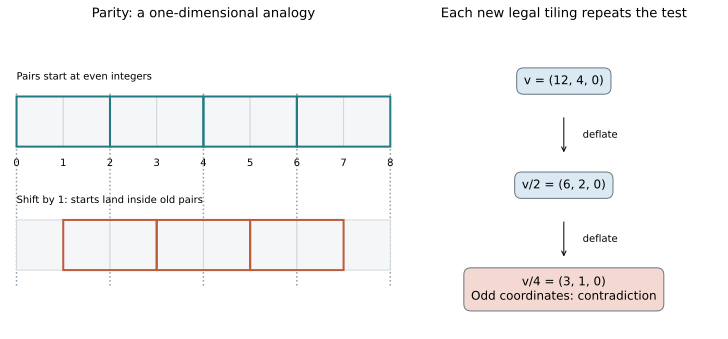

*Figure 6. Left: a one-dimensional analogy for parity, not a chair tiling.
A shift by one loses the recognized pair boundaries. Right: the actual
integer-vector descent. Each arrow produces another legal tiling; the
drawn sequence does not assume that a tiling equals its own deflation.*

Notice what we did **not** assume: the original tiling need not reproduce
itself under scaling. Each deflation may give a different tiling. Closure
of the class of legal tilings under deflation is sufficient.

**Check your understanding:** try Exercise 3 now. Exercise 4 asks which
premises made the argument possible.

This argument has been checked using **Lean**, a proof assistant: software
that checks each inference against precise definitions and logical rules.
The checked statement concerns the integer-grid model. See
[translation exclusion](../formal/TRANSLATION_EXCLUSION.md).

# 6. Why this can also rule out screw symmetries

To return to the screw-motion question, separate a rigid motion into an
orientation change followed by a shift:

$$g(x)=Rx+t,$$

The matrix $R$ describes a rotation or reflection; mathematically, it is
an **orthogonal matrix**, which preserves lengths and angles. The vector
$t$ describes the shift.

Suppose the geometry forces all symmetries to permute three common
perpendicular grid axes. There are six ways to permute $x,y,z$, and two
choices of direction for each axis. This gives $6\times2^3=48$ matrices.
Half are rotations; the other half reverse handedness, as a mirror does.
For the discrete model we allow proper orientations, meaning determinant
$+1$, and first count symmetries within those proper grid motions. There
are 24 possible matrices. A physical conclusion excluding reflections needs
two additional facts: all tiles have the same handedness, and the decorated
tile is **chiral**, so its mirror cannot coincide with a rotated copy.
Section 7 explains the first; the keyed-frame check discussed below supplies
the second. Even the bound of 48 would suffice for finiteness if both
handednesses were possible symmetry matrices.

Suppose two symmetries are $g(x)=Rx+t$ and $h(x)=Rx+s$. Solving
$y=Rx+s$ for $x$ gives $h^{-1}(y)=R^{-1}(y-s)$. Consequently

$$g(h^{-1}(x))=R\bigl(R^{-1}(x-s)\bigr)+t=x+(t-s).$$

This is a pure translation. Inverses and compositions of symmetries still
preserve the tiling: each simply rearranges the same tiles. By Section 5,
$t-s$ must vanish, so $g=h$. There is at most one symmetry per matrix,
and hence at most 24 proper grid symmetries. This argument proves finiteness;
it does not assume in advance that the symmetry group has finitely many
elements. The bound need not be attained by a particular tiling.

For a concrete screw-motion example, rotate by $90^\circ$ and move one unit
along the rotation axis. Four repetitions restore the original orientation
but move four units along the axis: a forbidden translation. The same
argument works whenever some finite number of repetitions cancels the rotation.

Both premises matter: we need translation exclusion **and** geometric
control of the possible orientation changes. Translation exclusion alone does not rule
out an irrational-angle screw. For our curved chair, this full physical
conclusion still depends on the geometric argument discussed next; it is
not itself the conclusion of our Lean theorem. The discrete bound of 24
proper grid symmetries **is** now proved in Lean; see the
[grid-symmetry proof and scope](../formal/GRID_SYMMETRY.md).

# 7. Two obligations that the short proof does not settle

The previous sections showed what follows **if** we have a legal grid
tiling. To finish a theorem about freely placed physical blocks, we must
justify that assumption and show that tilings exist in the first place.

## 7.1 Why should real blocks respect an integer grid?

An arbitrary block in space can slide, tilt, or touch only part of another
block. A proof that starts by placing everything on a cubic grid has already
assumed something substantial.

We now give the written geometric argument for the triangular cubic design.
It has five steps. Unlike Sections 4–6, this passage about arbitrary real
placements has not been formalized in our Lean development. The
[triangular-port report](../strong/PORT_SIMPLIFICATION.md) gives the new
rigidity proof and transfers the argument from the earlier
[square-port manuscript](../strong/review/CURVED_GRID_NOTE.md). Both remain
subject to mathematical review. Exact finite checks are supporting inputs,
not a substitute for the universal geometric reasoning below.

Keep these five questions in view while reading the formula below:

| Step | Question it settles |
|---|---|
| A | Must some neighbor share a surface patch with each cap? |
| B | Does one shared patch determine the cap's position and orientation? |
| C | Does that alignment put the neighbor on an integer grid? |
| D | Can we follow such contacts to an owner of every grid cube? |
| E | Could another, independently shifted collection of tiles coexist? |

The constants serve these questions: $w$ sets the footprint's length scale,
$\delta$ sets its depth increment, and $h$ bounds every surface displacement.
Steps A and E use the material left safely inside the tile; Steps B and C
use the detailed shape of its surface.

### The surface and the material it bounds

At a port frame anchor $p$, choose two ordered unit axes $U,V$ in the original
panel plane and its outward unit normal $N$. These are **port** axes,
distinct from the arrow used to summarize an entire A/B/C panel. A boundary
point of the cap is

$$X(u,v)=p+w(uU+vV)+k\delta\psi(u,v)N.$$

For the recorded example, use $w=1/64$, $\delta=1/4096$ and
$k\in\{-2,-1,1,2\}$. These dimensions are a sufficient choice, not values
forced by the matching rules. Step C explains the freedom to move the ports;
Section 10 checks a larger choice. The footprint
is the triangle with coordinate vertices $(-1,-1),(1,-1),(-1,0)$.
Its physical side lengths are $2w,w,\sqrt5w$: all different. Define

$$\lambda_0=(u+1)/2,\qquad \lambda_1=v+1,\qquad
\lambda_2=1-\lambda_0-\lambda_1,$$

$$\psi(u,v)=27\lambda_0\lambda_1\lambda_2
=-\frac{27}{4}(u+1)(v+1)(u+2v+1).$$

The $\lambda_i$ are **barycentric coordinates**: nonnegative weights
summing to one inside this triangle. More explicitly,
$(u,v)=\lambda_2(-1,-1)+\lambda_0(1,-1)+\lambda_1(-1,0)$.
On each edge one weight is zero, so the cap joins the flat panel there.
Inside, all three weights are positive. Their product is at most $1/27$,
with equality when they are all $1/3$. Thus $0\le\psi\le1$; positive
keys make bumps and negative keys make recesses. This standard cubic
triangle bubble also occurs in [finite elements](https://www.ljll.fr/ledret/M1English/M1ApproxPDE_Chapter5-2.pdf#page=12).

The extremal signed height is $k\delta$, attained at the triangle's
centroid $(u,v)=(-1/3,-2/3)$. **The anchor $p$ is not that centroid**:
it is the coordinate reference inherited from the earlier design. In fact,
$(0,0)$ lies outside this triangle, where the face remains flat. A uniform
bound on the absolute normal displacement is now

$$h=2\delta=\frac1{2048}<\frac1{64}.$$

Precisely, a port box consists of points $p+wuU+wvV+sN$ with
$|u|,|v|\le1$ and $|s|\le h$. For $(u,v)$ inside the triangle, replace
the carrier's local condition $s\le0$ by $s\le k\delta\psi(u,v)$.
Elsewhere retain the carrier. This specifies which side is solid, not just
an un-oriented surface. The graph joins continuously, but need not have
the same tangent plane as the surrounding face along its rim.

At these recorded dimensions, the triangle lies inside the old port square,
at least $19/64$ from its panel's edges, with disjoint port boxes within each tile. Changes to material stay
within normal distance $h$ of an exposed panel. Consequently every carrier
cube keeps its middle half, including an open ball of radius $1/4$ at the
cube center. More generally, the cube inset by any margin greater than $h$
lies in the solid's interior. These retained regions will connect local
contact geometry to a global conclusion.

The axes $U,V$ describe the **base plane**, not generally the tangent plane
at a point of the cap. Writing $X_u$ for differentiation in $u$ with $v$
fixed, we have $X_u=wU+k\delta\psi_uN$, and similarly for $X_v$.
At the centroid both derivatives of $\psi$ vanish, so the tangent plane
there is parallel to the base plane. The ordered directions are encoded
by the unequal triangle sides, not by a tilt at that extremum.

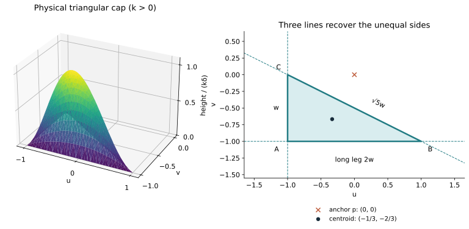

*Figure 7. Left: the height function $\psi$ over the physical triangle,
with height exaggerated. Right: all three straight lines on the continued
polynomial graph, in its base plane. Their intersections recover the
triangle. Dashed extensions are mathematical tools, not extra material.
The anchor and centroid are different points.*

**Comparison with the earlier square cap.** The frozen reference uses
$\phi=(1-u^2)(1-v^2)(1+u/5+v/7)$ on a square and twelve depth magnitudes.
The square alone has eight planar symmetries. The final asymmetric factor
breaks them, giving degree five and an extra distinguishing line on the
continued surface. Here the scalene footprint supplies that distinction,
allowing degree three. Within a single-polynomial, polygon-supported
design that is zero on every edge, degree three is minimal: each distinct
edge-line factor must divide the polynomial, and a bounded polygon needs
at least three such lines. This is not a minimum over all port designs.
The [comparison and preserved reference](../strong/PORT_SIMPLIFICATION.md)
give both constructions and their scopes.
The [earlier square-cap diagram](figures/tutorial-cap-rigidity.svg) is also
preserved for comparison.

### Step A: some neighbor shares an open part of every cap

An **open patch** is a little two-dimensional region of surface, not a
point or edge. Coverage alone would be awkward to use if infinitely many
tiny contacts could accumulate on a cap. A size estimate prevents this.

Every tile retains an interior ball of radius $1/4$, and has diameter less
than 4. Choose one such ball in each tile. The balls have disjoint interiors.
Any tile meeting a ball of radius $r$ has its chosen interior ball contained
in a concentric ball of radius $r+4+1/4$. Comparing volumes bounds the number
of such tiles by $(4r+17)^3$. The bound applies to every finite selection,
so an infinite number is impossible. This property is **local finiteness**:
only finitely many tiles meet a bounded region.

At an interior point of a cap, approach from the exterior of its tile.
Coverage supplies a tile at each approaching point. Local finiteness means
one neighboring tile contains infinitely many of them. Since the tile is
closed, it contains their limit on the cap. That limit cannot be in the
neighbor's interior, which would overlap interior points of the first tile
arbitrarily nearby. Therefore neighboring boundaries cover the cap.

Here we use the limit property of closed sets: a convergent sequence of
points in a closed set has its limit in that set. Also, “interior of a cap”
means away from its rim on the two-dimensional surface; it does **not**
mean inside the three-dimensional material.

There are only finitely many relevant boundary pieces, each closed and
either planar or a polynomial cap. A finite collection of closed subsets
with no surface-open part cannot cover an open patch: remove the first
closed set and choose a smaller surviving open patch, then repeat through
the finite list. If each had empty interior, some open patch would remain.
Hence one piece shares an open patch with the cap. Neither a plane nor a
boundary seam can contain an open part of this curved graph. The shared
piece is another cap.

### Step B: why partial agreement fixes the whole cap frame

The task is to compare two curved patches even when one has been tilted.
We will first turn a local coincidence into an identity of equations.
Then, instead of comparing every point of the resulting curved surfaces,
we will recover their coordinate frames from a few straight lines they contain.

We first need a polynomial fact. A polynomial in one real variable with
infinitely many distinct zeros is identically zero. If a polynomial in
two variables vanishes on an open rectangle, fix one variable in its
interval and apply the one-variable fact to the other. Each coefficient
then vanishes throughout an interval, so applying the fact again makes
every coefficient zero. Every open set contains a small rectangle. Thus
agreement of two polynomial expressions on an open set gives identity.

There is an extra step here: a rotated surface need not remain a height
graph over the original base plane. Use a polynomial equation for its surface
instead. Uniformly scale **all three** coordinates by $1/w$ and put
$H=k\delta/w$, which is $k/64$ for the recorded dimensions. The argument
below needs $H\ne0$, not this particular value. The cap lies on

$$P_H(u,v,z)=z-H\psi(u,v)=0.$$

Substituting a rigid motion into the second cap's equation gives another
degree-three polynomial $F(u,v,z)$. On the common open patch,
$F(u,v,H\psi(u,v))=0$, so the preceding polynomial fact makes this an
identity in $u,v$. The next paragraph explains how to turn this substitution
identity into an identity of the full three-variable equations.

Recall $z^2-a^2=(z-a)(z+a)$. More generally, $z^j-a^j$ contains a factor
$z-a$ for every positive integer $j$. Apply this fact to each power of $z$
in $F$, treating $u,v$ as fixed symbols, and then set $a=H\psi(u,v)$.
There is a polynomial $G$ such that

$$F(u,v,z)-F(u,v,a)=(z-a)G(u,v,z).$$

We just proved $F(u,v,a)=0$. Therefore $F=P_HG$: the second equation
contains the first as a factor. Notice that $a$ may itself depend on $u,v$;
the identity $z^2-a^2=(z-a)(z+a)$ still works after such a substitution.

Why must $G$ be a constant? The **total degree** of a polynomial is the
largest sum of exponents in one of its nonzero terms. For example,
$u^2v+z$ has total degree 3, and $u^3v^2$ has degree 5. Our $P_H$ has
total degree 3, as does $F$. Substituting an affine motion cannot increase
degree; since its inverse also cannot increase degree, an invertible motion
preserves it. Nonzero polynomial products add total degrees: their highest
degree parts multiply to a nonzero highest degree part. Thus
$3=3+\deg G$, so $G$ is a nonzero constant.

Consequently $F=0$ and $P_H=0$ describe exactly the same full surface,
including points outside the physical triangle. This extended surface is a
mathematical comparison tool; we have not added material to either tile.

To recover the frame, look for straight lines on this extended graph.
It has exactly three, all in the plane $z=0$:

$$u=-1,\qquad v=-1,\qquad u+2v+1=0.$$

Here is a direct check of completeness. Temporarily use coordinates
$x=(u+1)/2$ and $y=v+1$, so the equation becomes $z=27Hxy(1-x-y)$.
This affine change preserves straight lines; we do **not** use it to
compare lengths or angles. A line's projected coordinates have the form
$(x,y)=(a+dt,b+et)$. The cubic coefficient of its height is
$-27Hde(d+e)$. A straight line has height at most linear in $t$, so this
coefficient and every quadratic coefficient must vanish.

Work through $d=0$, $e\ne0$ first. Its height is
$27Ha(b+et)(1-a-b-et)$, with quadratic coefficient $-27Ha e^2$.
Since $H,e\ne0$, this forces $a=0$. The whole height is then zero on
the line $x=0$. The other directions give the following complete list.

| Direction | Quadratic coefficient | Resulting line |
|---|---|---|
| $d=0$, $e\ne0$ | $-27Ha e^2$ | $x=0$ |
| $e=0$, $d\ne0$ | $-27Hb d^2$ | $y=0$ |
| $e=-d$, $d\ne0$ | $27Hd^2(a+b-1)$ | $x+y=1$ |

The product vanishes on each line, giving $z=0$. Finally, $d=e=0$
would describe a vertical line, impossible for a graph with only one
height at each point. Returning to $u,v$ gives exactly the three lines
listed above, and no others.

Their intersections recover the three triangle vertices and the base
plane. Now use the **original Euclidean metric**: the side lengths are
$w,2w,\sqrt5w$. An isometry cannot exchange unequal lengths, so it fixes
each vertex. Let $A,B,C$ denote their physical positions, with $A$ the
right-angle vertex, $AB$ the long leg and $AC$ the short leg. Then

$$U=\frac{B-A}{2w},\qquad V=\frac{C-A}{w},\qquad p=A+wU+wV.$$

Thus the whole ordered frame and its anchor are recovered. Only a
reversal of the normal remains possible; evaluating the height at the
centroid requires the corresponding reversal of the signed key. Different
absolute depths cannot match by tilting one of the caps.

This is why the curved triangle works where a flat face can slide.
It also explains why an approximate match of meshes gives no such theorem:
the argument requires exact equality on an open patch.

**Check your understanding:** Exercise 19 isolates the factor argument on
a much simpler graph. Exercise 13 distinguishes the centroid from the
anchor and asks why a symmetric triangle would lose orientation information.

### Step C: a cap mate registers an adjacent carrier cube

Normalize the first tile to our reference frame and place the other by
$x\mapsto t+Rx$. Let subscripts $A,B$ identify their matched ports.
The recovered base frames agree. Their normals must oppose, since otherwise
their solid interiors would occupy the same side of the shared patch.
Therefore

$$RU_B=U_A,\qquad RV_B=V_A,\qquad RN_B=-N_A,\qquad k_B=-k_A.$$

All recorded axes are signed coordinate axes. These equations make $R$ a
signed permutation matrix. To see that $t$ is integral too, write the port
anchor in terms of its unit panel's center $f$:

$$p=f+\alpha U+\beta V.$$

The recorded offsets are $\alpha=3/16$, $\beta=1/16$. But take any common
offsets $\alpha,\beta$ for which the ports still form valid, separated
interfaces. At a cap match, the contributions
$\alpha(U_A-RU_B)$ and $\beta(V_A-RV_B)$ both vanish. Hence

$$t=p_A-Rp_B=f_A-Rf_B.$$

**The position offsets cancel.** Recovering the ordered axes lets us recover
the panel center even after moving the port. The original fractions are
not essential to registration. The two depth levels can even have different
offsets, provided every port of a given absolute depth uses the same pair:
only opposite keys of equal magnitude can match. Moving ports independently
without such compatibility would require a new argument.

A panel center has an integral coordinate in its normal direction and
half-integral coordinates in the other two directions. Since $R$ aligns
the normals, their difference above has three integral coordinates.
Furthermore, the center $f_B-N_B/2$ of the second tile's inside cube maps to
$f_A+N_A/2$. The neighbor owns exactly the cube just outside the first face.

One more feature of the port data controls handedness. Define
$\chi(k)=\det[U,V,N]$, the sign of a port's ordered orthonormal frame.
For the new assignment, $\chi(k)=\operatorname{sign}(k)$, so
$\chi(-k)=-\chi(k)$. Taking determinants in the frame equations gives

$$\det R=-\chi(k_A)\chi(k_B)=1.$$

Thus the relative motion is proper, even though we initially allowed
reflected placements. The panel-center and sign properties here are exact
checks of the [192 triangular port records](../strong/audit/triangular_v1/candidate.json).
They are design-specific inputs; they would not hold for arbitrary bumps.

### Step D: one contact component owns every cube of its grid

Starting from one tile, collect all tiles reachable by a finite chain of
open cap matches. Call this its **component**. Step C puts every member
on the reference tile's integer grid with proper relative orientation.
Two members cannot claim the same carrier cube, because both would contain
its retained interior core, violating nonoverlap.

Now take any cube owned by the component and a face-adjacent grid cube.
If the latter belongs to the same chair, it is already owned. Otherwise
the intervening face is exposed, has a cap, and Steps A–C supply a matched
tile in the component owning the adjacent cube. Thus ownership propagates
by every unit coordinate step. Every cube is reachable by finitely many
such steps, so this component owns every cube of its reference grid.

### Step E: there cannot be a second, independently shifted component

Carrier coverage is not yet coverage by the curved material. A bump extends
outside a carrier and a recess removes material. We must therefore rule out
an additional tile without assuming that the component already fills space.

Take any actual tile $A$ and the center $c$ of one of its retained open
balls of radius $1/4$. Step D gives an owner $B$ for a reference-grid cube
containing $c$. Choose an inset $\rho$ satisfying
$h<\rho$ and $\sqrt3\rho<1/4$; $\rho=1/64$ works for the recorded example.
Move each coordinate of $c$, only if needed,
into the interval at least $\rho$ from that cube's two corresponding faces.
This operation is called **clamping**. The resulting point $y$ lies in
the retained interior of $B$, since $\rho>h$. Each coordinate changed by
at most $\rho$, so

$$\|y-c\|\le\sqrt3\rho<1/4.$$

Thus $y$ also lies inside $A$'s open ball. Disjoint interiors force $A=B$.
Every actual tile is therefore in the original component. This retained-core
argument is adapted from Tsiokos's Chair44 proof, as documented in the
[comparison](../strong/review/CHAIR44_PROOF_COMPARISON.md).

The larger candidate in Section 10 has $h=1/8$ and still retains the
radius-$1/4$ balls. There we use $\rho=1/7$ instead:
$1/8<1/7$ and $3/49<1/16$. Thus the same clamping proof works with
different constants. Exercise 14 checks which inequalities are doing the work.

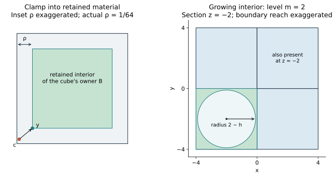

*Figure 8. Two-dimensional sections of the interior estimates. Left: moving
each coordinate by at most $\rho$ reaches retained material; in three
dimensions the distance bound is $\sqrt3\rho$. The inset is exaggerated.
Right: the negative-octant cube inside an enlarged chair supplies a growing
ball, used in Section 7.2. The plotted circle is a central section of that
ball, not a claim that a disk alone proves three-dimensional coverage.*

Finally, all eight ports on an exposed unit face have cap mates. Each mate
owns the same outward cube, so unique ownership makes them ports of the
same neighboring tile. The recovered cap frames and opposite keys give
exactly the whole-panel rules of Section 3. We have passed from arbitrary
placements to one common grid, one handedness, and the legal matching model.

**A further issue for physical symmetries.** Describing a physical tile by
$(t,R)$ must not secretly assign it several different decorated orientations.
The flat boundary pieces have exactly three perpendicular normal directions.
In each direction their planes occur at levels $-1,0,1$. A self-isometry
must permute these plane families and preserve their middle planes, whose
intersection is the origin. Its translation is therefore zero, and its
matrix belongs to the 48 signed coordinate permutations. Testing the
keyed decoration leaves only the identity. In particular, the tile has no
reflection symmetry and is chiral. The finite test is sufficient only
after the preceding geometric restriction on self-isometries.

Now let a physical symmetry $g(x)=Ax+b$ send a tile placed at $(t,R)$
to one placed at $(s,S)$. Absence of nonidentity tile self-isometries gives
$A=SR^{-1}$ and $b=s-At$. To see why, call the two placement maps
$f(x)=t+Rx$ and $j(x)=s+Sx$. The composition $j^{-1}\circ g\circ f$
maps the reference tile onto itself. It must therefore be the identity,
giving $AR=S$ and $At+b=s$. This is precisely where the absence of tile
self-symmetries matters. The common-grid registration makes $R,S$
proper cubic frames and $t,s$ integral, so $A$ is a proper cubic frame
and $b$ is integral too. Thus each physical symmetry induces a proper
grid symmetry of the placement set, to which Section 6 applies.
This is the extra connection beyond proving the proper-grid theorem. The
[dependency table](PROOF_STATUS.md) keeps registration, faithful symmetry
transport, and Lean grid results separate.

The [triangular-port report](../strong/PORT_SIMPLIFICATION.md) records the
new coordinate audits and the transfer from the earlier square-port
argument. The original [geometric scrutiny](../strong/review/GEOMETRIC_GRID_SCRUTINY.md)
remains evidence about that earlier design. Neither certifies triangulated
or printed replacements of the exact surfaces.

Tsiokos's Chair44 realization uses square pyramids instead. Its proof must
handle their extra symmetries and exclude additional off-grid placements.
Our [comparison](../strong/review/CHAIR44_PROOF_COMPARISON.md) explains the
different routes to the same discrete contact system.

## 7.2 Does even one infinite tiling exist?

If no tiling existed, the statement “every tiling has no period” would be
vacuously true. We need an independent existence argument.

**Build legal finite patches.** Replace an enlarged chair by the eight-child
pattern and repeat. Besides the carrier partition, this requires checking
that interfaces remain legal as adjacent parents are substituted. The
finite substitution-contact closure checks do precisely that: internal
child contacts fit, and the contacts appearing across substituted parent
interfaces stay within the checked set. Induction therefore gives a legal
patch with coarse support $2^mL$ at every level $m$. This is a construction
of particular patches; Section 4 separately proves what arbitrary legal
tilings must do.

**Find a growing ball inside each patch.** The support $2^mL$ contains the
entire cube $[-2^m,0]^3$. Its center is

$$c_m=(-2^{m-1},-2^{m-1},-2^{m-1}).$$

The distance from this center to each of the cube's faces is $2^{m-1}$.
The curved boundary deviates from the carrier by at most $h$; internal
matched bumps and recesses fill complementarily. Hence the actual patch
contains the open ball about $c_m$ of radius

$$r_m=2^{m-1}-h.$$

These radii tend to infinity. For $m\ge1$, translating by $-c_m$ is an
integer translation. We now have legal patches covering arbitrarily large
balls centered at the origin. They need not be nested or agree with each
other.

**Select consistent windows.** Write $W_n=[-n,n]^3$. Record the presence
or absence of every possible grid placement whose carrier meets $W_n$.
Only finitely many such placements exist: the orientation has 24 choices
and a bounded chair can meet the window only from a bounded set of integer
origins. We record complete placements, including portions outside the
window, rather than cutting boundary tiles into new shapes.

For each fixed $n$, take patches whose covered ball includes $W_n$ and a
margin greater than a tile diameter. There are finitely many possible
records in $W_n$. Among infinitely many patches, at least one record occurs
infinitely often: otherwise finitely many finite occurrence sets would
contain infinitely many patches, an impossibility. Keep an infinite
subcollection with that record. Enlarge the window and repeat, always
selecting from the previous subcollection. Its old records remain fixed.

For a literal sequence, choose the $n$th retained patch from the $n$th
subcollection, with increasing original patch index. For every fixed
window, the records in this sequence eventually stop changing. Declare a
placement present in the limit when its presence eventually stabilizes.
The records are consistent across windows because the subcollections
were nested.

**Check the limit.** Any proposed overlap or mismatched contact concerns
finitely many placements in some bounded window. It would already occur
in the sufficiently late finite patches, which are legal. Every fixed
cube is covered there, and the finite list of its possible owners has
stabilized, so it still has exactly one owner in the limit. This proves
coverage as well as legality. Complementary curved interfaces, with the
separated feature boxes of the design, then realize this grid tiling by
the exact solid. The selection argument is called **compactness**; we
have used only a repeated finite pigeonhole argument to establish it here.

The expanding interior is essential. A growing collection confined to a
thin slab would not establish a tiling of all three-dimensional space.
The written estimates are in the [existence audit](../strong/review/DEPENDENCY_AUDIT.md#d-existence-explicit-expanding-balls-and-a-compactness-argument).
Existence is not yet formalized in our own Lean development.

# 8. What a physicist can learn from the hierarchy

We now change the question. So far a contact has been either exactly legal
or illegal. Real objects have manufacturing errors, may deform under force,
and need some process to put them together. Which aspects of the ideal
hierarchy remain useful under those conditions?

## 8.1 A concrete example of coarse-graining

**Coarse-graining** means replacing a group of small objects by one effective
object, keeping information relevant at a larger scale. Here eight chairs
become one effective chair with twice the linear size and eight times the
volume, and the same contact rules reappear.

In statistical physics, repeatedly coarse-graining and then rescaling to
the original size is part of **real-space renormalization**. Our hierarchy
provides a concrete geometric example of that procedure.

It is not yet a renormalization calculation for a material. We have not
specified an energy for configurations or shown how temperature and
interaction strengths transform. The proved recurrence concerns legal
configurations. An energy model is the next ingredient.

## 8.2 Allowed configurations, equilibrium, and assembly are different

Imagine softening the rules: a wrong contact is possible, but costs an
energy $\epsilon>0$. Two wrong contacts cost $2\epsilon$, three cost
$3\epsilon$, and so on. For this simple model, the total energy is

$$H=\epsilon\sum_\alpha m_\alpha,\qquad m_\alpha\in\{0,1\}.$$

Here $H$ denotes energy, $\alpha$ labels a tested local constraint, and
$m_\alpha$ is 1 when that constraint is violated and 0 otherwise. The sum
counts violations.
One explicit state space makes this precise. At each integer origin, store
24 binary variables, one for each oriented chair placement: 1 means that
placement is selected. Any assignment of these bits is a state, even if
the selected carriers overlap or leave holes. For each unit cube, impose
a local constraint that exactly one selected chair owns it. For each
possible face-neighbor pair, impose the matching constraint whenever both
placements are selected. These tests have finite range because a chair
has bounded size; only a fixed finite number involve any one lattice site.
Their zero-violation states are exactly the legal grid tilings. In the
soft model, a failed coverage or nonoverlap test also has a finite penalty.

This is a proposed soft-constraint model, not a measured interaction between
our chairs. A continuous model of physical blocks would additionally need
excluded volume, positional and orientational interactions, and a dynamics.

The tiling question concerns zero violations. At nonzero temperature the
equilibrium question concerns free energy, $F=E-TS$, where $E$ is internal
energy, $T$ is temperature, and $S$ is entropy. (Here $T$ denotes temperature,
not the tiling used in Section 1.) Entropy accounts for the number of
accessible arrangements: many defective states can compete with fewer
perfectly ordered ones. The assembly question asks whether a physical
process can reach the ordered states within the available time.

Here is a small equilibrium calculation. Consider a finite sample with
specified boundary conditions and a finite set of bit configurations $s$.
The canonical equilibrium model assigns probabilities

$$p(s)=\frac{e^{-H(s)/(k_BT)}}{Z},\qquad
Z=\sum_s e^{-H(s)/(k_BT)},$$

where $k_B$ converts temperature to energy units and the denominator $Z$
normalizes the probabilities to sum to 1. A configuration with one extra
violation has $e^{-\epsilon/(k_BT)}$ times the statistical weight of an
otherwise equally weighted configuration. Suppose a class has $M$ states,
each of energy $\epsilon$, and another class has one state of energy zero.
The ratio of their total weights is

$$M e^{-\epsilon/(k_BT)}.$$

The defective class wins this comparison if $k_BT\log M>\epsilon$.
For $M$ equally accessible states, entropy is $S=k_B\log M$, so this is
exactly the competition expressed by $F=E-TS$. In a general equilibrium
distribution, $E=\sum_s p(s)H(s)$ and
$S=-k_B\sum_s p(s)\log p(s)$; $E$ is an average, whereas $H(s)$ is the
energy of one configuration. We have illustrated the competition, not
computed the number of defective chair states or a transition temperature.
Nor does the probability formula say how long a physical assembly takes
to equilibrate: that requires a dynamics and its energy barriers.

There are related models in which directional bonding produces one-component
icosahedral quasicrystals in simulations. They illustrate the physical program,
but do not establish self-assembly for our chair. [Noya and Doye](https://arxiv.org/abs/2407.17212)

## 8.3 Nearly legal periodic states can have a small energy cost

Does excluding every perfectly legal periodic arrangement mean that periodic
arrangements must cost a substantial energy per particle? In a model with
soft penalties, the answer can be no.

Continue with the 24-bit states on a lattice just defined. Assume each constraint involves
only nearby sites and each violation has a bounded cost. Take a large legal
region of side $L$, measured in lattice spacings, and repeat its state
pattern periodically, like repeating a picture on wallpaper.
The repeated configuration may violate rules near the seams. The number
of affected constraints grows like $L^2$, while the number of sites grows
like $L^3$. Hence an upper bound on excess energy per site scales as

$$\frac{\Delta E}{N}\leq\frac{C}{L}\quad\text{for sufficiently large }L.$$

Here $N$ is the number of sites per repeated cell, $\Delta E$ is its extra
energy from violations, and $C$ is independent of $L$. Doubling the cell
size multiplies its boundary area by four and its volume by eight, so the
estimated cost per site halves. This is a boundary-to-volume argument.

To make the estimate explicit, let $r$ bound the range of any constraint
in lattice units, let at most $K$ constraints be anchored at each site,
and bound each penalty by $\epsilon_{\max}$. Away from a seam by more than
$r$, every constraint sees exactly the neighborhood it saw in the legal
patch. For integer $L>2r$, at most

$$L^3-(L-2r)^3\le6rL^2$$

sites lie in the boundary layer. Thus
$\Delta E\le6rK\epsilon_{\max}L^2$, and one may choose
$C=6rK\epsilon_{\max}$. Here $N=L^3$ counts lattice sites, not physical
particles. Bit patterns at seams can encode missing or overlapping chairs;
allowing those states with bounded cost is essential to this estimate.

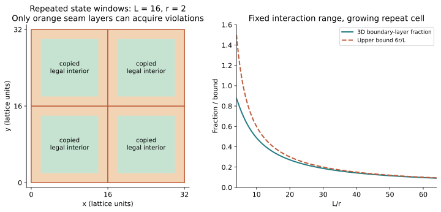

*Figure 9. Left: a two-dimensional section illustrating where violations
can occur when bit patterns are copied. Green interiors retain their legal
local neighborhoods; orange marks possible violations, not a claim that
every seam test fails. Right: the three-dimensional boundary-layer fraction
and its $6r/L$ bound. This depicts the soft lattice model, not a packing of
rigid physical chairs.*

Thus periodic approximations can have arbitrarily small violation density
without any periodic state being perfectly legal. This construction applies
to the soft discrete model; it does not produce a nonoverlapping periodic
packing of rigid chairs with hard geometric constraints.

This distinction suggests a physical question worth measuring: how much
ordering survives at a specified defect density?

## 8.4 Defects can be studied at successive scales

Introduce a wrong local contact and apply parent recognition wherever it
remains unambiguous. Repeat at the next level. Record the fraction of a
sample that can still be assigned consistent parents at each level.

If recognition remains reliable through $m$ levels, the corresponding
linear scale is proportional to $2^m a$, where $a$ is the unit-cube edge.
This provides an operational measure of hierarchical order. Whether errors
remain localized or spread across levels is a research question, not a
consequence of the ideal aperiodicity proof.

# 9. Diffraction: what would we actually observe?

One way to probe order is to scatter waves from a sample. Waves scattered
from different positions arrive with different phases. At some scattering
directions they reinforce one another, producing peaks in intensity;
at others they largely cancel. This is the basic idea of diffraction.

Nonperiodic does not mean random. Chair substitution point patterns have
established connections to sharp **Bragg peaks**, rather than only a diffuse
pattern. In the infinite ideal limit a spectrum consisting entirely of
such sharp peaks is called **pure point diffraction**.
[Lee and Moody](https://arxiv.org/abs/math/0002019)

Before writing the scattering formula, translate waves into familiar vectors.
A wave's **phase** is an angle recording its position in a cycle: a change
of $2\pi$ returns to the same point in that cycle. Represent a unit-amplitude
wave with phase $\theta$ by the planar arrow $(\cos\theta,\sin\theta)$.
Arrows add like ordinary two-dimensional vectors. The measured intensity
in this model is the squared length of their sum.

Complex numbers are a compact notation for these arrows. Write the vector
$(a,b)$ as $a+ib$, where $i^2=-1$. Euler's notation
$e^{i\theta}=\cos\theta+i\sin\theta$ describes the same unit arrow.
Its **complex conjugate** reverses the second coordinate:
$\overline{a+ib}=a-ib$. Multiplication then gives the squared length,
$(a+ib)(a-ib)=a^2+b^2=|a+ib|^2$.

A **wavevector** points along a wave's direction of travel and has length
$2\pi/\lambda$, where $\lambda$ is the wavelength. Moving by a vector $d$
changes a plane wave's phase by the dot product of its wavevector with $d$.
Scattering compares incoming and outgoing waves, so their wavevector
difference $q$ determines the relative phase $q\cdot d$ between markers
separated by $d$. This converts spatial positions into the arrows we add.

For a sample with $N$ idealized point scatterers at positions $r_j$, we can
sum the scattered waves and take the squared magnitude. Dividing by $N$
gives a convenient intensity per scatterer, often written as a structure
factor:

$$S(q)=\frac1N\left|\sum_{j=1}^N b_j e^{i q\cdot r_j}\right|^2,$$

Here $q$ is the change in wavevector between incoming and outgoing waves,
and $b_j$ is the scattering amplitude of marker $j$. The factor
$e^{i q\cdot r_j}$ records its phase. If all amplitudes equal 1 and all
phases agree, the sum is $N$, so $S(q)=N$: a strong peak. If phases differ,
the waves can cancel. A finite sample broadens peaks; it cannot show
infinitely sharp peaks or certify an infinite aperiodicity property.

**Two-point example.** Place equal markers at $r_1=0$ and $r_2=d$, with
$b_1=b_2=1$. Using $e^{i\theta}=\cos\theta+i\sin\theta$ and taking the
complex conjugate to compute a squared magnitude gives

$$S(q)=\frac12(1+e^{iq\cdot d})(1+e^{-iq\cdot d})
=1+\cos(q\cdot d).$$

If $q\cdot d$ is an even multiple of $\pi$, $S=2$: the waves reinforce.
For an odd multiple, $S=0$: they cancel. This calculation is the basic
ingredient of the many-point formula. More generally, for real $b_j$,
expansion gives $S(q)=N^{-1}\sum_{j,k}b_jb_k e^{iq\cdot(r_j-r_k)}$.
The intensity therefore probes pair separations weighted by the actual
scattering contrast. It does not read a substitution rule directly.

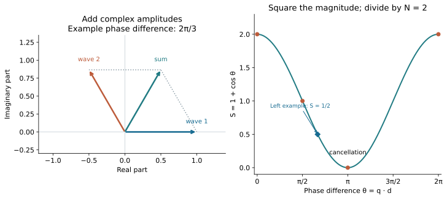

*Figure 10. Two-point interference. The arrows on the left are complex
amplitudes, not spatial displacement vectors. The plot on the right follows
from their squared sum and describes two markers, not a simulated diffraction
pattern of the full chair tiling. The highlighted point at $2\pi/3$ has
$S=1/2$ and corresponds to the particular arrow sum on the left.*

**Check your understanding:** Exercise 17 uses this same two-marker formula.

There is a crucial experimental detail. If homogeneous blocks of identical
density fill space perfectly, with no density change at their interfaces,
their combined bulk density is constant. A density-sensitive probe cannot
see the abstract partition into chairs. A finite sample still scatters from
its outer boundary, but that does not reveal the internal tiling.

To observe the order, use physical contrast: for example, an identical
embedded marker at a fixed position in each chair, an interface coating, or
an orientation-dependent material response. Then calculate the structure
factor for that actual observable. The intensity pattern depends on the
chosen decoration; some peaks may vanish.

The chair's repeated factor of two points toward **limit-periodic** order:
roughly, an arrangement described through periodic patterns on successively
larger scales, without one period common to the entire limiting pattern.
For the chair hierarchy, the relevant scales double repeatedly. It should not
be identified automatically with the familiar fivefold or icosahedral
quasicrystals. Aperiodicity alone determines neither a diffraction pattern
nor a photonic or acoustic band gap.

Doubling by itself is also insufficient to prove limit-periodicity or
pure point diffraction. It describes how lengths change, not how all
large-scale phases and orientations correlate. The diffraction results
for particular chair substitution point sets require additional analysis
of those sets. Applying them to our observable would require identifying
the point set, its weights, and the relevant tiling class. For example,
a marker depending on tile orientation is a different weighted point set
from an unweighted lattice of carrier-cube centers.

# 10. Bringing the rules to a 3D printer

To build a sample, we must return to the features that enforce its contacts.
The exact surfaces were chosen to make a geometric proof possible. A printer
introduces a different requirement: contacts must remain distinguishable
despite finite resolution and dimensional errors.

## 10.1 Move and enlarge the ports while preserving the rules

The curved bumps and recesses used as ports are called **caps** in the
construction. Let $a$ be the physical unit-cube edge; it is unrelated to
the position offsets $\alpha,\beta$ in Section 7. In the recorded triangular
candidate, each footprint has perpendicular legs $a/32$ and $a/64$.
Its two absolute peak depths are $a/4096$ and $2a/4096$.

Those dimensions are not an intrinsic cost of enforcing the rules. Recall
Step C: common offsets cancel from the position-matching equation. We can
therefore move the ports and enlarge them, provided their modified regions
remain separated and enough interior material is retained.

One checked choice, in unit-cube coordinates, is

$$\alpha=-1/4,\qquad \beta=7/32,$$
$$w=3/16,\qquad \delta=1/16,\qquad h=2\delta=1/8.$$

Keep the same triangle profile and signed keys. The width is twelve times
the recorded value, and both depths are 256 times larger. All 13,312
opposite-key frame matches give exactly the same neighboring placement as
before. The separation argument below lets the same fine and full parent
contact rules transfer to these dimensions.

At the **same** physical unit-cube edge $a=25$ mm:

| Quantity | Recorded candidate | Relocated candidate |
|---|---:|---:|
| Carrier span along each axis, $2a$ | 50 mm | 50 mm |
| Long triangle leg | 0.78125 mm | 9.375 mm |
| Short triangle leg | 0.390625 mm | 4.6875 mm |
| Smaller absolute peak depth | 0.00610 mm | 1.5625 mm |
| Larger absolute peak depth | 0.01221 mm | 3.125 mm |
| Difference between peak depths | 0.00610 mm | 1.5625 mm |

The carrier span excludes protruding caps. The recorded depth distinction
is about six micrometers. If we insisted on its fixed proportions, increasing
that distinction to 0.2 mm by uniform scaling would require $a=819.2$ mm.
The relocated example shows why that calculation is **not a lower bound on
the size of a physical demonstrator**. It changes the feature proportions
while keeping the carrier scale and contact rules. Exercise 5 compares
the two choices.

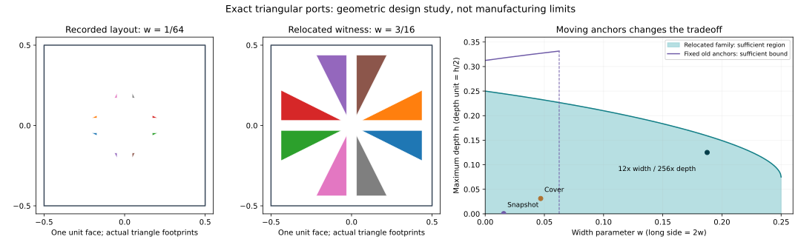

*Figure 11. Left and center: actual footprints on a unit face, at the same
scale; colors distinguish port slots, not depth levels. Right: a sufficient
region for the relocated family described below. The purple curve concerns
the old fixed anchors; its vertical cutoff is not a design-wide width limit.
The marked larger candidate has $w=3/16$ and $h=1/8$ and is depicted in the
[current relocated cover](figures/aperiodic-chair-cover-relocated.md).
The point labelled “Cover” instead denotes the [earlier triangular cover](figures/aperiodic-chair-cover-triangular.md),
with its 3× width / 64× depth display enlargement. Neither image is a fabrication trial.*

### Width: use the available face area

With the original anchors fixed, two triangle bases meet at $w=1/16$.
That is a limitation of those positions. Instead, consider

$$\alpha=-1/4,\qquad \beta=1/8+w/2,\qquad 0<w<1/4.$$

In local face coordinates the reference triangle lies in the wedge
$x\le-y\le0$. Writing $\epsilon=1/8-w/2>0$, its points satisfy
$y\ge\epsilon$ and $x+y\le-\epsilon$. Its distance from the nearest
outer face edge is at least $1/4-w>0$. The eight square-symmetry images
therefore stay separated from each other and from the face edges.
Our larger example is the member with $w=3/16$.

Widths can approach $1/4$, sixteen times the recorded value, while retaining
positive gaps. The upper bound follows from reflection: a triangle crossing
a reflection axis overlaps its reflected image. Each of the eight orbit triangles must
therefore fit into one 45-degree wedge of the square face. Checking the eight
relative orientations of the fixed 1:2 right triangle gives maximum widths
$1/6$ or $1/4$. Thus $1/4$ is the supremum **for this specified placement
family**; arbitrary independent placements or different footprints are not
covered by that bound. The endpoint has touching seams, so our example uses
strictly smaller width.

### Depth: follow the curve rather than its enclosing box

Let $d(q)$ be a support point's distance to the nearest edge of its unit
face. A useful sufficient condition is

$$h\psi(q)<d(q),\qquad h<1/2.$$

Enclose each modification in the curved region $|s|\le h\psi(q)$.
Parallel grid faces are at least 1 apart, while their combined normal reach
is at most $2h<1$.
For perpendicular faces, a common point would have distances $|s_A|,|s_B|$
from their planes. In face A, the distance to the other integer grid plane
is at least the distance $d(q_A)$ to the nearest face edge. Thus

$$|s_A|\le h\psi(q_A)<d(q_A)\le|s_B|.$$

Viewing the same point from face B gives the reverse strict inequality,
$|s_B|<|s_A|$, a contradiction. Same-face separation was already
established above.

The profile vanishes at the triangle edges, precisely where the available
space may be smallest. Replacing it by a box of constant height loses this
information. In the larger example the face-edge margin is $1/16$, less
than the maximum height $1/8$, so the old box estimate would reject it.
The actual profile satisfies the stronger, useful estimate

$$d(q)-h\psi(q)\ge5/256>0.$$

The [dimension study](../strong/PORT_DIMENSIONS.md) proves this over the
entire triangle with an exact polynomial inequality, not by checking sample
points. It also checks connected interior and the retained balls used in
Step E. The shaded region in Figure 11 comes from the same type of sufficient
condition. Its boundary is **not a necessary depth limit**: failure of that
estimate would not itself demonstrate a collision, and the best joint choice
of offsets, width and depth has not been determined.

For comparison, the earlier square cap has width $a/32$ in both directions
and the same $a/4096$ spacing at its center, with displacement bound
$141a/35840$ (about 0.09835 mm at this scale). The new support occupies a
quarter of the old square's area **at the same $w$**. This comparison should
not be confused with the relocated candidate's twelvefold increase in $w$.
The larger candidate removes the recorded example's microscopic depth
requirement. It still needs tests of dimensional error, mating clearance,
surface approximation and assembly paths before it becomes a manufacturing
design. The recorded snapshots and the cover retain their own dimensions.

## 10.2 Encode identity with separated features

A candidate replacement is a shallow array of broad tabs and pockets with
chamfered entrances, meaning beveled edges that help guide the parts together.
Use distinct spatial patterns at one or a few easily resolved heights.
The two-depth result changes the design objective: there is no need to
preserve twelve original identifiers separately. We need to preserve the
permitted and forbidden complete contacts, including their orientations
and exclusions of shifted matches.

For example, one binary symbol could occupy two positions:

```text
symbol 0:   tab      pocket
symbol 1:   pocket   tab
```

Its intended partner has the complementary relief in the aligned contact
coordinates. A wrong symbol then creates tab–tab interference at one
position. This is an example of encoding a distinction in position. It
does not prescribe one binary pair per old key: whole-panel A/B/C patterns
may admit a more economical implementation. The exact triangular example
already uses spatial arrangements of two depths to preserve the rules.
Section 10.1 enlarges that exact curved design. Broad tabs and pockets are
a further possible change, whose geometry would need its own analysis.

This is only a coding idea. A useful design must also distinguish rotations
and reflections, prevent lateral bypass, leave enough retained material,
and avoid accidental partial engagement. We should compare whole-panel
encodings of A/B/C against replacing every existing port separately.

Correctly reproducing the aligned contact table would reuse much of the
discrete reasoning. Establishing an exact physical monotile would additionally
require a new argument about arbitrary Euclidean placements.

A triangular pyramid may look like an obvious printable substitute for
the curved triangle, but it changes that argument. A small patch inside
one planar facet can slide along the facet and still coincide. Thus the
open-patch rigidity proof in Section 7 no longer applies. Polyhedral
interfaces can still work with a different registration argument, as in
Chair44; this is a proof obligation, not an impossibility result.

## 10.3 Tolerance and assembly are part of the design

**Clearance** is a small intentional gap between mating surfaces. It helps
real parts fit, but also admits motion and can weaken contact
discrimination. The useful test is whether intended pairs seat reproducibly
while unintended pairs remain distinguishable over a stated range of errors
and applied forces. Printer tolerances depend on material, orientation,
geometry, settings, and calibration. [Prusa's design guidance](https://help.prusa3d.com/article/modeling-with-3d-printing-in-mind_164135)

A collision-free final arrangement need not have an accessible assembly
path. A piece may be blocked by neighbors before reaching its final position.
Check insertion paths and disassembly as well as static fit.

A practical progression is:

1. Print **contact coupons**: small samples of correct and incorrect interfaces,
   including wrong orientations, at several clearances.
2. Measure seating gaps, assembly force, repeatability, and wear.
3. Print eight identical chairs and assemble one parent group.
4. Build a 64-chair patch to display two hierarchy levels.
5. Introduce controlled defects and measure recognition at each level.

Record printer settings and failed fits as carefully as successful ones.
This first object would be an experimental matching-rule demonstrator. Its
value does not depend on claiming that a finite, imperfect assembly proves
an infinite-space theorem.

# 11. What has been established, and where to read more

The chair hierarchy has substantial prior history. Goodman-Strauss used
chair recognition in [*A Pair of Aperiodic Tiles in Eⁿ*](https://strauss.hosted.uark.edu/papers/NDimPair.pdf).
The recent [Chair44 preprint](https://zenodo.org/records/22792358) by Ioannis
Tsiokos uses the same discrete decorated system as ours after coordinate
conversion and key relabelling. Its square-pyramid solid differs from our
curved solid. Our comparison does not settle private discovery chronology
or establish independent invention.

| Layer | Status in this project |
|---|---|
| Finite contacts and substitution data | Exact computational checks with preserved witnesses |
| Two-depth triangular cubic candidate | Same fine and full parent contact sets checked by separate implementations; written local rigidity and registration transfer; no new real-geometry Lean proof |
| Relocated, larger triangular ports | Exact packing, unchanged frame-map and curved-clearance checks; written transfer of the contact rules; width bound restricted to the stated family, depth conditions sufficient; no manufacturing trial or new Lean theorem |
| Universal grouping, legal deflation, and translation exclusion | Lean proofs for our defined proper integer-grid tiling model |
| At most 24 proper grid symmetries | Lean proof for every legal tiling in that same model; does not presume finiteness |
| Existence and arbitrary-placement bridge for the curved designs | Written arguments; triangular variant uses the preserved grid system and a new local rigidity proof; outside the completed Lean development and awaiting mathematical review |
| Chair44 square-pyramid solid | Pinned Lean build and fresh axiom audit reproduced; theorem includes existence and finite symmetry for arbitrary physical tilings |
| Printable replacement interfaces | Proposed direction; no validated replacement or printing experiment yet |

It helps to separate three kinds of evidence. A finite calculation checks
the configurations it actually enumerates. A proof shows why its conclusion
holds for every object satisfying specified assumptions. A formal proof
expresses those steps in a language a proof assistant can check.

## Optional detail: what must we trust in a computer-checked proof?

Lean checks a precisely stated formal theorem. We must still inspect whether
its definitions describe the intended geometric object and whether the
assumptions match the claim being communicated. Our grid audit reports the
standard logical axioms and no native-evaluation hooks. A **native-evaluation
hook** allows a finite calculation executed by compiled code to supply a
result to the proof; this requires trusting that execution as well as the
proof checker. The reproduced Chair44 endpoint uses 21 disclosed hooks.
Its release control suite also has a packaging failure: a historical comparison archive is
missing. That is distinct from the successful proof compilation. See the
[build record](../strong/review/CHAIR44_BUILD_REPRODUCTION.md).

Neither this tutorial nor the internal AI reviews constitute independent
human mathematical review.

## Further reading and a reproducible calculation

For a next reading step:

- **Inspect the earlier object:** open the [offline chair viewer](../strong/artifacts/recut-chair.html)
  directly in a browser. Its mesh shows the square-port reference, not the
  triangular candidate. See the [new shape comparison](../strong/PORT_SIMPLIFICATION.md)
  and [exact triangular snapshot](../strong/audit/triangular_v1/README.md).
- **Follow the local argument:** [three-pattern grouping](../strong/MOTIF_GROUPING.md).
- **Follow the formal proof:** [Lean project guide](../formal/README.md) and
  [legal deflation](../formal/LEGAL_DEFLATION.md),
  [translation exclusion](../formal/TRANSLATION_EXCLUSION.md), and
  [the grid-symmetry bound](../formal/GRID_SYMMETRY.md).
- **Follow the geometric proof:** [triangular-port argument](../strong/PORT_SIMPLIFICATION.md)
  and the earlier [square-port registration manuscript](../strong/review/CURVED_GRID_NOTE.md).
- **Follow the information through grouping:** [symbolic recurrence and two-depth recoding](../strong/INFORMATION_TRANSFER.md).
- **Explore the design freedom:** [movable anchors, width/depth bounds and reproducible larger candidate](../strong/PORT_DIMENSIONS.md).
- **Check the exact scope of each claim:** [current dependency table](PROOF_STATUS.md).
- **Compare physical realizations:** [Chair44 proof comparison](../strong/review/CHAIR44_PROOF_COMPARISON.md).
- **Explore physics:** the Lee–Moody diffraction paper and Noya–Doye assembly
  paper linked above address different aspects of order without periodicity.

To reproduce the finite grouping check, run from the repository root:

```sh
uv sync --locked
uv run --locked python strong/audit/motif_grouping.py
```

This command regenerates its research evidence. It checks the stated finite
grouping certificates; it does not test a printed object or establish the
continuous geometric bridge. Full Lean reproduction additionally requires
the pinned toolchain described in the Lean project guide.

For the new shape's symbolic and finite geometric checks, run:

```sh
uv run --locked python strong/audit/simplify_ports.py
node strong/audit/crosscheck_triangular_ports.cjs
```

These check the snapshot and the finite inputs to Section 7.1. The argument
quantifying over arbitrary surface coincidences remains written mathematics.

# 12. Exercises

The numbering preserves the original introductory questions. To follow the
chapter's learning sequence, use this route; the invitations in the text
mark the main places to pause.

| After reading | Exercises |
|---|---|
| Section 2: carrier and substitution | 1, 2 |
| Section 3: handshakes and enumeration | 8, 18 |
| Section 4: parent rule, partition, parity | 9, 10, 11 |
| Section 5: periods | 3, 4 |
| Section 6: symmetry | 12 |
| Section 7: curved geometry and existence | 13, 19, 14, 15 |
| Section 8: statistical weights and seam costs | 16, 7 |
| Section 9: scattering | 17, 6 |
| Section 10: printing scale | 5 |

1. **Count the boundary.** Explain why the seven-cube chair has 24 exposed
   unit-square panels, the same count as the original $2\times2\times2$ cube.
2. **Count a hierarchy.** How many elementary chairs are in a level-three
   group? What are its carrier volume and linear scale in unit-cube units?
3. **Exclude a period.** An alleged grid period is $(24,-8,0)$. Apply the
   deflation argument until you obtain a contradiction.
4. **Identify the missing premise.** Why is “this patch has an eight-chair
   decomposition” insufficient to show that every tiling is aperiodic?
5. **Compare two routes to larger features.** What unit-cube edge makes the
   two peak depths differ by 0.1 mm if the recorded proportions stay fixed?
   Repeat for the relocated candidate with $\delta=1/16$. At $a=25$ mm,
   calculate its long and short triangle legs and its two depths. Explain
   why neither calculation establishes a minimum printable block size,
   and why reducing the number of depth levels alone does not change the
   recorded candidate's scale requirement.
6. **Interpret scattering.** Two assemblies have the same outer boundary and
   uniform density, but different invisible internal tile partitions. Does
   their continuum density scattering distinguish the partitions?
7. **Energy versus legality.** If a periodically repeated discrete patch has
   seam energy $6\epsilon L^2$ and $L^3$ sites, what happens to its energy per
   site as $L$ grows? Does this make it a legal exact tiling?
8. **Read a handshake backwards (Section 3).** Suppose A meets A with
   $U_2=n_1\times U_1$ and $n_2=-n_1$. Prove that the second panel's
   rule asks for $U_1=n_2\times U_2$. Use that $U_1$ is perpendicular
   to the unit vector $n_1$.
9. **Find the forced center (Section 4.2).** Let $Q$ have no trigger and
   have a same-orientation notch owner $P$ at $(1,1,1)$. Write down the
   three candidates for its positive-$x$ outer face, explain two rejections,
   and transform the survivor into $P$'s coordinates.
10. **Turn a rule into a partition (Section 4.3).** Suppose every tile selects
    one center, belongs to that center's eight-tile group, and every member
    of a center's group selects that center. Prove that distinct groups
    cannot share a tile. Which hypothesis is missing if we only know that
    every tile occurs in some eight-tile group?
11. **Propagate parity (Section 4.4).** A path through unit cubes encounters
    group origins $a_0,a_1,\ldots,a_n$, with repeats allowed. Show that even
    consecutive differences imply $a_n-a_0\in2\mathbb Z^3$. Explain why
    grouping without contact recurrence would not establish this premise.
12. **Cancel orientations (Section 6).** If $g(x)=Rx+t$ and $h(x)=Rx+s$,
    calculate both $g\circ h^{-1}$ and $h^{-1}\circ g$. Why does translation
    exclusion make $g=h$ despite the different formulas?
13. **Locate the information (Section 7.1).** Evaluate the barycentric
    coordinates at the centroid $(-1/3,-2/3)$ and compute $X_u,X_v$ there.
    Why do zero slopes not lose the ordered-axis information? What would
    go wrong with an isosceles right-triangle footprint and the same
    barycentric product? Is the old anchor $(u,v)=(0,0)$ on the curved cap?
14. **Exclude an extra component (Section 7.1).** Identify the roles of
    $h<\rho$ and $\sqrt3\rho<1/4$ in the clamping argument. Check them
    for the recorded $h=1/2048$, $\rho=1/64$ and the larger candidate's
    $h=1/8$, $\rho=1/7$. Why would carrier coverage alone, without a
    retained-material estimate, be insufficient?
15. **Select a limit (Section 7.2).** Suppose patches cover balls of radius
    tending to infinity but alternate between different records in $W_1$.
    Explain how the selection procedure fixes this. Must the recentered
    finite patches themselves form an increasing sequence of sets?
16. **Compare statistical weights (Section 8.2).** A class of ten states
    has energy $\epsilon$ per state; one competing state has energy zero.
    At what temperature do these two classes have equal total canonical
    weight? Does this comparison predict an assembly time?
17. **Derive interference (Section 9).** Two unit-amplitude markers are
    separated by $d$. Compute $S$ when $q\cdot d=0,\pi/2,\pi$.
    Explain why a missing peak need not mean missing positional order.
18. **Align a face pair (Section 3.1).** The fixed face has center
    $f_a=(-1,-1/2,-1/2)$ and normal $n_a=(-1,0,0)$. A face on the
    other chair has $f_b=(1/2,1/2,-1)$ and $n_b=(0,0,-1)$. For
    $R(x,y,z)=(-z,y,x)$, check the normal condition and compute the
    translation aligning their centers. Does this alone prove the contact
    legal? Why does enumerating rotations and aligned face pairs find
    every possible grid face-contact?
19. **A factor from a graph (Section 7.1).** Set $a=u^2$ and
    $F(u,z)=z^2-u^4$. Check $F(u,a)=0$ and factor $F$ as $(z-a)G$.
    Do $F=0$ and $z-a=0$ describe the same set? Compare their total degrees
    and explain the purpose of the equal-degree condition in Step B.

Exercises 8–15 test the steps needed for the main proof. For a longer
project, reconstruct the finite contact census from Figure 3 and the recipe
in Section 3.1, and reproduce one row of the forced-neighbor table. Compare
individual placements and exclusion witnesses, not just the final counts.

## Answers and hints

1. The original cube has six sides with four panels each. Removing a corner
   loses three exterior panels but exposes three previously internal ones:
   $24-3+3=24$.
2. $8^3=512$ chairs; carrier volume $7\times512=3584$; linear scale factor
   $2^3=8$ relative to one chair. Its bounding cube therefore has edge 16.
3. The successive periods are $(12,-4,0)$, $(6,-2,0)$, and $(3,-1,0)$.
   The last vector is not even, but every legal tiling's period must be even.
4. We need every legal infinite tiling to have an intrinsic, unique grouping,
   and its deflation to remain legal, so that periods preserve the grouping
   and the argument can be repeated. Existence is a separate obligation.
5. $a/4096=0.1$ mm gives $a=409.6$ mm, with carrier span $819.2$ mm.
   For the relocated proportions, $a/16=0.1$ mm gives $a=1.6$ mm and a
   carrier span of 3.2 mm. At $a=25$ mm its legs are $3a/8=9.375$ mm
   and $3a/16=4.6875$ mm; depths are $a/16=1.5625$ mm and
   $a/8=3.125$ mm. These are dimensional calculations, not printer tests
   or minimum-size proofs. Keeping the old depth unit while reducing the
   number of levels alone leaves the first calculation unchanged.
6. No, under these idealized assumptions the density fields coincide.
   Introduce a physically observable contrast to distinguish them.
7. It is $6\epsilon/L$, which tends to zero. The seams may still violate
   constraints for every finite $L$. Small energy density is not exact legality.
8. Use $a\times(b\times c)=b(a\cdot c)-c(a\cdot b)$:
   $(-n_1)\times(n_1\times U_1)=U_1$, since
   $n_1\cdot U_1=0$ and $n_1\cdot n_1=1$.
9. The candidates are $D_{+--}$ and the two origin-$(2,0,0)$ placements
   with rotations $(-x,z,y)$ and $(-y,x,z)$. The first contradicts the
   no-trigger premise, the second creates C/C, and the third becomes
   origin $(1,-1,-1)$ with rotation $(-y,x,z)$ relative to $P$.
   This is a trigger at $P$.
10. A shared tile would have to select both centers, contrary to the
    single-valued parent rule. Merely occurring in some group supplies
    neither a unique selection nor the consistency of every group's members.
11. Sum the differences:
    $a_n-a_0=\sum_{i=0}^{n-1}(a_{i+1}-a_i)$. Each summand is twice an
    integer vector. The local even-offset premise comes from the full
    group contact list, not from the number or volume of children.
12. They are $x\mapsto x+t-s$ and $x\mapsto x+R^{-1}(t-s)$.
    Both preserve the tiling, so their translation vectors vanish.
    Since $R$ is invertible, either conclusion gives $t=s$.
13. All three weights are $1/3$. At this point $\psi_u=\psi_v=0$, so
    $X_u=wU$ and $X_v=wV$. The unequal triangle sides, recovered from
    the continued surface's three lines, distinguish the directions even
    though the tangent plane at the peak is parallel to the base plane.
    An isosceles right triangle admits a reflection exchanging its legs;
    the product of the barycentric coordinates respects that reflection.
    At $(0,0)$ the weights are $1/2,1,-1/2$, so this anchor lies outside
    the triangle on the unchanged flat panel, not on the curved cap.
14. The condition $h<\rho$ puts the clamped point $y$ in retained material
    inside $B$. Each coordinate moves by at most $\rho$, so
    $\sqrt3\rho<1/4$ keeps it inside $A$'s ball as well. For the recorded
    choice, $1/2048<1/64$ and $3/4096<1/16$. For the larger one,
    $1/8<1/7$ and $3/49<1/16$. Carrier ownership alone does not guarantee
    material at a point removed by a recess.
15. Some record occurs infinitely often; retain only its indices. Repeat
    within that subsequence for each larger window. The selected patterns
    agree on old windows, but the original or selected whole patches need
    not be nested.
16. Solve $10e^{-\epsilon/(k_BT)}=1$, giving
    $T=\epsilon/(k_B\log10)$. Transition rates and barriers do not occur
    in this weight comparison, so it supplies no assembly time.
17. From $S=1+\cos(q\cdot d)$, the values are $2,1,0$.
    Cancellation at the last phase is caused by the separation itself;
    destructive interference is compatible with precise positional order.
18. $Rn_b=(1,0,0)=-n_a$ and $Rf_b=(1,1/2,1/2)$, so
    $t=f_a-Rf_b=(-2,-1,-1)$. We still need to exclude carrier overlap
    and check every shared panel's pattern and arrows. Any actual grid
    face-contact has a rotation and at least one aligned unit-face pair;
    that pair recovers its translation, so it appears in the enumeration.
19. $F=(z-u^2)(z+u^2)$, so $G=z+u^2$. The second factor contributes
    the additional graph $z=-u^2$. Here $F$ has total degree 4 and each
    factor has degree 2: divisibility alone does not give identical zero
    sets. In Step B both defining polynomials have degree 3, leaving only
    a nonzero constant as the other factor.

# The lessons to keep

- Local geometry can encode information that controls organization at every scale.
- The needed distinctions can be distributed across a pattern; twelve distinct depths are not essential.
- Port positions and dimensions can change while preserving those distinctions; geometric separation must be checked for the new choice.
- The ability to build a hierarchy is weaker than forcing every tiling to have one.
- Recognizable grouping turns a global symmetry question into an integer-divisibility argument.
- The geometric bridge from freely moving solids to a discrete model deserves its own proof.
- Exact constraints, thermal stability, and assembly kinetics answer different questions.
- A physical measurement must couple to a real feature of the arrangement.
- A printable realization requires a tolerance and assembly study, not just an STL export.

The central experimental opportunity is to ask how much of that hierarchy
survives when exact local rules become imperfect physical contacts.
