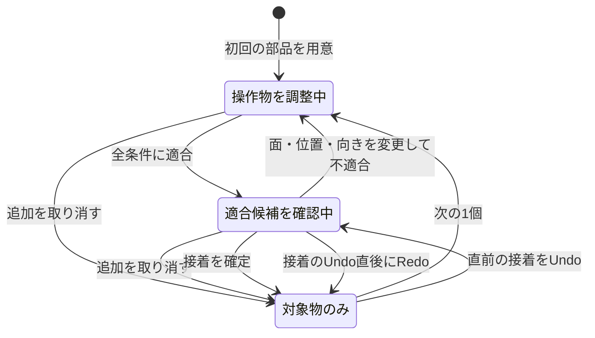
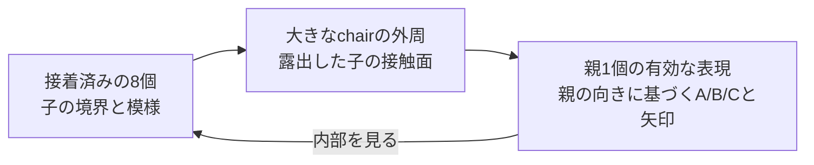

# インタラクティブ組立教材 — 仕様たたき台

作成: 2026-09-17。状態: **目標仕様。基本操作の試作あり。**
試作は [assembly.html](assembly.html)。実装した範囲と簡略化は[試作ノート](assembly/README.md)を参照。
改訂: プレイヤーのUXを優先する見直しを反映。初回の案内、候補選択、履歴、情報の段階表示、階層の閲覧を具体化した。
[自己レビューと独立AIレビューの記録](INTERACTIVE_ASSEMBLY_REVIEW.md)に、指摘と対応を保存する。

この文書は、チュートリアルに組立操作と階層の往復を加えるための仕様案である。
ユーザーと合意した方向、推奨する初期仕様、今後試して決める事項を区別する。
画面文言は日本語で例示する。公開チュートリアルに合わせた英語版の文言は実装時に用意する。

## 1. 目的と合意した方向

学習者が、同じchairを接続しながら、面の規則、複数面の同時制約、8個の親子対応を理解する。
「自分で条件を確かめて組む → 親が現れる → 同じ規則で次の階層を組む」を中心の体験とする。
対象読者は、この構成を初めて見る学部生。座標式を入力したり、全24面の模様を暗記したりせずに始められる。

設計判断では、次の操作が分かること、意図せず組立が壊れないこと、失敗から戻れることを最優先にする。
必要な説明は操作した箇所に短く表示し、詳しい数学はプレイヤーが求めたときに開く。
機能を増やす前に、初見のプレイヤーが最初の接着と最初の親を作れるかを試作で確かめる。

次を、このたたき台の前提とする。

- A/B/Cと矢印の接触規則に適合するときだけ、ブロックを接着できる。
- 操作モデルは **接着済みの対象物 + 今取り付ける操作物**。接着済みの群は一体として扱う。
- 通常の移動・回転・新規取り付けでは、対象物の内部配置も接着状態も変わらない。
- 接触面を同じ座標で比較する窓を設け、接着できる理由・できない理由を見えるようにする。
- 正しい8個の群と親1個の対応を、意味が分かる表現で往復できるようにする。

「表示するのは8個まで」は全描画物の上限として採用しない。
初期仕様では **同じ階層の8個から一つの親を作る課題**を提案するが、これは教材の単位であり、
二つの物体を扱う操作モデルとは別である。輪郭、比較図、説明用の周辺配置は個数に数えない。

## 2. 用語と変えてはいけない状態

| 用語 | 意味 |
|---|---|
| 対象物 | 確定済みの連結した組立。内部のブロック間の位置・向き・接着を固定する |
| 操作物 | 取り付け中の一つの剛体。初期版では現在の階層のchair 1個。将来は組立済みの群も扱える |
| 候補表示 | 未確定の位置・向きに操作物を仮表示した状態。確定済みの組立データは変わらない |
| 接着 | 条件を満たす配置を明示的に確定し、操作物を対象物に統合する操作 |
| 親 | 規定の8個の群を一つの有効なchairとして表したもの。子の構造は保持する |
| 内部を見る | 子の境界や模様を表示すること。接着の解除や個別移動を意味しない |

不変条件:

1. 作業面には対象物が一つ、操作物が高々一つ存在する。
2. 対象物の子をクリックしても、選択・説明の対象になるだけで、勝手に操作物へ分離しない。
3. 接着は操作物全体について一括確定する。不適合な一部分だけを残すことはない。
4. 視点変更、比較窓、断面表示、親子の表示切替は、接着を変更しない。
5. 確定する配置は同一階層の格子上にあり、回転は向きを保つ24通り。鏡映は使わない。
6. 描画用アニメーションの途中の姿勢を、接触判定や保存する状態として扱わない。

接着は教材上の固定関係を指す。接着剤、摩擦、重力、実物を差し込む経路の物理シミュレーションは初期版に含めない。
最終配置が適合することと、実物を衝突せずそこへ運べることは別である。

## 3. 初回の体験と画面構成

### 3.1 二つの入口と最初の親までの案内

入口は「親を一つ作ってみる」と「自由に組んで調べる」の二つにする。
初回は前者を勧めるが、案内の完了を自由組立の利用条件にしない。
どちらも現在の階層のchair 1個を対象物として開始し、接着の判定規則は共通とする。

| 入口 | 目的と案内 | 完成の扱い |
|---|---|---|
| 親を一つ作ってみる | 最初の接触から親への置き換えまで、既知の8子構成に基づく案内を続ける | 「親の組立 3/8」と表示し、一つの親の完成を目指す |
| 自由に組んで調べる | 局所的に適合する配置を試し、必要に応じて面の説明を見る | 「接着済み3個／残り材料5個」と表示し、親を作ることを必須にしない |

最初の案内は「取り付けたい面を選んでみましょう」とする。
最初の操作物はあらかじめ用意して、面を選ぶと接触候補が現れるようにする。
以降は「次の1個」で材料を追加する。長い操作説明を読ませてから始める構成にはしない。
案内では、一度に一つの操作を提示し、既にできた説明を毎回繰り返さない。

「ヒント」は、取り付ける場所 → 比べる矢印 → 具体的な候補の順に、求めた分だけ示す。
具体的な候補を表示しても接着はプレイヤーが確定する。
接着後には、次の取り付けと、8個そろったときの親への置き換えまで案内を継続する。
次の階層では同じ操作を使い、案内の再表示は任意とする。

「接着できます」と「案内中の親を完成させる配置です」は別の情報にする。
案内から外れる局所適合接触も拒否せず、確定前に「接着できますが、案内中の完成例とは異なる配置です」と短く示す。
これは特定の完成例との照合であり、別の親や無限タイリングへの拡張を否定する判定ではない。
外れた後は、案内へ戻るためのUndoの手順、またはそのまま自由組立に切り替える選択を示す。
案内中の完成例から外れた時点で「親の組立 n/8」という進捗表示を止め、接着済み・調整中・残り材料の数に切り替える。
「案内中の完成例とは異なる配置です」と戻り方を継続表示し、Undoで完成例の部分配置に戻れば進捗表示を再開する。
別の正しい親が完成した場合は通常どおり認識し、案内例との違いだけで完成を拒否しない。

案内から自由組立への切り替えは案内設定の変更とし、対象物、操作物と下書き、材料数、階層、選択、視点、Undo/Redoをすべて保持する。
組立のUndo/Redoでは案内／自由の設定を巻き戻さない。案内の進捗は復元された配置から再計算する。
自由組立から新しい案内を始める場合は再開始として扱い、現在の組立・下書き・履歴を置き換える旨を確認する。
確認を取り消した場合は何も変更しない。内部閲覧中の切り替えは、組立に戻ってから行う。

### 3.2 画面と情報量

デスクトップでの概略:

```text
階層 0   組立 3/8                    元に戻す  やり直す  視点を戻す
┌────────────────────────┬──────────────────────┐
│                        │ 接触面を比較         │
│ 対象物 + 操作物        │ 対象の面  操作物の面 │
│                        │ A →       A ↑        │
│ 選択面と候補を強調     ├──────────────────────┤
│                        │ この面は適合         │
│                        │ 他の1面が向き違い    │
│                        │ ［なぜ？］           │
└────────────────────────┴──────────────────────┘
場所を選ぶ → 向きを調整 → ［接着する］
```

同じブロックであることが分かる外観を保ち、役割を輪郭とラベルで示す。
操作物は半透明、対象物は不透明を基本とし、状態は色だけに依存させない。
A/B/Cは文字、矢印は明瞭な方向記号として表示する。
曲面の細部は必要時に切り替え、最初は形と面の規則を読み取れる表示を優先する。

スマートフォンでは3D表示の下に比較窓と操作を置く。
失敗理由や「接着する」がホバー操作でしか現れない設計にしない。
比較窓は拡大でき、閉じた後は元の選択面へ戻る。
面・候補の選択と回転にはキーボードで操作できる一覧またはボタンを設け、
接着結果と失敗理由は読み上げ可能なテキストでも通知する。
確定後は「次の1個」、拡大窓を閉じた後は起点の操作へフォーカスを戻す。
親が完成した場合は「親にまとめる」を次の主操作として示す。
ボタンを無効にする場合は、その近くに理由と次にできる操作を表示する。

## 4. 取り付け操作

### 4.1 面を選び、向きを調整する

基本操作は自由な3Dドラッグだけに依存させない。
基本経路では、対象物の取り付けたい露出面を一つ選ぶと、操作物を接触候補の位置へ仮配置する。
毎回、操作物の裏側の面を探して選ぶことを要求しない。
自動配置は両面の中心と向かい合う法線を合わせる位置合わせの補助であり、矢印の正解を常に自動選択する機能にはしない。
候補の順序は安定させ、比較窓を開いたりカメラを動かしたりするだけで別の候補へ切り替わらないようにする。
標準経路では、選んだ対象面と組み合わせ可能な模様の面を優先表示する。AにはA、BにはC、CにはBが対応すると短く添える。
「別の面を使う」では、面の文字・矢印・chair上の位置の小図で候補を区別できる一覧を用い、
全24面を番号順に一つずつ巡ることを必須にしない。同じ配置になる候補は重複表示しない。
「すべての面を見る」で模様違いの面も調べられる。模様の一致は全体の接着成功を保証するものではなく、
矢印・他の共有面・重なりは引き続き判定する。14種の局所的行き詰まり接触をこの候補整理で除外しない。
接触面を合わせたまま、面の法線回りに90度ずつ回転できる。
「別の面を使う」で候補を切り替えられ、操作物の面を直接指定する方法も残す。
回転と面の変更によって、許されたすべての姿勢を調べられるようにする。

候補への吸着はプレビューであり、接着確定ではない。
適合候補は吸着位置として提示し、不適合な向きも「なぜ違うか」を調べられる仮表示として残す。
重なりのある仮表示は交差部分を強調し、確定できない状態であることを示す。

自由ドラッグは補助として追加可能とする。候補が複数ある場合は「前の候補」「次の候補」でも選べる。
視点を回す操作と部品を回す操作を区別し、部品の回転ボタンには対象を明記する。
部品の回転ボタンは比較窓に隣接させ、「この図で左へ90°／右へ90°」と回転矢印で方向を示す。
方向は比較窓の座標に固定し、3Dカメラを裏側へ回しても逆転しない。
左回転は対象側の外向き法線 `n₁` 回りの正の90度、右回転は負の90度に対応する。
比較窓の右向き矢印が左回転で上向きになることを、数式なしで見て確かめられるようにする。
別の共有面を説明のために比較窓へ出している間は、回転ボタンを「取り付け面に戻る」に置き換える。
この操作は比較表示を元の取り付け面へ戻すだけで、部品の姿勢・候補・カメラ・履歴を変更しない。
戻った後に左右の回転ボタンを表示する。一度のクリックで表示面の変更と回転を同時に行わない。
取り付け軸とは異なる面を見せたまま「この図で左へ90°」を実行しない。
初期版では対象物の姿勢は作業座標内で固定し、観察のための回転はカメラ側で行うことを推奨する。

### 4.2 判定と確定

接着ボタンを有効にするには、少なくとも一つの単位面を共有し、次のすべてを満たす必要がある。

- 操作物と対象物の粗いchairの内部が重ならない。
- 新しく生じる **すべての共有面** で、模様と矢印が適合する。
- 同じ階層・縮尺での配置であり、格子位置と許された回転で表される。

辺や頂点だけで触れている状態は、この教材の接着として確定しない。
選んだ面以外で、操作物が対象物の別のブロックに触れる場合も必ず検査する。

適合時は「接触3面すべて適合」のように全体の結果を示す。
「接着する」で操作物が対象物へ統合され、その後に「次の1個」を追加できる。
不適合時は理由と該当箇所を示し、対象物を押し動かしたり分解したりして解決しない。

| 結果 | 表示例 | 補助操作 |
|---|---|---|
| 模様違い | 「奥の面でCとCが接しています」 | 該当する両面を強調 |
| 矢印違い | 「B/Cは適合します。矢印を反対向きにしてください」 | 必要な矢印を破線で重ねる |
| 他面の不適合 | 「選択面は適合しています。別の接触面が不適合です」 | 接触一覧の問題箇所へ移る |
| 重なり | 「ブロックの内部が重なっています」 | 交差部分を表示 |
| 面接触なし | 「接着する面を選んでください」 | 露出面を示す |

複数の問題がある場合は全体の不適合件数を表示し、一覧は「なぜ？」から開けるようにする。
表示の都合で一件を先に説明しても、他が適合したように見せない。
混み合った箇所は透明化・断面表示で観察する。
不適合を検出してもカメラは自動で動かさない。「問題の面を見る」を押したときだけカメラを合わせ、
「元の視点に戻る」で呼び出し前の視点を復元する。対象物の内部配置や操作物の姿勢は変えない。

### 4.3 操作状態と取り消し



「追加を取り消す」は未確定の操作物だけを除去する。
接着のUndoは確定前の状態を復元し、直前に付けた操作物を一つの剛体として再び調整可能にする。
**Undo直後は、操作物が存在していてもRedoできる。**
上の図は通常の取り付けと直前の接着の往復を示す。履歴全体の規則は次の表に従う。

| 操作・状態 | 履歴の動作 |
|---|---|
| 「次の1個」で追加し、未接着の部品を調整中にUndo | その追加前へ戻す。Redoでは取消直前の候補姿勢まで復元する |
| 接着をUndo | 確定前の対象物と操作物を復元する。直後のRedoで同じ接着を再確定する |
| さらにUndo／複数回Redo | 対応する作業状態全体を順に復元する。現在の操作物へ別の操作物を追加しない |
| Undo後、部品の位置・向き・取り付け面を変更 | 別の試行として履歴を分岐し、以前のRedoを解除する。ドラッグの微小な移動を一件ずつ履歴に積まない |
| 「追加を取り消す」 | 操作物を除去する。この取消自体もUndoでき、取消前の候補姿勢を復元できる |
| 視点変更、比較窓の開閉、説明する接触面の選択、親子の閲覧 | 組立履歴を変更せず、Redoも解除しない |

履歴には部品の追加・接着・追加取消・親への集約・作業単位変更を操作単位として記録する。
候補の調整はその操作物の下書き状態として保持する。Undo後に下書きを変更した場合も、次のUndoで分岐元へ戻れるようにする。
例: 姿勢Pで接着 → Undo → 姿勢Qへ変更 → Undoなら、未接着の姿勢Pへ戻る。
そこからRedoすれば未接着の姿勢Qへ戻り、破棄済みの古い接着を実行しない。
Qへの一連の変更を一つの下書き編集としてまとめ、途中の回転やドラッグをすべて遡らせない。
どの復元でも作業状態を丸ごと切り替え、対象物一つと操作物高々一つの条件を保つ。
ここで復元する作業状態は組立・下書き・材料・作業階層であり、カメラ、説明窓、案内／自由の設定は履歴から復元しない。
初回にあらかじめ供給した操作物だけは開始状態とし、それ以前に戻る履歴はない。
ボタンには「部品の追加を戻す」「接着を戻す」「接着をやり直す」など、次の対象が分かる補足を表示する。
部品の取り付け面を変更することと、説明を見るために別の接触面を選ぶことは区別する。

任意の古い子を外す機能は、残りの群が複数に分離する場合の扱いが必要なため後続版で検討する。
初期版の修正手段は、未確定部品の調整、接着履歴のUndo/Redo、明示的な課題の再開始とする。
再開始には確認を出すが、通常の接着や親への置き換えには繰り返し確認を要求しない。

## 5. 接触面を同じ座標で見る窓

### 5.1 操作を妨げない段階表示

通常は、対象側／操作側の二つの模様と実際の矢印、選択面の適合結果だけを小さく表示する。
他の面に不適合がある場合は「他の1面が不適合」のように全体の状態も添える。
接触が未選択なら面を選ぶ短い案内を表示し、空の比較表を並べない。

| 段階 | 表示するもの |
|---|---|
| 通常 | 二つのA/B/C・実際の矢印・適合結果。3D上の選択面と同期した輪郭 |
| 「なぜ？」 | 適合／不適合の短い説明、必要な矢印を破線で重ねた図、全接触の結果一覧、「問題の面を見る」 |
| 「座標で詳しく見る」 | 共通の基底、法線の向きと記号、座標式、チュートリアルの対応箇所 |

不適合の検出だけで詳細を自動展開せず、問題箇所を強調して短い理由を示す。
詳細を開かなくても回転、候補変更、接着、取消を行える。
プレイヤーが詳細を開いた状態は候補を変更しても維持し、閉じたり開いたりを繰り返させない。
詳細説明と組立操作のボタンが画面幅によって押し出されないかを試作で確認する。

### 5.2 同じ座標で比較するための規則

選んだ接触の両面を、横並びの二つの正方形として表示する。
両者は **同じ空間方向を画面の右・上として投影** する。各面をそれぞれ正面から撮影した二枚を並べる方式にはしない。
反対側の面を表示するための暗黙の反転によって、矢印の関係が変わって見えることを避ける。

比較座標は対象側の面を基準に決め、操作物を回しても固定する。
実装上は対象側の外向き法線を `n₁`、矢印を `U₁` とし、
画面右を `e₁ = U₁`、画面上を `e₂ = n₁ × U₁` とする。
操作物の矢印もこの同じ基底へ投影する。
詳細表示では、対象側法線と操作側法線が逆であることを、⊙／⊗と「手前向き／奥向き」の文字で併記する。

比較窓の通常表示と詳細表示を合わせて、次の情報を確認できるようにする。

- 対象側／操作側の区別、A/B/C、各面の実際の矢印。
- 操作側に要求される矢印を破線、実際の矢印を実線で表示。
- 「A/A: この向きの90度」「B/C: 反対向き」の短い説明。
- 接触面の番号と全接触数。選択面の適合と組立全体の適合を別に表示。
- 3D上の面との対応を示す輪郭。比較窓と3Dのどちらからも選択を同期する。

この座標では対象の矢印は右向き、A/Aで要求される操作側の矢印は上向き、B/Cでは左向きになる。
反対の90度も許すような「直交なら適合」という判定・説明にはしない。
対象物やカメラを回しても、同じ接触の適合結果は変わらない。
座標式は「座標で詳しく見る」で開き、最初の操作には要求しない。

## 6. 親と8個の子の往復

### 6.1 親として認識する条件

初期課題では、現在の階層の8個が規定の子配置に一致すると「親にまとめる」を有効にする。
比較は群全体の平行移動と向きを保つ回転を許し、各子の位置・向きまで照合する。
個数が8、外形が大きなchair、または全内部接触が適合するという条件だけでは代用しない。
認識結果には親の原点・向きと各子の対応を保存する。

候補の親の輪郭を重ね、「この8個が一つの親になります」と示す。
未確定の操作物がある間は親への変更を実行しない。
8個そろっても認識できない場合は「この8個は一つの親の配置になっていません」と示し、
局所的に適合している接着まで間違いと扱ったり、強制的に正しい配置へ並べ替えたりしない。
案内付きなら案内中の完成例との違いとUndoの手順を示す。
自由組立なら、複数の親にまたがる配置の可能性もあり、これだけで無限に続けられないとは言えないことを短く説明する。

初期版では両方の入口で同じ階層の材料を8個用意することを提案する。
使い切ったら「この作業面の材料はすべて使用中です」と示し、Undoで組み替えるか、親として認識された場合に次の階層へ進める。
自由組立の材料数は正解への進捗として表示しない。9個以上を禁止する数学的な規則でも、描画全体の上限でもない。
材料切れで突然操作不能にならないよう、残数と利用できる操作を常時示す。
材料数の8個は試作の初期値であり、自由探索を妨げる場合は変更する。固定した製品要件や学習者の達成条件にしない。

材料の表示は「接着済み」「調整中」「未使用」を分け、その合計を現在の作業面の材料数とする。
操作物を出すと未使用から1個を取り置きし、接着時に接着済みへ、追加取消時に未使用へ戻す。
例えば「接着済み3個／調整中1個／残り4個」。Undo/Redoでも同じ集計を復元し、材料を二重に供給しない。

### 6.2 表現の三段階



まず子の境界を残したまま親の外形を示し、次に内部の境界を薄くして外周を強調する。
最後に親の有効な接触規則へ表示を切り替える。子の配置と内部接着は保存する。
手動で段階を往復でき、アニメーションは省略可能にする。
いったん親として集約した後の段階表示は閲覧操作とし、繰り返しても組立や履歴を変更しない。

重要な説明は「外形は大きなchair。外側の接触条件を、親のルールとして表します」とする。
細かい曲面が滑らかに変形して、元のブロックの拡大コピーになる演出は使わない。
親の模様は子の模様の多数決や平均でもない。親の向きに従って割り当て、
群同士の接触規則が元の規則に一致するという既存の接触再帰の結果で正当化する。

### 6.3 縮尺と用語

親への集約直後は空間内の大きさを変えず、親の線寸法が子の2倍であることを示す。
「この親で次を組む」で作業単位を切り替え、階層表示を一つ上げる。
集約と作業単位変更の間は、完成した8個を親として観察する段階とする。
旧階層の材料追加は行わず、「この親で次を組む」「子を見る」「集約をUndo」を示す。
次へ進むと、一回の操作で親1個を新階層の対象物とし、同じ階層の未使用材料7個を用意する。
途中に異なる階層の操作物を作らない。Undoで集約後の観察段階と旧階層の材料状態へ戻り、Redoで新階層を再開する。
カメラのズームと作業単位の変更を区別し、尺度を併記する。
例えば階層 `k` の基準長は元の単位の `2^k` 倍、親の内部に含まれる最下層のchairは `8^k` 個である。

表向きの操作名は「親にまとめる」「親を見る／子を見る」「この親で次を組む」を優先する。
補足では、このチュートリアルのdeflationは **8個をまとめ、座標を1/2に縮めて標準サイズに戻す操作** と説明する。
逆方向に親を拡大して標準サイズの子8個へ置き換える場合をinflationとして説明する。
単に内部を表示するだけなら、座標変更を伴うdeflation/inflationを実行したとは呼ばない。

### 6.4 次の階層と内部の探索

親を次の作業単位にすると、それが新しい対象物1個になる。
「次の1個」は同じ階層・同じ構造の親のコピーを操作物として供給する。
元の親から子を抜き取る操作ではなく、材料を追加したことが分かる表示にする。
同じ作業面に親と小さい子を混ぜて接着させない。

親には子の構造を保持し、選択した親だけ内部を表示できる。
**「親を見る／子を見る」を常に見つけやすい場所に置き、閲覧のためにUndoを要求しない。**
選んだ親の子を見て、さらに子の内部へ進み、階層の道筋から戻れるようにする。
道筋は「作業中の組立 → 選んだ親 → その子」のように示す。
作業している階層と、閲覧中の階層を区別し、単に見る対象を変えても材料の大きさや作業単位は変えない。

内部表示は読み取り専用を初期仕様とする。子同士は接着済みのままである。
周囲と接着している親の内部を見ても周囲の組立を保持する。内部の観察中は閲覧とそのカメラ操作だけを可能にし、
「組立に戻る」で元の選択、未確定操作物の姿勢、作業視点を復元して取り付けを再開する。
この往復は組立のUndo/Redo履歴を消費せず、Redoも解除しない。
Undo/Redo、材料追加・取消、部品の姿勢変更、集約・作業単位変更、再開始、案内／自由の切り替えも内部観察中は休止する。
ショートカットにも同じ規則を適用し、「組立に戻ると操作できます」と示す。
「組立に戻る」は常時利用可能にし、復帰後に元の履歴をそのまま使えるようにする。
閲覧中に根元の組立を変更してから古い復帰状態で上書きする動作を防ぐ。

既存の子の配置を実際に編集し直す場合だけ、親への集約前など該当する作業状態へ履歴を戻す。
周囲と接着している親の子だけを黙って編集しない。
親への集約・作業単位の変更自体はUndo/Redoに含め、対応する配置と階層を復元する。

これにより、画面で扱う物体は対象物と操作物の二つのまま、64個以上を内包する階層を学べる。
全階層の全子を同時描画する必要はない。実用上の階層上限は試作後に決め、教材の制限として表示する。

## 7. 局所適合、行き詰まり、証明の区別

自由組立の接着条件は、共有面の適合と非重複までとする。
二体の接触が適合しても、その周辺を覆えるとは限らない。
既存の正規化された有向接触の有限チェックには44種の適合接触があり、そのうち14種は周辺で行き詰まる。
この14種を、説明なしに「矢印が違う」などとして接着時に拒否しない。

後続版の「行き詰まりを調べる」では、候補が尽きる面と各候補の失敗理由を示す。
成功条件は保存済みの有限な不可能性の証拠を再現することとし、探索の打ち切りを不可能と表示しない。
行き詰まりが見つからなかった場合も「無限に続けられます」とは表示しない。
説明のために8個の親の外側の隣接ブロックが必要なら、参考用の半透明表示として出す。
これらは編集可能な第三の物体ではなく、「周辺を埋めるなら必要な配置」という別の役割で示す。

親の認識成功は、その有限な群が規定の配置であることを示す。
任意の無限タイリングで親が強制され、一意に分割できるという定理全体を、組立成功だけで実証したとは扱わない。
本教材の組立判定は格子上のA/B/C・矢印モデルを対象とする。
任意の空間配置から格子へ帰着する幾何の議論や、実物の製造精度の問題は、チュートリアルへリンクする。

## 8. 実装の拠り所と検証境界

| 既存資料 | 利用する内容 |
|---|---|
| [チュートリアル](APERIODIC_CHAIR_TUTORIAL.md) | 面の規則、座標、接触再帰、deflationの説明と主張範囲 |
| [局所的な親の規則](../strong/MOTIF_GROUPING.md) | 六つのtrigger、親の子配置、外部隣接者との区別 |
| [群認識の証明書](../strong/audit/motif_grouping_certificate.json) | `face_table`、`contact_table`、`derived_group`、行き詰まりの証拠 |
| [群認識の検証記録](../strong/audit/motif_grouping_verification.json) | 24面・44接触・14除外・8子などの整合確認 |
| [座標の証明書](../strong/audit/coordinate_certificate.json)・[監査説明](../strong/audit/README.md) | 親の接触、偶数オフセット、接触再帰の根拠 |
| [既存ビューアー](../strong/artifacts/recut-chair.html) | 表示方法と既存の配置例。対話的判定の検証を代替しない |
| [現状の依存関係表](PROOF_STATUS.md) | 有限チェック、Leanの格子定理、曲面の記述的議論を区別する基準 |

座標と面情報は検証済みの資料から再現可能に取り出し、画面用の手作業で別の配置表を作らない。
新しいブラウザー実装は別の実装であり、既存証明書を読み込むだけで正しいとはみなさない。
接触と親認識の計算は描画から分離し、格子位置・回転・必要なら倍座標で正確に扱う。
同じ階層の親同士は、接触再帰に基づく同じ規則で判定する。
アニメーション、透明化、誇張した曲面メッシュの数値を適合判定に使わない。

内部状態には、案内／自由組立の区別、案内中の完成例と進行、作業階層と閲覧経路、対象物、未確定操作物、
取り付け面と説明用の選択面、候補姿勢、接触ごとの結果、親子対応、下書きとUndo/Redo履歴を持たせる。
説明用カメラ移動から戻る視点、内部観察から組立へ戻る状態も保持する。
接着グラフと子の相対配置を保存し、親の表示に切り替えても捨てない。
コピーした親は、不変の構造を共有してもよいが、一方の操作が他方の配置を変更しない設計にする。

既存の公開ビューアーと凍結済み研究データは保持し、新教材は独立したページとして試作することを推奨する。
公開URL・実装ライブラリ・保存形式はこの文書では確定しない。

## 9. 初期版の範囲と受け入れ条件

初期版に含めるもの:

- 対象物と操作物、対象側の面選択からの候補表示、90度回転、明示的な接着。操作側の面指定も可能とする。
- 全共有面と重なりの判定、段階的な比較窓、失敗理由の一覧、明示的なカメラ案内と視点復帰。
- 接着固定、追加取消、未確定操作物も矛盾なく扱うUndo/Redo。
- 規定の8個の認識、親への三段階表示、次の階層での組立、履歴を使わない親子の閲覧と作業復帰。
- 最初の親まで続く案内と段階的なヒント、任意の局所適合配置を試せる自由組立。
- キーボード・タッチでの主要操作、動きを減らす設定、チュートリアルへの導線。

行き詰まり証拠の再生、triggerを探す課題、誤り修正問題、矢印規則の無効化実験、
任意の群同士の接着、任意の子の取り外し、永続保存・共有は後続版とする。
初期版の画面には未実装の操作を並べない。

| 確認場面 | 受け入れ条件 |
|---|---|
| 初回の案内で組む | 長い事前説明なしで最初の接触へ進め、ヒントを使って最初の親の認識・表示まで到達できる |
| 案内と自由組立で同じ接触を試す | 接着判定は一致する。案内中の完成例から外れることだけを理由に適合接触を拒否しない |
| 案内例から外れ、Undoで戻る | 外れている間は親への進捗を表示せず、戻り方を示す。復帰すると進捗を再計算する |
| Undo直後に案内から自由組立へ切り替える | 操作物とその姿勢・材料・履歴を保持し、Redoできる。Undo/Redoで案内モードに勝手に戻らない |
| 自由組立から新しい案内を開始しようとして取消 | 組立・下書き・視点・Undo/Redoが変わらない |
| 自由組立で8個が一つの親にならない | 局所適合を不正解と呼ばず、材料残数と組み替えの操作を示す |
| 基本経路で部品を取り付ける | 対象側の面選択だけで候補が現れ、操作物の隠れた面を毎回選ばなくてよい |
| 最初の候補が不適合 | 面の文字・矢印・位置を手掛かりに別の候補を選べ、説明のない長い候補巡回を必要としない |
| 新しい部品を移動・回転・取消 | 対象物の全子の相対位置と既存の接着が変わらない |
| 手前は適合し、奥の共有面が不適合 | 接着を拒否し、奥の面へ移動して理由を確認できる |
| A/Aの矢印が逆の90度 | 拒否する。規定の90度と混同しない |
| B/C、C/B、A/Aを群全体ごと回転 | 24通りの向きを保つ回転で判定が不変 |
| 面の規則だけを検査 | 既存の36通りの模様・相対方向の比較と一致し、対象側と操作側を交換しても結果が一致する |
| 比較窓とカメラを操作 | 正しい向きの関係を保ち、各面を独立に正面視したことによる反転がない |
| 3Dカメラを接触面の反対側へ回す | 比較窓を基準にした左／右90度の操作が変わらず、予想した方向へ矢印が回る |
| 別の共有面の説明から回転に戻る | 最初の「取り付け面に戻る」では表示だけが戻り、姿勢・候補・履歴は変わらない。その後に表示された面の基準で回転できる |
| 詳細を閉じたまま接触を試す | 適合／不適合と次の操作が分かり、数式や全接触一覧を開かなくても取り付けられる |
| 不適合を検出し、説明を開閉する | カメラや候補を勝手に変更しない。「問題の面を見る」から元の視点へ戻れる |
| 二体の正規化された接触を照合 | 1,194候補中44適合を既存データと照合し、14種を隠れて除外しない |
| 正しい8個と、位置・向きを変えた誤配置 | 正しい群だけ親として認識。群全体の移動・回転は認識を妨げない |
| 親にまとめ、内部を見る | 子の姿勢・接着が往復前と一致し、内部を見るだけでは分解しない |
| 次の階層で親同士を接着 | 二つの操作対象という構造を保ち、子へ展開した境界の適合とも整合する |
| 接着と階層変更のUndo/Redo | 二つ目の操作物を発生させず、配置・親子対応・階層を復元する |
| 材料追加・取消・接着・次階層への移行を往復 | 接着済み＋調整中＋未使用が材料総数と一致する。集約後の観察段階で旧階層の材料を追加しない |
| 接着直後にUndo → Redo | 操作物に戻った状態でも直ちにRedoでき、同じ接着を復元する |
| Undo後に部品の姿勢を変更 | 古いRedoは解除され、次のUndoで分岐元へ戻れる。微小なドラッグ履歴を何度も戻す必要がない |
| 調整中の追加をUndo → Redo | 追加前へ戻り、Redoで取消直前の候補姿勢を復元する |
| Undo後に比較窓・視点・親子表示を操作 | Redoを維持し、次のRedoで同じ作業状態を復元する |
| 部品を取り付ける途中で親の内部を往復 | 周囲の組立を保持し、作業に戻ると未確定部品の姿勢・選択・視点が復元される |
| 内部観察中にUndo・再開始・モード変更を試す | 組立は変わらず、組立へ戻る操作を案内する。復帰後は元のUndo/Redoを使える |
| 狭い画面、キーボード、動きを減らす設定 | ドラッグ・ホバー・色の識別・アニメーション視聴を必須にせず主要操作を完了できる |

座標データとブラウザー実装の照合は数学的な機能検証、操作固定・フォーカス・画面幅の確認はUX検証として記録する。
既存の静的ビューアー検証だけで、新教材の接着機能を検証済みとは扱わない。
これらの機能確認と並行して、最小の試作から初見のプレイヤーの操作を観察する。
全機能がそろうまでUXの検証を待たない。数学的に適合していることと、操作が分かることを別に確かめる。

### 最初の数分の試用で見ること

案内役が口頭で手順を補わず、次の場面を観察する。製品内のヒントは利用してよい。

1. 取り付けたい面を選び、部品の向きを変えて最初の接着を確定する。
2. 意図的に用意した不適合を見て、理由と次に試す操作を見つける。
3. 接着をUndoし、Redoまたは別の向きの試行に進む。
4. 案内を使って親を完成させ、子を見る／親を見るを往復して組立へ戻る。

最初の接着までの時間、操作が止まった箇所、取り違えたボタン、口頭の助けが必要だった箇所を記録する。
速さだけを合格条件にせず、意図しない分解・配置消失、戻り方が分からない状態、進めない理由が不明な状態を優先して直す。
試用後には「この面は合うのに全体が接着できないのはなぜか」「親の内部を見たとき接着は外れたか」を聞き、
操作の成功と概念の理解を区別する。未実施の試用を、検証済みのUXとして記録しない。

## 10. 試作で判断する事項

| 論点 | たたき台の推奨 | 試して確かめること |
|---|---|---|
| 接着の確定方法 | 候補への吸着後にボタンで確定 | 操作数を増やしすぎず、意図しない接着を防げるか |
| 操作物の向き変更 | 対象側の面から候補を出し、90度回転・別の面への切替で調整する | 位置合わせの負担を減らし、向きを考える余地を保てるか |
| 親の認識の提示時期 | 成立したら輪郭とボタンを出す | 自力で親を発見する楽しさを奪わないか |
| 接触の詳細 | 最小限の比較を常設し、「なぜ？」と座標の説明を段階的に開く | 説明を開かずに操作でき、必要な理由にも到達できるか |
| 8個の材料 | 案内では親の完成まで導き、自由組立では材料残数として示す | 材料切れが探索を妨げ、より大きい作業面が必要になるか |
| 階層の往復 | 親／子の閲覧を目立つ位置に置き、履歴を変えず元の作業へ戻す | 閲覧と編集の違いが伝わり、迷わず戻れるか |
| 初回の案内 | 最初の親までヒントを継続し、具体的な答えは要求時だけ表示する | 自力で考える余地を保ち、行き詰まりから回復できるか |
| 表示の密度 | A/B/C・矢印を基本、曲面は任意表示 | 同一のブロックの規則だと理解できるか |

これらは追加のユーザー判断を待たないと仕様書を読めない空欄ではなく、試作の初期値と評価点である。
実装に進む際は、まず2個の接触と比較窓、次に固定された群への追加、最後に親子の往復の順で確かめる。
