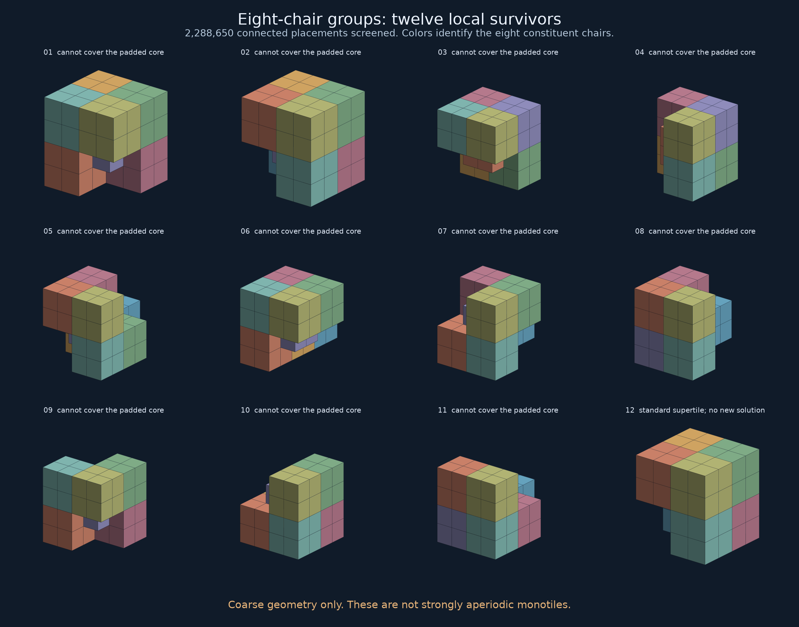

# Arbitrary connected eight-chair groups

**No new strongly aperiodic block was found.** This pass exhausts a larger
family of whole-chair groupings, including groups that cross the known
hierarchy. It also produces a simple parity certificate for the hardest
local exclusion.



These drawings show coarse chair unions. They are not proposed strongly
aperiodic solids; the filler geometry and markings are not included.

## 1. What changed in the search

The previous attachment argument concerned a standard eight-chair supertile.
Here the eight chairs may form **any face-connected arrangement** occurring
in the hierarchical tiling. Their positions are not constrained to a common
parent supertile.

The test patch contains 32,768 chairs. Its 3,351 required interior chairs
are separated from the patch boundary by at least seven adjacency steps.
Eight connected chairs have graph diameter at most seven, so all possible
clusters touching this core are represented. Clusters may cross the core
boundary, and the surrounding halo need not be covered.

Any tiling by one cluster shape must cover an interior anchor. We exhaustively
enumerate connected eight-chair sets containing that anchor, using a compiled
helper driven by the project's `uv` environment. Proper cube rotations and
integer translations identify congruent chair arrangements.

| Stage | Result |
|---|---:|
| Rooted eight-chair placements enumerated | 2,288,650 |
| Rooted placements whose shape can occur at every core chair | 34 |
| Distinct shapes represented by those placements | 12 |
| Shapes admitting a disjoint cover of the core | 1 |
| New arrangements among the valid covers | 0 |

The twelve shapes each have a possible occurrence covering every required
chair separately. Eleven nevertheless fail when those occurrences must be
chosen together without overlap. The remaining shape is exactly the standard
eight-chair substitution supertile.

The 2,288,650 figure counts **rooted placements**, not that many distinct
monotile designs. It is kept separate from the earlier 65,216-design total.

## 2. A three-chair contradiction

For group **02** in the figure, an initially expensive independent search
reduced to three required chairs, with indices 2641, 2642 and 2644 in the
saved patch. Every possible occurrence covering any of them covers exactly
two of the three:

| Possible cluster | 2641 | 2642 | 2644 |
|---|---|---|---|
| A | yes | yes | no |
| B | yes | no | yes |
| C | no | yes | yes |

If `a,b,c` indicate which occurrences are selected, exact coverage requires

```text
a + b = 1
a + c = 1
b + c = 1
```

Adding them gives `2(a+b+c)=3`, impossible for integer selections. No remote
placement repairs this contradiction: the padded patch contains every
possible occurrence touching those three chairs.

The [small certificate](artifacts/eight_chair_small_certificate.json) lists
the three full eight-chair placements. It was checked independently of the
SAT solver that located it. The other ten exclusions were also checked with
an independent exact-cover search.

## 3. The survivor has a periodic unmarked packing

The sole coarse survivor is a 4×4×4 cube with a 2×2×2 corner removed. As an
unmarked polycube, it has 56 unit cubes and a translational tiling with
lattice basis

```text
(14,0,0), (-4,2,0), (-8,0,2).
```

The determinant is 56. Its 56 constituent unit cubes occupy the 56 quotient
classes exactly once, giving an exact periodic space filling.

One way to understand the construction is to start with the seven-cube
chair `{0,1}³ \ {(1,1,1)}`. The map `x + 2y + 4z (mod 7)` sends its seven
cubes to distinct residues. Scaling this tiling by two gives the displayed
56-cube example.

This rejects the **unmarked coarse shape** as a strongly aperiodic block.
It does not prove that any hypothetical additional key geometry would also
admit that packing. For the whole-filler attachment strategy, the separate
[attachment parity argument](OPEN_FUSION.md#why-extending-the-attachment-range-cannot-rescue-this-design)
is the relevant obstruction.

## 4. The resulting conditional exclusion

Combining this pass with the earlier work gives the following result for
the tested fusion architecture:

> A fixed arrangement of eight whole coarse chairs, face-connected and used
> under proper rotations, cannot be combined with a fixed pattern of whole
> cross fillers to give the requested monotile through this hierarchy.

The search leaves only the standard supertile arrangement; its recognizable
placement in the hierarchy is already excluded by the attachment parity
argument. Every infinite tiling constructed from this substitution contains
a fifth-level supertile, so the padded-core exclusions apply to such tilings,
not merely to a choice of finite outer boundary.

The four-chair version was excluded earlier. Volume balance requires four
chairs per three crosses. Thus, **within this face-connected, whole-piece,
proper-rotation fusion strategy**, any remaining candidate must use at least
12 chairs and 9 crosses, or change an assumption of the strategy.

This does not exclude groups whose chairs are connected through fillers,
re-cut pieces, different hierarchies, or general three-dimensional blocks.
Nor does it cover accidental congruences that do not preserve the selected
whole-chair decomposition. The underlying marked chair/cross construction is
[Goodman-Strauss's aperiodic pair](https://doi.org/10.1006/eujc.1998.0282).

## 5. Verification and reproducibility

- Two complete smaller enumerations agree between the compiled search and
  the original Python method: 587 rooted four-chair sets and 5,050 rooted
  five-chair sets.
- All 3,350 non-anchor core positions are checked for occurrences; a few
  representative local neighborhoods are insufficient.
- Thirty-one rejected-placement witnesses are independently checked in Python.
- All eleven exact-cover exclusions are independently checked; the valid
  cover is checked for overlap and complete coverage of the core.
- The survivor is identified by exact chair coordinates, and its unmarked
  periodic packing is checked by exact quotient-voxel occupancy.

Run from the repository root; a C++17 compiler is needed for the screen:

```sh
uv run --locked python strong/eight_chair_search.py --level 4 --size 4
uv run --locked python strong/eight_chair_search.py --level 4 --size 5
uv run --locked python strong/eight_chair_search.py
uv run --locked python strong/eight_chair_certificate.py
uv run --locked python strong/verify_eight_chairs.py
uv run --locked python strong/render_eight_chairs.py
uv run --locked python strong/summarize.py
```

The compiled enumeration has a time limit and records whether it completed.
The recorded eight-chair run completed. Timeouts are not exclusions.

Artifacts: [complete screen and cover results](artifacts/chair_screen_8_level5.json),
[independent verification](artifacts/eight_chair_verification.json),
[three-chair certificate](artifacts/eight_chair_small_certificate.json),
[visual comparison](artifacts/eight-chair-groups.png).
