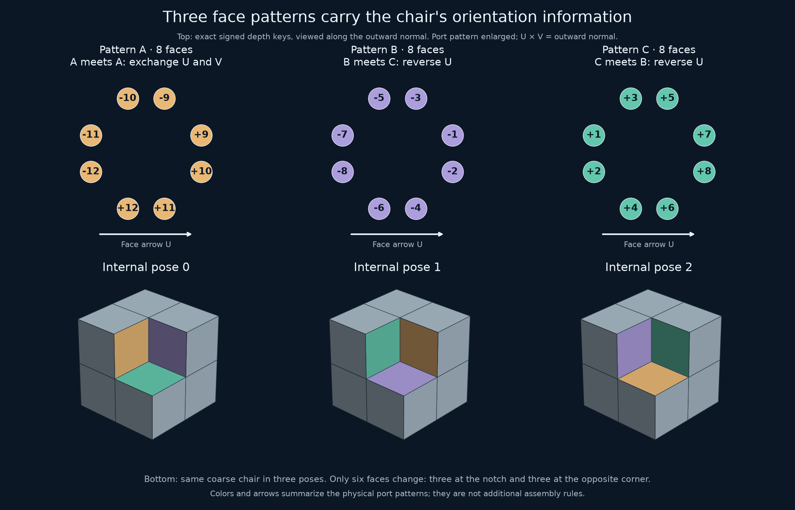

# Follow-up: handedness, three face patterns, and a periodic control

*Research record, 15–16 September 2026. Frozen candidate unchanged.*

**Later context:** [Chair44](review/TSIOKOS_CHAIR44_COMPARISON.md) uses the same
discrete decorated system with different surface geometry. The results below
remain records of our curved candidate and controls, not evidence of a
distinct matching-system discovery.

**Main findings:** one matching cap already forces neighboring copies to
have the same handedness. The 192-port specification reduces to three
oriented face patterns. A particular modification that erases the three
internal poses admits an explicit periodic tiling, while still enforcing
handedness. A different, six-depth recoding preserves the original contact
rules. These results clarify what the candidate's geometry is doing.

The proposed all-tilings theorem still needs external mathematical review.
The finite checks support specified lemmas; they do not replace the
[analytic and hierarchy arguments](audit/README.md). Novelty is unresolved.
See the short [expert-review note](REVIEW_NOTE.md).

Reference candidate SHA-256:
`95284fd672945936a383b046f67f5d4b11ab34d05909d0548f4ac95a565b3e54`.

## 1. Reflections: a local invariant gives a global reduction

For a port with ordered tangent axes `u,v` and outward base normal `n`, put
`c = det[u,v,n]`. Every occurrence of a signed key `k` in the frozen data
has the same `c(k)`, and `c(-k)=-c(k)`. For positive keys 1 through 12:

```text
-1, +1, +1, -1, -1, +1, +1, -1, +1, -1, +1, -1.
```

Open-cap rigidity identifies ordered tangent axes. Opposite tile interiors
require opposite outward normals and opposite signed keys. For the
relative orthogonal map `R` between two matching copies:

```text
R u_B = u_A,   R v_B = v_A,   R n_B = -n_A,
k_B = -k_A,
det(R)c(k_B) = -c(k_A), hence det(R)=+1.
```

This allows `R` to be improper at the outset. A reflection does not itself
change a tab into a pocket: signed height is measured along the transformed
outward normal. The determinant equation excludes opposite-handed contacts.

The existing cap-contact component argument makes each component fill all
space. Applying it with either initial handedness shows that every tiling
has one handedness throughout. Reflect an all-mirrored tiling globally to
obtain a proper-copy tiling; conjugation preserves its symmetry group.
Thus the proposed finite-symmetry theorem extends to **arbitrary Euclidean
congruent copies**, provided the existing analytic and hierarchy proofs hold.

### Checks and separate review

[check_reflections.py](audit/check_reflections.py) reads raw frozen data,
generates all 48 signed coordinate permutations, and uses cube-center
transforms and adjacency-derived offsets. It imports none of the earlier
geometry or contact helpers.

| Check | Proper | Improper |
|---|---:|---:|
| Geometrically possible chair contacts | 1,194 | 1,194 |
| Contacts whose ports fit | 44 | 0 |
| Aligned whole-face trials | 2,304 | 2,304 |
| Whole-face matches | 192 | 0 |
| Opposite-key cap frame correspondences | 1,536 | 0 |

All cap-locked translations are integral. The proper contact set agrees
exactly with the original certificate. The full keyed solid has no
nonidentity self-symmetry among the 48 frame orientations.

The geometry review subagent independently recomputed the signed-key
triple products from raw JSON and checked the determinant argument,
including why cap rigidity does not assume a proper isometry. It found the
extension sound. This is an internal AI review, not human acceptance.
Outputs: [verification](audit/reflection_verification.json) and
[face rejection witnesses](audit/reflection_certificate.json).

## 2. Three oriented face patterns describe the full table



Center a face at the origin with outward normal `n=+z` and right-handed
axes `(U,V,n)`. In this coordinate order, divided by 16,

```text
(-3,-1), (-3,1), (-1,-3), (-1,3),
(1,-3), (1,3), (3,-1), (3,1),
```

the three signed-key words are:

| Motif | Signed keys in that order | Number of faces |
|---|---|---:|
| A | -12, -11, 12, -10, 11, -9, 10, 9 | 8 |
| B | -8, -7, -6, -5, -4, -3, -2, -1 | 8 |
| C | 2, 1, 4, 3, 6, 5, 8, 7 | 8 |

The port's local `u` axis is the signed direction of its coordinate of
magnitude 3; its local `v` axis is the signed direction of magnitude 1.
Each face has a motif and a choice of arrow `U`. These descriptors
reconstruct all 192 original positions, frames, and keys exactly.

There are just three face handshakes, with the second face's axes expressed
in the first face's frame:

| First / second motif | Required second frame `(U_B,V_B,n_B)` |
|---|---|
| A / A | `(V_A,U_A,-n_A)` |
| B / C | `(-U_A,V_A,-n_A)` |
| C / B | `(-U_A,V_A,-n_A)` |

No other motif pairing or in-plane orientation fits. Colors and arrows
describe physical boundary geometry; they are not extra assembly rules.

The complete 2×2 faces of an eight-chair group also have three profile
types. After the recorded correspondence of types and frames, their
compatibility is exactly the fine-face compatibility: **2,304 comparisons,
zero disagreements**. This explains recurrence more directly than the
192-port table. It does not independently exclude misregistered macrofaces;
the earlier full macrocontact check, including odd offsets, remains needed.

Data: [face motifs and all 24 descriptors](audit/face_motifs.json).
This analysis uses the coordinate audit helpers, rather than independently
implementing their geometry.

## 3. Where the three-state information lives

Write each signed key uniquely as `k=s*K[g][q]`, with `s=±1`, `q=0,1,2`,
and these four signed-key families:

```text
K[1] = (1, -3, -9)     K[2] = (2, -5, -10)
K[3] = (4, -7, -11)    K[4] = (6, -8, -12).
```

Here `s` is an abstract polarity, not necessarily the physical tab/pocket
sign. Cyclically rotating the coarse chair preserves `(g,s)` at every
spatial port. The phase `q` changes on 48 ports: all eight ports on six
faces. The other 144 ports are unchanged. The six faces are the three
around the missing-cube notch and the three at the opposite outer corner.

The local chirality is `c(k)=(-1)^g s`; it does not depend on `q`.
This separates the information enforcing handedness from the information
distinguishing the three internal poses. It does not prove that every
aperiodic construction needs these particular phases.

## 4. Erasing phase produces an explicit periodic solid

Replace each key `s*K[g][q]` by `s*g`. This is a definite altered solid:
it identifies signed keys and includes tab/pocket sign changes. It is not
merely recoloring or making the original caps less visible.

The altered solid has three proper self-symmetries and 186 allowed fine
contacts. Its eight-chair group permits all 1,194 even-offset geometric
macrocontacts. After deflation, no chair contact is forbidden by keys.

Repeat the same eight-child group under the lattice with basis columns:

```text
(14,0,0), (-4,2,0), (-8,0,2).
```

The fundamental volume is 56, containing eight chairs. Its 56 cubes have
distinct residues

```text
(x mod 2, y mod 2, z mod 2,
 (floor(x/2)+2 floor(y/2)+4 floor(z/2)) mod 7).
```

The separate [periodic verifier](audit/verify_periodic_ablation.py) checks
every interface in this finite lattice quotient directly from port data:
192 directed unit-face incidences and 1,536 directed port incidences, all
matching. Together with the unchanged feature-separation bounds, these
give a physical periodic tiling of the altered exact solid.

On the **same placements**, the original candidate fails at 60 directed
unit-face incidences and 480 directed port incidences. These counts double
the number of opposing pairs. This is a controlled periodic example of a
modified solid, not a counterexample to the frozen candidate.

The altered solid still forces one handedness at each cap. Consequently,
**forcing handedness alone does not force aperiodicity**.

Data: [phase analysis and explicit witness](audit/orientation_information.json),
[independent interface verification](audit/periodic_ablation_verification.json).

## 5. Six depths suffice for the checked contact language

A different recoding preserves phase but merges some families. Using the
same `(g,q,s)` and `c=(-1)^g s`, set

```text
k_new = c * (q+1 + 3 floor((g-1)/2)).
```

This uses six positive depth magnitudes. It retains **exactly** the 44
original proper chair contacts and the 44 original macrocontacts. No
contacts are lost or added. Every new key has local frame chirality equal
to its sign, so the single-handedness argument still applies. The signed
key sum remains zero, preserving volume 7; all depths are smaller than the
reference maximum, so the existing feature-clearance bounds remain valid.

These facts support transferring the same hierarchy and cap-rigidity
arguments to this simpler assignment. We have not made it a new frozen
reference or independently re-audited it. Its explicit assignment is saved
in [key_reduction.json](audit/key_reduction.json).

Removing the family distinction altogether, `k_new=c*(q+1)`, gives 191
contacts, including 147 additional ones. **Its tilability and aperiodicity
are unclassified**; extra contacts alone establish neither periodicity
nor failure of all possible hierarchy arguments. No minimality claim is made.

## 6. Exploration record and next decisions

1. Began with all 48 frame orientations: no improper whole-chair contacts.
2. Checked whole faces independently of chair overlap: still no improper
   matches. This suggested a local obstruction.
3. Checked single caps and discovered the stronger determinant invariant.
   The separate geometry reviewer confirmed its all-tilings implication.
4. Tried a uniform permutation of key names under cyclic chair rotation;
   it failed because occurrences of a key can transform differently.
5. Derived the signed quotient instead. It isolated the phase on six faces
   and produced the periodic eight-chair control.
6. Canonicalized complete face profiles: three motifs, with the same
   compatibility at the next scale. Drew and inspected the explanatory figure.
7. Verified the periodic control via a second coordinate implementation.
8. Tested two bounded depth recodings: six depths preserve both contact
   levels; three depths introduce additional contacts, left unclassified.
9. Prepared the [review note](REVIEW_NOTE.md). No external expert has been
   contacted and no novelty claim has been established.

The most useful next mathematical task is a concise proof of unique
eight-chair grouping stated in the three-motif language, checked against
the existing 33-star certificate. This could make the mechanism easier for
a human reviewer to inspect. Independent scrutiny of the analytic
grid-enforcement argument remains essential. Key minimization and a
polyhedral replacement are separate questions; the current evidence does
not certify a mesh or a manufactured block.

**Subsequent work, 16 September:** that grouping task is now completed in
[A local parent rule](MOTIF_GROUPING.md). It gives a motif-only implication
proof, a no-branching face-coverage certificate, and an intrinsic parent
map proving uniqueness. The older 33 neighborhoods were independently
regenerated as a cross-check. The 30 contacts surviving the local test
also equal the substitution closure exactly.

## Reproduce this pass

From the repository root, using the locked environment:

```sh
uv run --locked python strong/audit/check_reflections.py
uv run --locked python strong/audit/orientation_information.py
uv run --locked python strong/audit/verify_periodic_ablation.py
uv run --locked python strong/audit/check_key_reduction.py
uv run --locked python strong/audit/draw_orientation_information.py
```

The earlier audit and its reproduction commands remain in
[audit/README.md](audit/README.md). The frozen data were not overwritten.
