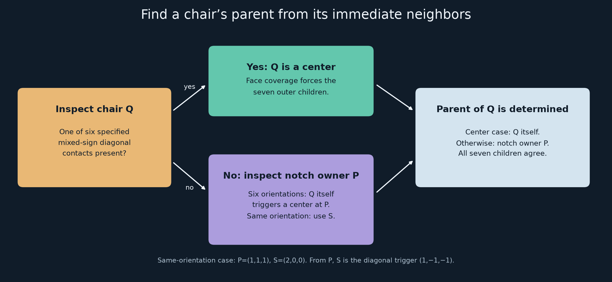

# A local parent rule for the three-pattern chair

*Research record, 16 September 2026. The frozen solid is unchanged.*

**Attribution added after the markings comparison:** the mixed-sign corner
triggers and the same-orientation notch-owner exception implement the
recognition mechanism in Goodman-Strauss's *A Pair of Aperiodic Tiles in
Eⁿ* (1999), Proposition 4.6 (author preprint: Theorem 3.6). This note verifies
that mechanism for our three-pattern rules; it does not introduce a new
conceptual grouping method. The [exact comparison](review/GOODMAN_STRAUSS_COMPARISON.md)
records the common coarse contacts and the additional pose constraints.

**Result:** the eight-chair grouping has a short local recognition rule.
If a chair has one of six specified diagonal neighbors, it is a group
center. Otherwise its group center is the chair occupying its notch.
Every outer child selects that same center, so the grouping is unique.

This gives an alternative proof of the **grid-model grouping lemma**.
It uses three face patterns and arrows, a small contact enumeration, and
forced face coverage. It does not depend on enumerating all 33 complete
neighborhoods or testing all 28 pairs of competing groups. Both older
certificates remain valid cross-checks. The analytic passage to a common
grid and the subsequent recurrence of grouped rules remain separate parts
of the [full proposal](RECUT_CHAIR.md).



## 1. The matching system, without depth keys

Work on the integer grid in one handedness, as justified conditionally by
the earlier [cap and reflection arguments](FOLLOWUP_REFLECTIONS.md).
The coarse chair comprises the seven cubes with lower corners in
`{-1,0}³` except `(0,0,0)`. Its placement origin is the reentrant corner
of the missing cube; it is not its center of volume.

Each exposed unit face carries one of A, B, C and an arrow `U`. With outward
normal `n`, define `V=n×U`. On opposing faces, only these matches are allowed:

| First and second patterns | Required second arrow |
|---|---|
| A and A | `U₂=V₁` |
| B and C | `U₂=-U₁` |
| C and B | `U₂=-U₁` |

In particular, C cannot meet C. The arrows matter: matching pattern names
alone gives a different system. This picture specifies all 24 faces:


These markings describe the actual cap geometry. No extra colored-tile
rule has been added. The new checker reconstructs all 192 frozen ports
from this description and checks all 36 canonical pattern/orientation
handshakes against the exact keys and local cap frames.

## 2. The six diagonal contacts that identify a center

Normalize the chair being inspected, `Q`, to the origin with identity
orientation. A placement below means `x ↦ t+R(x)`. Write `D_s` for the
diagonal neighbor with signs `s` and this orientation:

| Neighbor | Origin `t` | `R(x,y,z)` |
|---|---|---|
| `D---` | `(-1,-1,-1)` | `(x,y,z)` |
| `D--+` | `(-1,-1,1)` | `(x,z,-y)` |
| `D-+-` | `(-1,1,-1)` | `(z,-y,x)` |
| `D-++` | `(-1,1,1)` | `(y,-z,-x)` |
| `D+--` | `(1,-1,-1)` | `(-y,x,z)` |
| `D+-+` | `(1,-1,1)` | `(-x,y,-z)` |
| `D++-` | `(1,1,-1)` | `(-z,-x,y)` |

The **six mixed-sign contacts** are the central triggers. The all-negative
contact `D---` is not a trigger by itself. Neither is a neighbor at
`(1,1,1)`. A diagonal position with an arbitrary rotation is not enough;
the orientation in the table is part of the condition.

**Local lemma.** If any one of the six triggers occurs, covering the
remaining faces forces exactly the following neighborhood:

```text
the seven D neighbors in the table,
plus N: origin (1,1,1), identity orientation.
```

`Q` together with the seven D neighbors is the desired eight-chair group.
Its coarse union is a scale-two chair. `N` is an additional external
neighbor occupying Q's notch; it is not a member of this group.

### How the local lemma is checked

The face picture and three handshakes permit 44 nonoverlapping directed
contacts out of 1,194 geometric possibilities. Fourteen of the 44 cannot
occur in a complete tiling: each leaves an exposed face for which every
possible covering neighbor overlaps it or mismatches its face pattern.
One round of this elementary exclusion leaves 30 contacts.

For each of the six triggers, repeatedly find an uncovered face with only
one compatible covering neighbor. Seven such forced steps fill the entire
neighborhood. No branching or assumption about its extension beyond that
neighborhood is used.

For example, starting with `D--+`, the forced neighbors in order are:

```text
D---, D-+-, D-++, N, D+--, D+-+, D++-.
```

The first three steps cover the other relevant squares of Q's `x=-1`
side. The next covers its notch face `x=0`. The final three complete
the needed negative-y and negative-z faces. The
[generated proof tables](audit/motif_grouping_tables.md) identify every
face and every forced step for all six starting contacts. They also give
the 14 exclusion witnesses. Thus the finite work is exposed explicitly;
this is not yet an enumeration-free synthetic proof of the local lemma.

## 3. A chair without a trigger points to its notch owner

The allowed contacts covering any one of Q's three notch faces are exactly
seven placements, all with origin `(1,1,1)`. Each covers **all three** notch
faces. Hence these faces have a single neighboring owner `P`.

### Six ordinary cases

For six of the seven possible orientations of P, look back at Q in P's
own coordinate frame. Q is precisely one of the six mixed-sign D neighbors.
By the local lemma, **P is a group center**, and Q is one of its children.

This is just a reciprocal contact: no information from P's more distant
neighbors is needed. The six reciprocal pairs are recorded in the appendix.

### The remaining case: P has Q's orientation

Here `P=N`, so Q appears to P as `D---`, which is not a trigger. Assume
Q has no trigger; otherwise Section 2 already identifies Q as a center.

Inspect Q's outer face with center `(1,-1/2,-1/2)`, normal `+x`. This is
the A face numbered 21 in the picture. After the 14 exclusions it has just
three possible covering neighbors:

1. `D+--`, excluded because Q has no trigger.
2. A neighbor at `(2,0,0)` with rotation `(-x,z,y)`. This would meet P
   with **C against C**, at face center `(3/2,0,1/2)`, and is forbidden.
3. A neighbor `S` at `(2,0,0)` with rotation `(-y,x,z)`.

Therefore S is forced. Viewed from P, its origin is

```text
(2,0,0) - (1,1,1) = (1,-1,-1),
```

and its rotation is `(-y,x,z)`. It is exactly `D+--` in P's frame.
Thus **P is a group center in this last case as well**, and Q is its
all-negative child.

This is the whole exceptional argument: one face, three alternatives,
one forbidden C/C meeting.

## 4. The parent rule proves existence and uniqueness of the grouping

Define a map on the actual chairs of any valid grid tiling:

```text
parent(Q) = Q, if Q has a central trigger;
            the notch owner of Q, otherwise.
```

Sections 2–3 show that the selected parent is a group center and that Q
belongs to its eight-chair group. It remains to show that every child
of a group selects that group's center, rather than selecting itself
or another chair.

Let Q be a group center.

- For each of its six mixed-sign D children, Q is the child's notch
  occupant with a nonidentity orientation. Such a child cannot have a
  trigger: the local lemma would force its notch occupant to have the
  child's own orientation. It therefore selects Q.
- For `D---`, Q is an identically oriented notch occupant. The sibling
  `D+--`, viewed from `D---`, lies at `(2,0,0)` with rotation `(-y,x,z)`:
  it is the axial neighbor S from the exceptional argument. This contact
  is absent from the forced central neighborhood. Thus `D---` cannot be
  a center and also selects Q.

Q selects itself. **The eight chairs in this group all have the same
parent, Q.** Conversely, every chair selecting Q has already been shown
to be one of those eight children.

The fibers of the parent map are therefore exactly the eight-chair groups.
They partition the tiling uniquely. Any occurrence of the specified group
has a trigger at its center, so another grouping into the same groups
must use the same parent map. This also explains why no separate test of
28 pairs of competing parent roles is needed.

The rule reads only immediate face-neighbors and their oriented patterns.
It is intrinsic to the tiling and commutes with translations. That is
the property needed when iterating grouping to exclude periods. Iteration
still uses the separately verified macrocontact recurrence and even-offset
lemma; this note proves one level of unique grouping.

## 5. Checks, findings, and limits

The new [checker](audit/motif_grouping.py) imports no project implementation.
It constructs contacts directly from coarse cubes, A/B/C patterns, and
arrows. Its proof stage uses face exclusions and forced coverage, not stars.
Only afterward does it independently enumerate stars to compare results
with the old certificate.

| Check | Result |
|---|---:|
| Frozen ports reconstructed from motifs | 192 of 192 |
| Canonical pattern/orientation comparisons | 36, all agree |
| Geometric contacts / fitting contacts | 1,194 / 44 |
| Contacts excluded by one impossible-face test | 14 |
| Remaining contacts | 30 |
| Central triggers forcing the same full neighborhood | 6 of 6 |
| Outer children selecting the group's center | 7 of 7 |
| Independently regenerated stars matching the old certificate | 33 of 33 |

An additional finding: the remaining 30 contacts equal the previously
computed closed substitution contact set **exactly**. Thus the difference
between 44 locally fitting contacts and the 30 used by the substitution
has a one-neighborhood explanation: the other 14 are already local dead
ends. This does not by itself prove that every remaining contact occurs
in an infinite tiling; no such additional claim is needed here.

The 33-star cross-check divides into one central star and 32 noncentral
stars. Three notch orientations occur in eight stars each; four occur
in two each. The old full-neighborhood proof is consistent with the much
shorter parent rule.

This remains a computer-assisted finite lemma with written implications.
It improves the explanation and reduces the required certificate; it
does not establish novelty, replace external review, or certify the
triangulated solid. No geometry or frozen construction data were changed.

### Exploration record

1. Read the old forcing witnesses and noticed that every noncentral star
   points to an origin at `(1,1,1)`: its notch owner.
2. Found six contacts appearing only in the central star. For 30 of the
   32 noncentral stars, the reciprocal notch contact is already one of them.
3. Checked the two remaining stars: an axial neighbor supplies the missing
   trigger at the notch owner.
4. Replaced star enumeration by impossible-face exclusions and singleton
   face coverage. All six central implications follow without branching.
5. Reduced the exceptional case to a single A face and a forbidden C/C pair.
6. Proved all seven children select their central chair. This replaces the
   old competing-group pair analysis with a locally determined parent map.
7. Regenerated all 33 stars independently as a comparison, and found that
   the 30 surviving contacts equal the substitution contact closure.
8. Generated and visually inspected the face-layout and parent-rule figures.

### Reproduce and inspect

```sh
uv run --locked python strong/audit/motif_grouping.py
uv run --locked python strong/audit/draw_motif_grouping.py
```

- [Verification summary](audit/motif_grouping_verification.json)
- [Explicit implication and obstruction certificate](audit/motif_grouping_certificate.json)
- [Readable generated tables](audit/motif_grouping_tables.md)
- [Original proposal and remaining proof dependencies](REVIEW_NOTE.md)

Candidate SHA-256 remains
`95284fd672945936a383b046f67f5d4b11ab34d05909d0548f4ac95a565b3e54`.
