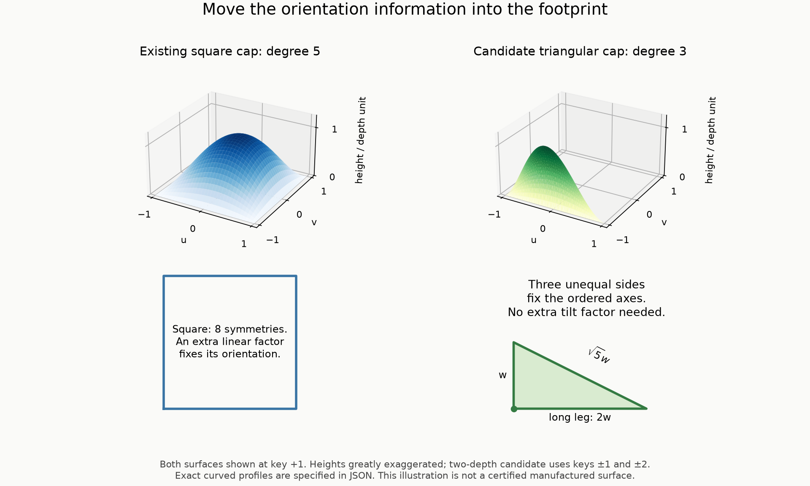

# A simpler port: a cubic cap on a scalene triangle

*19 September 2026. Research candidate, written local rigidity argument and
reproducible finite checks. The frozen square-cap reference is unchanged.*

**Result.** Replace the asymmetric degree-five square cap by a degree-three
cap supported on a scalene right triangle, and use the previously established
two-depth recoding. The new port retains the decisive implication:

> Coincidence on any open surface patch fixes the whole port's position,
> ordered tangent axes and absolute depth. Only normal reversal with signed
> depth reversal remains possible.

The proof is given below, rather than inferred from finitely many tested
orientations. Exact finite checks establish the coordinate hypotheses and
the same 44 fine and 44 full parent contacts. A separate JavaScript replay
confirms all contact decisions from raw coordinates and actual triangle
vertices. This does not constitute a new Lean theorem, external review or
certification of a mesh or manufactured tile.

The tutorial integration additionally checked all 2,304 aligned unit-panel
comparisons (192 fits): the A/B/C panel table is also unchanged. Among all
48 signed coordinate frames, only the identity preserves the new carrier
and keyed port frames. The reduction of arbitrary self-isometries to this
finite list uses the flat boundary plane families at levels -1, 0, 1, as
explained in the tutorial; the enumeration alone is not that reduction.



The subsequent [movable-anchor dimension study](PORT_DIMENSIONS.md) separates
the recorded dimensions from necessary matching information. Relocation gives
a strictly separated witness with 12× width and 256× depth; the common D4
triangle-orbit family admits widths approaching 16×. Those parameters are a
separate research witness and do not replace this snapshot.

## 1. What becomes simpler

| Property | Frozen reference | New candidate |
|---|---|---|
| Port footprint | Square | Scalene right triangle |
| Polynomial total degree | 5 | 3 |
| Depth magnitudes used | 12 | 2 |
| Source of ordered-axis information | Extra asymmetric linear factor | Three unequal triangle sides |
| Nonplanar ports per tile | 192 | 192 |
| Fine / full parent contact counts | 44 / 44 | Exactly the same 44 / 44 poses |
| Full frame from an open patch | Five-line continuation argument | Three-line continuation argument |

Here “simpler” means lower polynomial degree and fewer depth levels. It does
not yet mean easier fabrication, larger tolerances, fewer ports, or a
polyhedral surface. The candidate is still curved. Its support area is one
quarter of the previous square at the same width parameter; this is not a
claim of improved manufacturing robustness.

There are two independent simplifications: [information transfer](INFORMATION_TRANSFER.md)
supplies the two-depth assignment, while this investigation changes the
surface used to realize its matching rules.

## 2. Exact candidate and attribution

Keep the old seven carrier cubes, port frame anchors p, ordered axes U,V,N,
width parameter w=1/64, depth unit delta=1/4096, and eight child placements.
In normalized tangent coordinates use the triangle

    A=(-1,-1), B=(1,-1), C=(-1,0).

Its side lengths are 2, 1 and sqrt(5). It is contained in the old square
[-1,1]^2. The old point p is a **frame anchor**, not the new triangle's
centroid. Its interpretation is unchanged in all coordinate formulas.

Set

    lambda0=(u+1)/2,
    lambda1=v+1,
    lambda2=1-lambda0-lambda1=-(u+2v+1)/2,

and define, on the triangle,

    psi(u,v)=27 lambda0 lambda1 lambda2
            =-27 (u+1)(v+1)(u+2v+1)/4.

Outside the triangle the face stays flat. The modified graph is

    p + w*u*U + w*v*V + k*delta*psi(u,v)*N.

The barycentric coordinates are nonnegative and sum to one. Therefore
0<=psi<=1 by AM-GM, with maximum 1 at the centroid (-1/3,-2/3).
The graph is zero on all three edges and joins the surrounding plane
continuously. It is not asserted to be C1 across those edges; neither was
the frozen square cap. The normalized integral is 9/20.

The product 27 lambda0 lambda1 lambda2 is a standard cubic **triangle bubble**
from finite elements, not a newly invented function. See Hervé Le Dret's
[finite-element notes, page 164](https://www.ljll.fr/ledret/M1English/M1ApproxPDE_Chapter5-2.pdf#page=12)
and the [DefElement bubble definition](https://defelement.org/elements/bubble.html).
The investigation here concerns its use on a scalene support to obtain the
port rigidity needed by this particular chair construction; no priority
claim is made for that application either.

For each original port let chi=det[U,V,N] and c=abs(original signed key).
Set k=chi*a_c, where

    (a1,...,a12)=(1,2,1,1,1,1,1,1,2,1,1,1).

Thus k is one of -2,-1,1,2 and its sign is chi. The normalized graph height
after **uniform** spatial scaling by 1/w is H*psi, where H=k/64.
We never use anisotropic scaling to infer an isometry.

The complete new geometry is a separate immutable research snapshot:
[triangular_v1/candidate.json](audit/triangular_v1/candidate.json), with
[manifest](audit/triangular_v1/manifest.json). It contains every signed key
and retains the original key as provenance. The generator refuses to
replace an existing differing snapshot; later designs need a new version.

## 3. Why even a small matching patch fixes the entire triangle

**Local rigidity proposition.** For nonzero H and K, an ambient Euclidean
isometry identifying open patches of the graphs z=H*psi and z=K*psi
identifies their entire base triangles and ordered tangent frames. In
normalized local frames it is either (u,v,z)->(u,v,z), with H=K, or
(u,v,z)->(u,v,-z), with H=-K.

**Step 1: an open coincidence identifies the complete algebraic graphs.**
Write P_H=z-H*psi(u,v). Pull back P_K under the putative affine isometry
and substitute z=H*psi. This polynomial in u,v vanishes on an open set,
so it vanishes identically. Division by the polynomial P_H, which is monic
in z, gives divisibility. Both defining polynomials have total degree three;
an invertible affine change preserves that degree. Thus the quotient is a
nonzero constant. The complete algebraic surfaces coincide under the map.

**Step 2: this cubic surface has exactly three straight lines.**
Use affine barycentric coordinates x,y only to classify lines; affine
coordinate changes preserve straightness, not distances. The graph is

    z=27 H x y (1-x-y).

For a nonconstant projected line (x,y)=(a+d*t,b+e*t), the cubic coefficient
of the right side is -27 H d e(d+e). A line on the surface has z affine
in t, so this coefficient must vanish. The three possible directions give:

| Direction | Quadratic coefficient | Necessary base-line condition |
|---|---|---|
| d=0, e!=0 | -27 H a e^2 | a=0 |
| e=0, d!=0 | -27 H b d^2 | b=0 |
| e=-d, d!=0 | 27 H d^2(a+b-1) | a+b=1 |

On each resulting line the whole product vanishes, hence z=0. A vertical
nonconstant line cannot lie on a graph. These exhaust the possibilities.
In u,v coordinates the three lines are

    u=-1, v=-1, u+2v+1=0, all with z=0.

**Step 3: the three lines recover the metric frame.**
Their intersections recover exactly A,B,C and their common plane. Any
isometry of the surface therefore induces a distance-preserving permutation
of these three vertices. Their distinct side lengths force that permutation
to be the identity. The right-angle vertex A, long leg AB and short leg AC
recover the ordered axes and the old anchor:

    U=(B-A)/(2w), V=(C-A)/w, p=A+w*U+w*V.

Only the normal sign can remain free. Evaluating the graph at its centroid
gives H=K or H=-K accordingly. This also proves that the two absolute depth
levels cannot mate by a tilt, translation or rotation.

The proof holds for arbitrary affine isometries, including reflections;
it does not assume a grid or one of 24 orientations. The straight lines
belong to the algebraic continuation. Their finite segments are precisely
the physical triangle's boundary, so continuation also recovers the full
bounded port. No extra material outside the port is required.

## 4. Transferring the registration argument

Here is the written transfer of the existing
[curved-grid argument](review/CURVED_GRID_NOTE.md). This section is a
mathematical deduction, distinct from the finite checks in section 6.

1. **A mate on an open patch exists in any tiling.** Every tile still retains
   an interior ball of radius 1/4 and has diameter less than four, so the
   same local-finiteness bound applies. Each cap is nonplanar and polynomial
   on its triangular interior. The finite boundary-cover argument therefore
   supplies an open coincident cap patch. The extra flat area outside each
   triangle does not change this step.
2. **That mate registers both frames and the adjacent carrier cube.** The
   proposition above gives R*U_B=U_A, R*V_B=V_A and R*N_B=sigma*N_A, with
   k_A=sigma*k_B. Sigma=+1 puts both local interiors on the same side of
   the graph and is excluded by disjoint interiors. Thus sigma=-1.
   The relative map and translation are exactly

       R=U_A U_B^T + V_A V_B^T - N_A N_B^T,
       t=p_A-R*p_B=f_A-R*f_B,  f=p-(3U+V)/16.

   All such pairs have integer t and opposite adjacent cube ownership.
   Because sign(k)=chi, det(R)=-chi_A*chi_B=+1. Hence common handedness is
   derived even if reflections were initially permitted.
3. **Registered components own the entire cubic lattice.** Each exposed
   carrier face still has eight nonzero caps. A mate on any one supplies
   the next cube. Retained cores prevent duplicate ownership, so ownership
   propagates along all lattice edges as before.
4. **No second component can coexist.** The new height bound is
   h=2*delta=1/2048<rho=1/64. Clamping a retained-ball center into an inset
   registered cube moves it by at most sqrt(3)*rho<1/4. The two tile
   interiors would intersect unless the tiles are identical. This is the
   same retained-core argument, attributed in the existing manuscript to
   Tsiokos's Chair44 proof; see the
   [comparison](review/CHAIR44_PROOF_COMPARISON.md#5-an-attributed-simplification-of-our-geometric-argument).
5. **Complete faces obey the original port rules.** Adjacent cube ownership
   makes all eight cap mates across a face belong to its one neighboring
   tile. Local rigidity identifies each full triangle and its signed key,
   giving the same complete-face matching test as before.

Consequently the written registration argument extends to this exact
candidate. The coordinate hypotheses, including all new opposite-key pairs,
are checked below. This transfer has not received independent mathematical
review and is not a new real-geometry formalization in Lean.

Conversely, in a legal carrier-grid tiling, identical port graphs with
opposite local normals replace the two sides of the same interface. The
universal feature boxes are mutually disjoint unless they are the same box;
thus each replacement preserves coverage and interior-disjointness locally.
The existing abstract grid tilings can therefore be realized by these exact
curved caps. No new infinite tiling is inferred merely from an eight-child
sample. The abstract hierarchy and symmetry results apply through the
identification of the complete contact atlas, conditional on the written
geometric transfer, rather than through a new Lean build for this snapshot.

## 5. Lower-degree and planar alternatives: what was ruled out

**Keeping a square is restrictive.** A polynomial zero on all four square
edges is divisible by (1-u^2)(1-v^2). At degree four it is only a constant
multiple of that product, hence has all eight square symmetries. It cannot
recover the ordered tangent frame in the same local-rigidity sense. The
frozen degree-five cap is already of minimum degree within this square,
single-polynomial, zero-boundary family for that requirement.

**A triangle makes degree three possible and necessary.** Zero on each
triangle edge forces divisibility by its three distinct line factors.
A nonzero such polynomial has degree at least three; at degree three it
is unique up to multiplication by a constant. More generally, a bounded
polygon has at least three distinct edge lines. This is a degree lower
bound in the single-polynomial, polygon-supported, zero-boundary class,
not a lower bound for all possible port shapes.

**The triangle must break metric symmetry.** An isosceles right triangle
has a reflection exchanging its two legs. The barycentric product respects
that symmetry, so it fails ordered-axis rigidity. On our scalene triangle
the permutation is not an isometry. Barycentric symmetry alone is harmless:
the support's Euclidean metric matters.

**A flat-sided triangular pyramid loses the open-patch property.** Its
unit-height tent is 3*min(x,y,1-x-y). On the open facet where x is smallest,
the surface is z=3H*x, independent of y. Translating a small patch by
y->y+epsilon preserves it without fixing the triangle. For example,
x=1/12, y=1/3 and epsilon=1/100 remain strictly within that facet; in the
chosen physical frame this is translation by w/100 along V. The same
obstruction applies to any planar-facet port under the strong requirement
that *one arbitrary open patch* determine its whole frame.

This is **not** a proof that polyhedral ports cannot work. It shows why
they require a different argument involving more than one local planar
patch. Chair44 already uses square pyramids with a different registration
strategy; the comparison above records the existing investigation. That
direction remains available if fabrication simplicity is the priority.

## 6. Reproduction and exact evidence

From the repository root:

```sh
uv run --locked python strong/audit/simplify_ports.py
node strong/audit/crosscheck_triangular_ports.cjs
uv run --locked python strong/audit/draw_port_simplification.py
```

The first script checks the line-coefficient identities, boundary-polynomial
dimensions, symmetry controls, feature bounds, volume cancellation, actual
triangle vertex matches, adjacent-owner conditions and complete contact
atlases. Its atlas reconstruction uses the existing coordinate-audit helper.
The second imports no project geometry implementation and independently
replays the finite triangle and contact checks from the two raw snapshots.

| Exact check | Result |
|---|---:|
| New signed keys -2, -1, +1, +2 | 16, 80, 80, 16 occurrences |
| Opposite-key ordered port pairs | 13,312 |
| Corresponding distinct full-frame relative poses | 1,410 |
| Improper or nonintegral full-frame maps | 0 |
| Periodic feature-box separation checks | 15,528, all positive |
| Port-box membership checks over all 48 signed frames | 9,216 |
| Minimum checked box separation | 3/32 |
| Height bound | 1/2048 |
| Volume | 7 |
| Fine geometric / fitting contact poses | 1,194 / 44 |
| Full macro geometric / fitting contact poses | 6,801 / 44 |
| Fitting macro poses with an odd offset | 0 |
| Aligned panel comparisons / fits | 2,304 / 192, identical to reference |
| Signed coordinate frames / self-symmetries | 48 / identity only |

The 1,410 poses are single-cap necessities, not whole-chair fitting poses.
The counts do not count distinct designs or tilings. The 44-pose comparisons
are exact equality of sets, not only equality of their sizes.

- [Primary evidence](audit/port_simplification.json)
- [Independent finite replay](audit/triangular_ports_crosscheck.json)
- [New research snapshot](audit/triangular_v1/candidate.json)

No old snapshot, printed model, existing viewer or published site was changed.
The illustration is a mesh visualization with exaggerated height, not the
exact surface. Remaining practical questions include usable minimum feature
size, tolerances, whether a polyhedral substitute can be certified by a
different argument, and whether any of the 192 ports can be removed.
