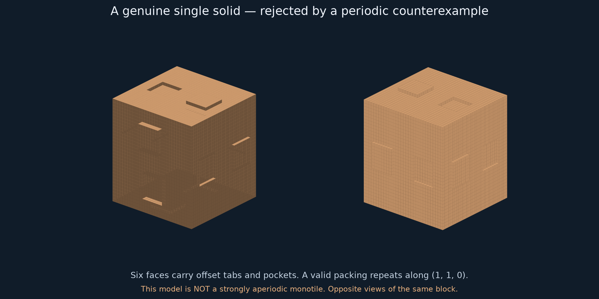

# Search for a strongly aperiodic 3D monotile

**Current context:** the later [Chair44 comparison](review/TSIOKOS_CHAIR44_COMPARISON.md)
identifies the same discrete matching system in Tsiokos's public release.
Our physical surfaces differ. This page preserves the search history;
start with the [project overview](../README.md) for current results and scope.

**Curved-solid proposal:** [A recut chair with a recursive matching rule](RECUT_CHAIR.md)
gives an exact curved solid, independently checked grid-hierarchy certificates,
and a proposed analytic argument enforcing the grid. The full construction
needs mathematical review. Its [offline viewer](artifacts/recut-chair.html)
shows an approximation of the exact surfaces.
The [frozen-coordinate audit](audit/README.md) adds a separate verifier,
geometric proof details, controls, and a package for external review.
The [follow-up record](FOLLOWUP_REFLECTIONS.md) adds a reflection argument,
three face motifs, and a periodic control. The [review note](REVIEW_NOTE.md)
summarizes the proposed theorem and its dependencies.
The [local parent proof](MOTIF_GROUPING.md) explains forced grouping through
three face patterns, with an illustrated layout and a smaller certificate.

The research reflection [What the search taught us](../FINDINGS.md) collects
the main insights and distinguishes verified results from future directions.

**Result of the earlier searches below: no strongly aperiodic monotile found.**
The [whole-chair exploration](EIGHT_CHAIRS.md) exhausts 2,288,650 rooted eight-chair
placements. Of twelve surviving coarse shapes, only the standard supertile
covers the test core; its filler attachment is already obstructed.
The [preceding pass](OPEN_FUSION.md) establishes the boundary and parity arguments.

The [second pass](SECOND_PASS.md) brings the total to **65,216 designs
analyzed** and adds tests of a concrete hierarchical cluster-fusion strategy.
The new family has no unresolved case in its aligned-grid model.

The first pass, documented below, tested 54,144 single-block matching designs, including concrete
tab-and-pocket solids, and derived a sufficient mechanism that eliminates
screws. The mechanism is proved for a 121-state matching system; its reduction
to one geometric block is still missing. Neither the rejected blocks nor the
121-state system is presented as the requested monotile.

This investigation uses “strongly aperiodic” to mean that every tiling has
finite symmetry group: no nonzero translations or infinite-order screws.
Finite rotations are allowed. Some group-theoretic papers use the same term
for *trivial* symmetry group; that stricter convention is not our target.
For context, see the 3D discussion in Craig Kaplan's
[The Path to Aperiodic Monotiles (2025)](https://arxiv.org/html/2509.12216v1).

## 1. A mechanism that removes screw symmetry

**Lemma.** Suppose a tiling by a bounded polyhedral block uses only finitely
many orientations, and has no nonzero translation symmetry. Its entire
isometry symmetry group is finite.

Fix one tile orientation O. The linear part of a symmetry must send O to
one of the finitely many tile orientations, modulo the block's finite
orthogonal symmetry group. Hence only finitely many linear parts occur.
Two symmetries with the same linear part differ by a translation, so the
assumed absence of translations makes them equal. The group is therefore
finite.

In a cubic frame the proper rotational parts have orders 1, 2, 3 or 4.
A screw with a quarter turn, for example, becomes a nonzero translation
after four repetitions. Aperiodicity in a forced finite frame kills screws
as well. SCD evades this argument because it uses infinitely many orientations.

This suggests changing the architecture: enforce a finite frame and forbid
translations in all three directions, instead of trying to perturb the SCD
turn angle.

## 2. Actual single-solid search families

The finite model places one block at each cell of a common cubic grid and
allows all 24 proper cube rotations. It is **not** a restriction to
translation-only placements. Reflections are unnecessary for the periodic
counterexamples, so those examples also disqualify the shapes if reflections
are allowed.

### Family A: three tabs and three pockets

Start with a solid 8×8×8 cube. Each face has a 2×2 square port whose centre
is displaced by two units in one of the four tangent directions. Three
ports are outward tabs of depth one; three are inward pockets of depth one.
The core remains connected and each port stays away from edges.

Two aligned faces fit exactly when the ports occupy the same position and
one is a tab while the other is a pocket. This gives 20×4⁶ = 81,920 face
descriptions, or **3,424 designs modulo proper rotations**.

### Family B: distinguish different connector keys

Refine Family A with two or three key types. Each type has equally many tabs
and pockets. This balancing is necessary for an infinite grid tiling:
an unmatched excess per block grows like the number of blocks, whereas a
finite region's boundary can absorb only a number proportional to its area.

Distinct shallow depths can realize the keys on a larger core; they are
shape differences on the same block, not different tile types. Up to key
renaming and proper rotations, **15,536 refinements of the surviving
one-key designs** were tested. Refinements of a base design already ruled
out by an open 3³ patch are ruled out automatically: adding constraints
cannot create a tiling.

### Family C: a tab and pocket on every face

Each face now carries a tab at offset +d and a pocket at offset −d.
Opposing faces fit when their key types agree and their directed offsets
are opposite. This permits a face to match a rotated copy of its own type,
which the previous family could not do.

We enumerate all 203 partitions of the six faces into key types, and all
4⁶ directed-offset assignments, then quotient by proper rotations and key
renaming. This gives **35,184 designs**.

The offset ports are actual surface geometry. The matching model does not
rely on paint or instructions to the assembler. However, the assumption
that all blocks share the prescribed cubic grid is an additional assumption
that has not been derived from the geometry.

## 3. Results, including delayed counterexamples

| Family | Designs tested | Explicit periodic tiling | No aligned tiling | Unresolved after refinement |
|---|---:|---:|---:|---:|
| Three tabs / three pockets, one key | 3,424 | 1,040 | 2,384 | 0 |
| Two or three key refinements | 15,536 | 4,768 | 10,768 | 0 |
| Tab-and-pocket pairs on all six faces | 35,184 | 11,120 | 24,064 | 0 |
| **Total** | **54,144** | **16,928** | **37,216** | **0** |

“No aligned tiling” means that an exhaustive solver proved an open cube of
side 3, 5 or 7 impossible. Any infinite tiling in this grid model would
contain such a patch, so it too is impossible. This is not a claim about
arbitrarily oriented or staggered Euclidean tilings of the same solid.

The periodic verdict has no such qualification: a single verified grid
tiling that repeats is already a counterexample to strong aperiodicity of
the physical shape.

The initial dipole sweep left 20 cases unresolved. Further checks found:

- Four with a periodic 8³ cell.
- Eight with a periodic 12³ cell.
- Five with no open 7³ patch under exhaustive backtracking.
- Three with no open 7³ patch under the independent SAT formulation.

Timeouts were recorded as `unknown`, never as `unsat`. The reports preserve
the intermediate unknown results as well as the final resolutions.

### A specific solid and its hidden diagonal repeat



The [STL](artifacts/rejected-dipole-block.stl) is a **rejected candidate**,
not a solution. It is a connected nonconvex solid with a 32 mm cubic core.
Five faces use depth-one dipoles; one uses depth two.

In the order +x, −x, +y, −y, +z, −z, its port codes are

```text
[4, 4, 0, 20, 0, 4]
```

The code is `12*key + 2*direction`, where directions 0…5 are
+x, −x, +y, −y, +z, −z. Each arrow points toward the tab; the pocket is
opposite. This specifies the solid reproducibly without interpreting a picture.

One of its infinite tilings has translations, in core-width units,

```text
(1,1,0), (2,-2,0), (0,0,3).
```

These vectors generate a lattice with a 12-block fundamental volume.
The apparently large 12³ cubic certificate contains a much smaller oblique
repeat. The exported witness checks a rectangular 4×4×3 repeat region by
**exact voxel coverage**, including wrapped ports. All 1,572,864 voxels
are covered exactly once, with no holes or overlaps.

See [the geometric certificate](artifacts/geometric_counterexample.json).
This is why searching only for short axis-aligned cubic repeats can be misleading.

## 4. A positive construction at the matching-rule level

This is a target mechanism for a future geometric encoding, not a switch
from the user's monotile requirement to a many-tile answer.

Let W be a finite aperiodic set of planar Wang tiles. Use the eleven-tile
set of Jeandel and Rao. Their result gives both existence of infinite
tilings and absence of **every** nonzero planar translation.
[Author's explanation and source](https://members.loria.fr/EJeandel/research/wang.html).
The explicit E,N,W,S tuples in our code follow
[Sébastien Labbé's research code](https://www.labri.fr/perso/slabbe/docs/0.7/wang_tiles.html).

A cube state is a pair `(a,b) ∈ W×W`, giving 121 states. The face labels are
axis-specific tuples:

| Face | Label |
|---|---|
| +x / −x | `(a_E,b_E)` / `(a_W,b_W)` |
| +y / −y | `(a_N,b)` / `(a_S,b)` |
| +z / −z | `(a,b_N)` / `(a,b_S)` |

Equal labels must meet. The literal tile identities `a` and `b` on the
last two pairs of faces synchronize the two fields:

```text
C(i,j,k) = ( A(i,j), B(i,k) ).
```

**Existence:** take any two infinite valid W-tilings A and B. This formula
gives a valid 3D configuration, with every cube filled.

**Every configuration has this form:** z-neighbor constraints copy `a`
unchanged along z; y-neighbor constraints copy `b` unchanged along y.
The remaining constraints require A and B to be valid W-tilings.

**No translations:** a period `(p,q,r)` of C would make `(p,q)` a period
of A and `(p,r)` a period of B. Planar aperiodicity gives

```text
p=q=0 and p=r=0, hence p=q=r=0.
```

**No infinite-order screws or other infinite symmetry group:** the cube
grid permits finitely many orientations, so the lemma in §1 applies.

This proves strong aperiodicity of the labelled matching system. We also
constructed and checked a 12³ sample: 1,728 cube states and 4,752 matching
neighbor interfaces. The infinite proof relies on the established planar
theorem, not the size of that sample.

### The exact missing step

To obtain the requested monotile, one connected solid would have to enforce
this structure, or another equally strong one, in **every** tiling. The
solid would need enough local configurations to encode both fields, preserve
the synchronizing rules, and rule out tilings that bypass the encoding.

A direct one-block-per-cell encoding using rotation alone supplies at most
24 states in the proper cubic frame, so it cannot directly represent this
full 121-state catalogue. This does not rule out encodings using clusters,
relative offsets, fewer effective logical states, or noncubic cell structures.
It identifies why simply adding 121 kinds of connectors to a cube is not
a monotile construction.

The most defensible next architecture is a **recognizable cluster of one
nonconvex polyform**, with two crossing families of propagated states.
“Recognizable” means the shape itself forces a unique decomposition into
those clusters. No such polyform or recognition proof was obtained here.
The table above gives a tested family to move beyond, rather than a reason
to repeat the same small-cube search indefinitely.

## 5. Why face colors alone are insufficient

A cube with one arbitrary color on each face, allowing rotations, always
has a period-two tiling. At integer cell `(i,j,k)`, use the proper rotation

```text
diag( (-1)^(i+j), (-1)^(j+k), (-1)^(i+k) ).
```

Its determinant is +1. Across any neighboring pair of cells, the sign
of the corresponding normal coordinate reverses, so matching faces expose
the same original face color. The whole arrangement repeats after two
cells along each axis. Directed geometric ports were used precisely because
their in-plane orientation can break this universal colored-cube construction.

## 6. Verification and reproducibility

Run from the repository root:

```sh
uv sync --locked
uv run python strong/search_ports.py
uv run python strong/search_ports.py --keyed
uv run python strong/search_dipoles.py
uv run python strong/refine_dipoles.py
uv run python strong/sat_refine.py
uv run python strong/verify_search.py
uv run python strong/crossed_planes.py
uv run python strong/export_counterexample.py
uv run python strong/summarize.py
```

Time-limited searches may produce different intermediate `unknown` counts
on different machines. The periodic witnesses, no-open-patch conclusions,
and final summary are the meaningful results. `summarize.py` asserts that
the recorded refinements resolve every original survivor; it will not
silently count a timeout as a disproof.

Validation includes:

- Exhaustive candidate generation under the stated finite models.
- Direct face-by-face checking of every returned placement certificate.
- 76 sampled cases checked with an independent, unanchored SMT encoding
  and independently generated rotation matrices.
- Exact voxel verification of all four initially deceptive period-six
  one-key blocks, 110,592 fundamental-domain voxels each.
- Exact voxel coverage and closed STL topology for the displayed dipole
  counterexample, plus its explicitly verified diagonal translations.

See [summary](artifacts/summary.json),
[verification](artifacts/verification.json),
[SAT refinements](artifacts/sat_refinement.json), and
[the crossed-plane model](artifacts/crossed_planes.json).

The search is not a proof that strongly aperiodic monotiles cannot exist.
It excludes particular aligned-grid architectures and provides a proved
logical target for a more expressive geometric construction.
